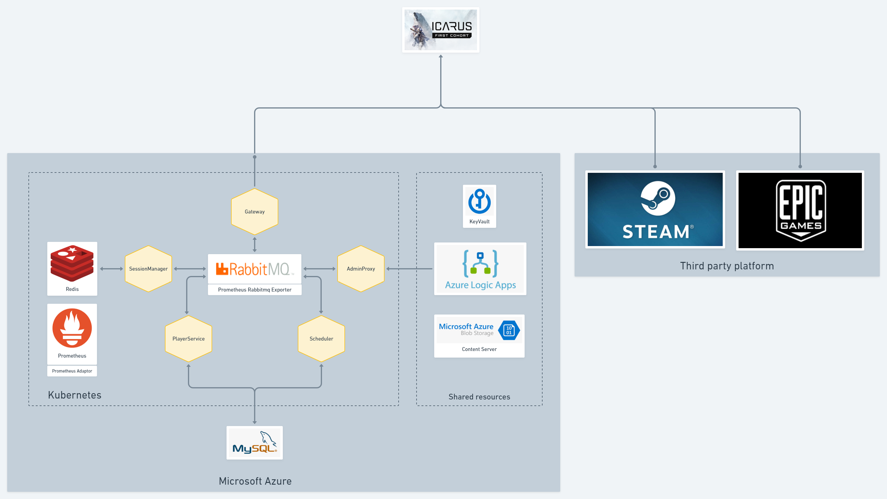
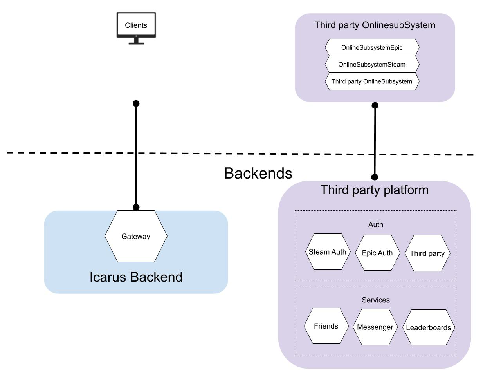

# icarus-backend-services

Icarus 게임 백엔드를 구성하는 Go 기반 microservice 모음입니다. 각 서비스는 독립적으로 배포되며 RabbitMQ(AMQP/STOMP)를 공용 message bus로 사용해 서로 통신합니다. Unreal Engine 클라이언트 측 `OnlineSubsystemIcarus`(별도 repository)가 이 서비스들과 WebSocket/STOMP wire protocol로 직접 연동됩니다.

```
adminproxy/    관리자용 HTTP → RabbitMQ RPC gateway (internal network 전용)
botclient/     부하 테스트를 위한 게임 클라이언트 시뮬레이터
lobbystats/    매치메이킹 대기열 통계 산출 및 실시간 broadcast
```

---

## Services

### [`adminproxy/`](./adminproxy/README_adminproxy.md) — Admin Gateway
Internal network 전용 관리 microservice. HTTP request를 RabbitMQ 기반 RPC로 변환하여 Player Service, Session Manager, Gateway로 라우팅하고, 비동기 응답을 동기 HTTP response로 되돌려주는 request/response bridge입니다. `frameIdx` 기반 `context.Context` correlation으로 RabbitMQ의 pub/sub 모델과 HTTP의 동기 모델을 연결하는 것이 핵심 설계입니다.

**핵심 사용처**: 운영진의 게임 데이터 갱신, 계정/캐릭터 조회·수정, 유지보수 상태 관리 등 admin tool의 backend.

### [`botclient/`](./botclient/README_botclient.md) — Load Testing Simulator
실제 게임 클라이언트와 동일하게 로비 진입 → JWT 인증 → gateway 연결 → RPC 시퀀스 실행이라는 전체 흐름을 다수의 가상 봇으로 동시 재현하는 부하 테스트 도구입니다. `RecvAck` 기반 self-throttling 스케줄러로 부하 테스트 도구 자신이 병목이 되지 않도록 설계되었으며, JSON 시나리오 파일만으로 부하 패턴을 코드 변경 없이 조정할 수 있습니다.

**핵심 사용처**: 신규 빌드/인프라 변경 전 백엔드 스택 전체(Gateway, Lobby, Player Service)의 동시 접속 처리량 및 병목 검증.

### [`lobbystats/`](./lobbystats/README_lobbystats.md) — Lobby Queue Telemetry
RabbitMQ Management API를 polling하여 매치메이킹 대기열의 크기와 처리 속도를 계산하고, 이를 STOMP를 통해 게임 클라이언트에 실시간 broadcast하는 소규모 microservice입니다. RabbitMQ의 pull 방식 관리 API와 클라이언트가 필요로 하는 push 방식 실시간 업데이트 사이의 격차를 메우는 adapter 역할을 합니다.

**핵심 사용처**: 클라이언트 로비 화면의 "대기 인원 N명, 예상 대기 시간 M초" 표시를 위한 서버 측 데이터 소스.

---

## Cross-Service Architecture

### Deployment topology



전체 백엔드가 Kubernetes 클러스터(Microsoft Azure) 위에서 어떻게 배치되는지를 보여주는 실제 배포 아키텍처입니다. `Gateway`, `SessionManager`, `PlayerService`, `Scheduler`, `AdminProxy`가 RabbitMQ를 중심으로 서로 연결되며, `SessionManager`는 Redis, `PlayerService`/`Scheduler`는 MySQL을 데이터 저장소로 사용합니다. Prometheus + RabbitMQ Exporter/Adaptor로 메시지 브로커와 서비스 상태를 모니터링하고, Azure Blob Storage가 게임 콘텐츠 서버(Content Server) 역할을, Azure Key Vault가 비밀 관리를 담당합니다. `AdminProxy`는 Azure Logic Apps를 통해 운영 알림·자동화 워크플로우와 연결됩니다. 클라이언트는 Steam/Epic Games 같은 서드파티 플랫폼을 거쳐 이 Kubernetes 클러스터의 `Gateway`로 진입합니다.

### Client-to-backend relationship



클라이언트 관점에서 바라본 상위 레벨 구조입니다. 게임 클라이언트는 두 개의 독립적인 backend 축과 연결됩니다: 하나는 `Icarus Backend`의 `Gateway`(이 저장소의 서비스들이 속한 자체 백엔드), 다른 하나는 Steam/Epic 등 `Third party OnlineSubsystem`을 경유하는 `Third party platform`(Auth, Friends, Messenger, Leaderboards 등 플랫폼 제공 서비스)입니다. `OnlineSubsystemIcarus`(Unreal 클라이언트 플러그인)는 이 두 축을 모두 추상화하여 게임 코드에 노출하며, 이 저장소의 microservice들은 그중 왼쪽 축(`Icarus Backend`)의 서버 측 구현체에 해당합니다.

세 서비스(`adminproxy`, `botclient`, `lobbystats`)는 서로 직접 호출하지 않고 **RabbitMQ를 매개로 한 exchange/queue 바인딩**으로만 결합되어 있어, 개별 배포·재시작·장애가 다른 서비스에 직접적인 컴파일/런타임 의존성을 만들지 않습니다. 서비스 간 공유되는 계약은 exchange 이름 상수와, 클라이언트-서버 양측에 동일하게 구현된 **byte-level wire protocol**(`EventName\nheader:value\n\nBody`) 두 가지로 좁게 유지됩니다. `botclient`는 위 두 다이어그램의 `Gateway` 진입 경로 전체(로비 → 인증 → RPC)를 독립적인 시뮬레이터로 재현하여 부하를 발생시키는 역할을 합니다.

---

## Shared Design Patterns

여러 서비스에 걸쳐 반복적으로 나타나는 설계 원칙입니다.

- **RabbitMQ connection resilience**: `adminproxy`, `lobbystats`, `botclient` 모두 connection 종료를 감지해 자동 재연결하는 supervisor 패턴을 독립적으로 구현하고 있으며, 재연결 시 exchange/queue 상태를 함께 재구성하여 broker 재시작 이후에도 일관된 상태로 복구됩니다.
- **커스텀 wire protocol의 다중 언어 재구현**: Unreal 클라이언트의 `FIcarusWSFrame`(C++)과 동일한 프레임 포맷이 `lobbystats`, `botclient`에 각각 독립적으로 재구현되어 있으며, 이 protocol-level 계약이 서로 다른 언어·repository 간 상호운용성의 유일한 접점입니다.
- **Config 기반 운영 조정**: 폴링 주기(`lobbystats`), 부하 패턴(`botclient`), 클라이언트 최소 버전(`adminproxy`)처럼 운영 중 자주 바뀌는 값들은 모두 코드 변경 없이 config 파일이나 API 호출로 조정 가능하도록 분리되어 있습니다.

---

## Tech Stack

- **Language**: Go
- **Messaging**: RabbitMQ — AMQP(`streadway/amqp`, `adminproxy`), STOMP(`go-stomp/stomp`, `lobbystats`/`botclient`), Management HTTP API(`lobbystats`)
- **Transport**: WebSocket(`gorilla/websocket`), HTTP(`gorilla/mux`)
- **Configuration**: `spf13/viper`, command-line flag override
- **Serialization**: `encoding/json`, 커스텀 byte-level frame codec, zlib 압축

---

## Disclaimer

본 문서는 포트폴리오 목적의 proprietary 게임 백엔드 microservice 모음에 대한 기술 개요입니다. `adminproxy`는 internal network 전용으로 운영되는 admin 시스템입니다. 소스는 architecture 및 코드 품질 리뷰 목적으로만 공개됩니다.
