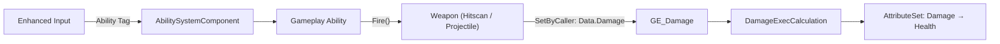
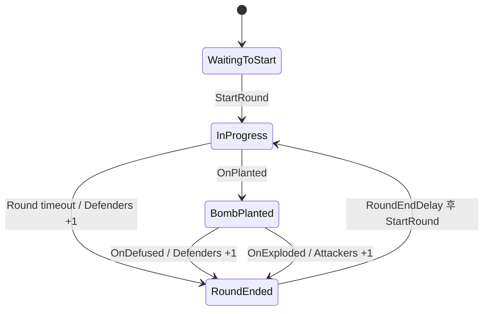

# Kiraverse — UE5.4 GAS

Kiraverse([@Kiraversegame](https://x.com/Kiraversegame))는 PvP 모드에서 플레이하며 **Free-to-Play 멀티플레이어 게임**입니다.
플레이어는 팀을 이루어 토큰과 수집품(Collectables)을 획득하고, 이를 자유롭게 거래하거나 다른 플레이어에게 대여할 수 있습니다.

Unreal Engine 5.4의 **Gameplay Ability System**(GAS)을 기반으로 구현한 C++ 멀티플레이어 게임플레이 코어입니다.
Jump / Dash / Zoom / Fire 어빌리티, Hitscan(단발·연발) / Projectile 무기와 무기 교체 구조,
그리고 폭탄 설치·해체(Bomb Defusal) 라운드 루프를 포함합니다.

> [!NOTE]
> **포트폴리오용 발췌 코드**
> 이 저장소의 코드는 실제 Kiraverse 프로젝트에서 **포트폴리오 목적으로 발췌**한 것입니다.
> 발췌 범위는 경쟁 모드의 게임플레이 코어(GAS 기반 전투 시스템, 폭탄 설치·해체 라운드 루프)이며,
> 토큰·수집품·거래 등 경제 시스템은 포함하지 않습니다.

## 프로젝트 하이라이트

- **Tag-driven Ability Architecture** — Native Gameplay Tag로 입력 라우팅과 활성화 조건(`ActivationBlockedTags` / `ActivationOwnedTags`)을 통일해 어빌리티 간 결합도를 낮췄습니다.
- **Data-driven Weapon System** — 무기 액터의 데이터(`FireAbilityClass`, 반동·탄퍼짐·줌·소모량)만으로 Hitscan / Projectile 무기를 구성하고, 교체 시 Fire 어빌리티를 부여·회수합니다.
- **Unified Damage Pipeline** — `SetByCaller`와 `UGameplayEffectExecutionCalculation`으로 무기 종류와 무관하게 데미지 적용 경로를 단일화했습니다.
- **Event-driven Round Loop** — 폭탄 액터가 Multicast Delegate로 상태 변화를 통지하고, GameMode가 이를 구독해 라운드 상태 머신을 진행합니다.
- **Replication-aware Design** — `LocalPredicted` 예측 실행, 서버 권위(Server-authoritative) 판정, RepNotify 기반 상태 동기화를 전제로 설계했습니다.

## 요구사항
- Unreal Engine 5.4 이상
- 플러그인: GameplayAbilities, GameplayTags, GameplayTasks, EnhancedInput

## 폴더 구조
```
Source/Kiraverse/
└─ Public / Private
   ├─ AbilitySystem/
   │  ├─ KiraverseGameplayTags.*        네이티브 태그 모음
   │  ├─ KiraverseAttributeSet.*        Health / Stamina / Ammo / Damage(메타 속성)
   │  ├─ KiraverseGameplayAbility.*     모든 어빌리티의 공통 베이스 (Instancing / NetExecution 정책)
   │  ├─ Abilities/
   │  │  ├─ GA_Jump.*  GA_Dash.*  GA_Zoom.*
   │  │  ├─ GA_Fire_Base.* → GA_Fire_HitscanSingle / GA_Fire_HitscanAuto / GA_Fire_Projectile
   │  │  ├─ GA_Bomb_Interact.*         폭탄 줍기 / 버리기
   │  │  └─ GA_Bomb_Channeled.* → GA_Bomb_Plant / GA_Bomb_Defuse   채널링 공통 베이스
   │  ├─ Effects/
   │  │  ├─ GE_Damage.*                Instant, DamageExecCalculation 사용
   │  │  ├─ GE_Cost_Fire.*             발사당 Ammo / Stamina 소모 (SetByCaller)
   │  │  └─ GE_Cooldown_Dash.*         Dash 쿨다운, 태그 부여
   │  └─ Calculations/
   │     └─ DamageExecCalculation.*    SetByCaller 데미지를 Damage 속성에 기록
   ├─ Character/
   │  └─ KiraverseCharacter.*          ASC 보유, Enhanced Input → 태그 기반 어빌리티 발동
   ├─ Weapon/
   │  ├─ KiraverseWeaponBase.*         Fire() 순가상함수 + 무기 데이터(FireAbilityClass 등)
   │  ├─ KiraverseWeapon_Hitscan.*     라인 트레이스
   │  ├─ KiraverseWeapon_Projectile.*  발사체 스폰
   │  ├─ KiraverseProjectile.*         이동 + 충돌 시 데미지 적용
   │  └─ KiraverseWeaponComponent.*    무기 장착/교체, 어빌리티 부여·회수
   ├─ Bomb/
   │  ├─ KiraverseBomb.*               폭탄 액터 (상태 머신, Fuse 타이머, 이벤트 Delegate)
   │  ├─ KiraverseBombSite.*           설치 구역(Plant Zone) 볼륨
   │  └─ KiraverseBombComponent.*      폭탄 소지 상태 관리
   └─ Game/
      ├─ KiraverseGameMode.*           라운드 루프, 팀 배정, 승패 판정
      ├─ KiraverseGameState.*          라운드 상태 · 점수 · 페이즈 종료 시각 (Replicated)
      ├─ KiraversePlayerState.*        팀 정보 (Replicated) + Team 태그 동기화
      └─ KiraverseTypes.h              ETeam / ERoundState
```

## 아키텍처



> 아래 코드 스니펫은 실제 소스에서 발췌한 것이며, 가독성을 위해 주석과 보조 구문을 일부 축약했습니다.

### 1. GAS 코어

#### Native Gameplay Tags

모든 태그는 `UE_DECLARE_GAMEPLAY_TAG_EXTERN` / `UE_DEFINE_GAMEPLAY_TAG_COMMENT`로 선언한 **Native Gameplay Tag**입니다.
데이터 테이블이나 문자열 리터럴 없이 컴파일 타임 심볼로 참조하므로, 오타가 컴파일 에러로 드러나고 IDE에서 사용처를 추적할 수 있습니다.

```cpp
// KiraverseGameplayTags.h — 선언
namespace KiraverseGameplayTags
{
    UE_DECLARE_GAMEPLAY_TAG_EXTERN(Ability_Fire);
    UE_DECLARE_GAMEPLAY_TAG_EXTERN(Cooldown_Dash);
    UE_DECLARE_GAMEPLAY_TAG_EXTERN(Data_Damage);
    // ...
}

// KiraverseGameplayTags.cpp — 정의 (네이티브 태그 등록)
UE_DEFINE_GAMEPLAY_TAG_COMMENT(Ability_Fire, "Ability.Fire", "Shared tag for every weapon fire ability.");
UE_DEFINE_GAMEPLAY_TAG_COMMENT(Cooldown_Dash, "Cooldown.Dash", "Blocks Dash while its cooldown effect is active.");
UE_DEFINE_GAMEPLAY_TAG_COMMENT(Data_Damage, "Data.Damage", "SetByCaller key for runtime damage magnitude.");
```

| 분류 | 태그 | 용도 |
|---|---|---|
| Team | `Team.Attackers`, `Team.Defenders` | 팀 식별 (Plant / Defuse 게이팅 보조) |
| Ability | `Ability.Jump` / `Dash` / `Fire` / `Zoom`, `Ability.Bomb.PickUp` / `Drop` / `Plant` / `Defuse` | 입력 → 어빌리티 활성화 식별자 |
| Cooldown | `Cooldown.Dash`, `Cooldown.BombAction` | 재발동 차단 (폭탄 채널 중복 방지 포함) |
| State | `State.Dashing` / `Firing` / `Zooming` / `Planting` / `Defusing` / `CarryingBomb` | 어빌리티 실행 중 부여되는 상태 → 다른 어빌리티 게이팅 |
| Data | `Data.Damage`, `Data.Cost.Ammo`, `Data.Cost.Stamina` | `SetByCaller` 런타임 수치 키 |
| Weapon | `Weapon.Hitscan.Single` / `Auto`, `Weapon.Projectile` | 무기 분류 (UI · 인벤토리 필터링 · 분석) |

#### AttributeSet

`KiraverseAttributeSet`은 Health / MaxHealth / Stamina / MaxStamina / Ammo와, 들어오는 피해를 임시로 받는 메타 속성 `Damage`를 가집니다.
`PostGameplayEffectExecute`에서 `Damage`를 `Health`로 옮기고 다시 0으로 리셋하는 표준 GAS 패턴을 사용합니다.

#### Ability 공통 정책

`UKiraverseGameplayAbility`는 모든 어빌리티의 공통 베이스로 기본 정책을 한 곳에서 관리합니다.
`InstancedPerActor`(액터당 인스턴스 1개)와 `LocalPredicted`(소유 클라이언트가 즉시 예측 실행하고 서버가 확정)를 기본값으로 두어, 입력 지연 없이 반응하면서도 서버 권위를 유지합니다.

```cpp
UKiraverseGameplayAbility::UKiraverseGameplayAbility()
{
    // 액터당 1개 인스턴스, 로컬에서 예측 실행 후 서버가 확정
    InstancingPolicy = EGameplayAbilityInstancingPolicy::InstancedPerActor;
    NetExecutionPolicy = EGameplayAbilityNetExecutionPolicy::LocalPredicted;
}
```

### 2. 캐릭터 & 입력 라우팅

`AKiraverseCharacter`는 ASC · AttributeSet · WeaponComponent · BombComponent를 소유합니다.
ASC는 `Mixed` 복제 모드(GameplayEffect는 소유 클라이언트에만, Gameplay Tag / Cue는 모든 클라이언트에 복제)로 구성했고,
`PossessedBy`(서버)와 `OnRep_PlayerState`(클라이언트)에서 `InitAbilityActorInfo`를 호출합니다.

Enhanced Input 액션은 구체적인 어빌리티 클래스가 아니라 **Ability Tag**에 바인딩됩니다.
입력 계층이 어빌리티 구현을 알 필요가 없으므로, 무기마다 Fire 어빌리티가 달라져도 입력 바인딩은 `Ability.Fire` 하나로 유지됩니다.
`IsLocallyControlled()` 가드로 활성화 요청은 소유 클라이언트(또는 리슨 서버 호스트)에서만 발생합니다.

```cpp
// AKiraverseCharacter — ASC 구성 (Mixed 복제 모드)
AbilitySystemComponent = CreateDefaultSubobject<UAbilitySystemComponent>(TEXT("AbilitySystemComponent"));
AbilitySystemComponent->SetIsReplicated(true);
AbilitySystemComponent->SetReplicationMode(EGameplayEffectReplicationMode::Mixed);

// SetupPlayerInputComponent — 입력 액션을 "어빌리티 태그"에 바인딩
EnhancedInput->BindAction(FireAction, ETriggerEvent::Started, this,
    &AKiraverseCharacter::ActivateAbilitiesWithTag, KiraverseGameplayTags::Ability_Fire.GetTag());

// 소유 클라이언트에서만 활성화 요청 → LocalPredicted로 예측 실행, 서버가 확정
void AKiraverseCharacter::ActivateAbilitiesWithTag(FGameplayTag Tag)
{
    if (AbilitySystemComponent && AbilitySystemComponent->AbilityActorInfo.IsValid()
        && AbilitySystemComponent->AbilityActorInfo->IsLocallyControlled())
    {
        AbilitySystemComponent->TryActivateAbilitiesByTag(FGameplayTagContainer(Tag));
    }
}
```

설치(Plant)와 해체(Defuse)는 하나의 입력 키를 공유합니다. 두 태그를 함께 전달하면 해당 캐릭터에게 실제로 부여된 어빌리티(공격측 = Plant, 수비측 = Defuse)만 매칭됩니다.

```cpp
void AKiraverseCharacter::ActivateBombChannelAbility()
{
    if (/* IsLocallyControlled() */)
    {
        FGameplayTagContainer BombChannelTags;
        BombChannelTags.AddTag(KiraverseGameplayTags::Ability_Bomb_Plant);
        BombChannelTags.AddTag(KiraverseGameplayTags::Ability_Bomb_Defuse);
        AbilitySystemComponent->TryActivateAbilitiesByTag(BombChannelTags);
    }
}
```

### 3. Jump / Dash / Zoom / Fire

- **GA_Jump**: `Character->Jump()`만 호출하고 즉시 종료합니다. 실제 점프 궤적은 `CharacterMovementComponent`가 담당합니다.
- **GA_Dash**: `LaunchCharacter`로 전방 임펄스를 주고 `GE_Cooldown_Dash`를 자신에게 적용합니다.
  `ActivationBlockedTags`에 `State.Dashing` / `Cooldown.Dash`를 등록해, 별도의 bool 플래그 없이 태그만으로 대시 중·쿨다운 중 재발동을 차단합니다.
- **GA_Zoom**: 입력을 누르고 있는 동안 장착 무기의 `ZoomFOV`를 카메라에 적용하고, 해제 시 기본 FOV로 복원합니다.
- **GA_Fire_Base**(abstract): 현재 장착 무기를 조회하는 헬퍼와 발사 비용 커밋(`CommitFireCost`)을 제공합니다.
  - **GA_Fire_HitscanSingle**: 발동당 한 번만 `Weapon->Fire()`를 호출하고 종료합니다.
  - **GA_Fire_HitscanAuto**: `UAbilityTask_WaitInputRelease`로 입력 해제를 감지하면서, 무기의 `FireRate`를 주기로 하는 타이머로 `Fire()`를 반복 호출합니다. 입력을 떼면 어빌리티가 종료되며 타이머도 함께 정리됩니다.
  - **GA_Fire_Projectile**: 발동당 한 번 `Weapon->Fire()`를 호출해 발사체를 스폰합니다.

**Cooldown as a Gameplay Effect** — 쿨다운은 Duration GE가 대상에게 `Cooldown.Dash` 태그를 부여하는 방식입니다.
UE 5.3+의 **GE Component**(`UTargetTagsGameplayEffectComponent`)를 사용해 구 `InheritableOwnedTagsContainer`를 대체했습니다.

```cpp
UGE_Cooldown_Dash::UGE_Cooldown_Dash()
{
    DurationPolicy = EGameplayEffectDurationType::HasDuration;
    DurationMagnitude = FGameplayEffectModifierMagnitude(FScalableFloat(1.5f));

    // UE 5.3+ GE Component 방식으로 대상에게 Cooldown.Dash 태그 부여
    UTargetTagsGameplayEffectComponent& TagsComponent = AddComponent<UTargetTagsGameplayEffectComponent>();
    FInheritedTagContainer TagChanges;
    TagChanges.Added.AddTag(KiraverseGameplayTags::Cooldown_Dash);
    TagsComponent.SetAndApplyTargetTagChanges(TagChanges);
}
```

**Zoom** — `ActivationOwnedTags`로 실행 중 `State.Zooming`이 자동 부여·회수되고, FOV 조작은 로컬 카메라 연출이므로 소유 클라이언트에서만 수행합니다.

```cpp
UGA_Zoom::UGA_Zoom()
{
    AbilityTags.AddTag(KiraverseGameplayTags::Ability_Zoom);
    ActivationOwnedTags.AddTag(KiraverseGameplayTags::State_Zooming);
}

void UGA_Zoom::ActivateAbility(/* ... */)
{
    // 입력 해제를 감시하는 Ability Task
    UAbilityTask_WaitInputRelease* WaitRelease = UAbilityTask_WaitInputRelease::WaitInputRelease(this, false);
    WaitRelease->OnRelease.AddDynamic(this, &UGA_Zoom::OnZoomInputReleased);
    WaitRelease->ReadyForActivation();

    // FOV는 로컬 카메라 연출이므로 소유 클라이언트에서만 적용
    if (!ActorInfo->IsLocallyControlled())
    {
        return;
    }
    // ...
    CameraManager->SetFOV(Weapon->GetZoomFOV());   // 무기별 ZoomFOV
}

void UGA_Zoom::EndAbility(/* ... */)
{
    if (ActorInfo && ActorInfo->IsLocallyControlled())
    {
        // ...
        CameraManager->UnlockFOV();                // 기본 FOV 복원
    }
    Super::EndAbility(Handle, ActorInfo, ActivationInfo, bReplicateEndAbility, bWasCancelled);
}
```

### 4. 데미지 & 소모 파이프라인

`GE_Damage`는 Instant 이펙트이며 `DamageExecCalculation`(GameplayEffectExecutionCalculation)을 실행합니다.
무기 쪽 코드는 `SetSetByCallerMagnitude(Data_Damage, BaseDamage)`로 데미지 값을 실어 보내고, ExecCalc는 그 값을 읽어 `Damage` 속성에 Additive로 기록합니다.
무기 종류(Hitscan / Projectile)와 무관하게 데미지 적용 경로가 하나로 통일되어 있어, 방어력·저항 같은 스탯을 추가할 때 ExecCalc 한 곳만 수정하면 됩니다.

```cpp
// GE_Damage — 실제 계산은 ExecCalc에 위임
UGE_Damage::UGE_Damage()
{
    DurationPolicy = EGameplayEffectDurationType::Instant;

    FGameplayEffectExecutionDefinition ExecutionDefinition;
    ExecutionDefinition.CalculationClass = UDamageExecCalculation::StaticClass();
    Executions.Add(ExecutionDefinition);
}

// 무기 측 — 데미지 크기를 SetByCaller로 주입해 타깃 ASC에 적용
const FGameplayEffectSpecHandle SpecHandle = SourceASC->MakeOutgoingSpec(UGE_Damage::StaticClass(), 1.f, EffectContext);
if (SpecHandle.IsValid())
{
    SpecHandle.Data->SetSetByCallerMagnitude(KiraverseGameplayTags::Data_Damage, GetBaseDamage());
    SourceASC->ApplyGameplayEffectSpecToTarget(*SpecHandle.Data.Get(), TargetASC);
}
```

발사 비용도 같은 방식입니다. `GE_Cost_Fire`는 Ammo / Stamina 두 어트리뷰트에 Additive Modifier를 두고, 크기는 `SetByCaller`(`Data.Cost.Ammo`, `Data.Cost.Stamina`)로 발사 시점에 주입받습니다.
소모량은 무기 데이터(`AmmoCost`, `StaminaCost`)가 제공하며 `GA_Fire_Base::CommitFireCost`가 이를 읽습니다.

```cpp
UGE_Cost_Fire::UGE_Cost_Fire()
{
    DurationPolicy = EGameplayEffectDurationType::Instant;

    FGameplayModifierInfo AmmoModifier;
    AmmoModifier.Attribute = UKiraverseAttributeSet::GetAmmoAttribute();
    AmmoModifier.ModifierOp = EGameplayModOp::Additive;
    FSetByCallerFloat AmmoMagnitude;
    AmmoMagnitude.DataTag = KiraverseGameplayTags::Data_Cost_Ammo;
    AmmoModifier.ModifierMagnitude = FGameplayEffectModifierMagnitude(AmmoMagnitude);
    Modifiers.Add(AmmoModifier);

    // Stamina Modifier도 동일한 구조 (Data_Cost_Stamina)
}
```

### 5. 무기 시스템과 교체 구조

`AKiraverseWeaponBase`(abstract)는 데미지 전달 방식을 `Fire()` 순가상함수로만 추상화하고,
**어떤 Fire 어빌리티를 쓸지는 `FireAbilityClass` 프로퍼티로 데이터화**했습니다.
Hitscan 무기 클래스는 하나뿐이며, Single / Auto 차이는 무기 BP에 지정하는 `FireAbilityClass`(`GA_Fire_HitscanSingle` vs `GA_Fire_HitscanAuto`)로만 결정됩니다.

| 프로퍼티 | 기본값 | 설명 |
|---|---|---|
| `FireAbilityClass` | — | 장착 시 부여할 Fire 어빌리티 (Single / Auto / Projectile을 결정) |
| `BaseDamage` | 10 | 히트당 데미지 |
| `FireRate` | 0.15 | 발사 간격(초). Auto 어빌리티의 타이머 주기 |
| `RecoilPitch` / `RecoilYaw` | 1.5 / 0.5 | 발사당 카메라 반동(도) |
| `RecoilRecoverySpeed` | 8 | 반동 회복 속도(도/초) |
| `SpreadAngle` | 1 | 탄퍼짐 원뿔의 반각(도). 0이면 직선 |
| `ZoomFOV` | 45 | `GA_Zoom` 유지 중 FOV |
| `AmmoCost` / `StaminaCost` | 1 / 5 | 발사당 소모량 |

**Hitscan** — `Fire()`는 `LocalPredicted` 어빌리티에 의해 클라이언트에서도 호출되지만, `HasAuthority()` 가드로 히트 판정과 데미지 적용을 서버로 단일화했습니다.
탄퍼짐은 `FMath::VRandCone`으로 시야 방향 주변의 원뿔 안에서 무작위화합니다.

```cpp
void AKiraverseWeapon_Hitscan::Fire(AKiraverseCharacter* Shooter)
{
    // ...
    // 히트 판정은 서버에서만 수행 (클라이언트의 예측 호출은 여기서 반환)
    if (!Shooter->HasAuthority())
    {
        return;
    }

    const FVector TraceStart = Shooter->GetPawnViewLocation();
    FVector TraceDirection = Shooter->GetControlRotation().Vector();
    if (SpreadAngle > 0.f)
    {
        TraceDirection = FMath::VRandCone(TraceDirection, FMath::DegreesToRadians(SpreadAngle));
    }
    const FVector TraceEnd = TraceStart + TraceDirection * TraceRange;

    FCollisionQueryParams QueryParams;
    QueryParams.AddIgnoredActor(Shooter);
    QueryParams.AddIgnoredActor(this);

    FHitResult HitResult;
    if (!GetWorld()->LineTraceSingleByChannel(HitResult, TraceStart, TraceEnd, TraceChannel, QueryParams))
    {
        return;
    }
    // ... 이후 GE_Damage 적용 (4장 참고)
}
```

**Projectile** — 서버가 Replicated 발사체 액터를 무기 메시의 `Muzzle` 소켓 위치에서 스폰합니다.
발사체(`AKiraverseProjectile`)는 `USphereComponent` + `UProjectileMovementComponent` 구성이며, 첫 충돌 시 `GE_Damage`를 적용하고 소멸합니다.
발사자는 `IgnoreActorWhenMoving`으로 충돌에서 제외하고, `LifeSpanSeconds`(기본 5초)로 미충돌 발사체가 잔존하지 않도록 했습니다.

```cpp
FTransform SpawnTransform = (Mesh && Mesh->DoesSocketExist(MuzzleSocketName))
    ? Mesh->GetSocketTransform(MuzzleSocketName)
    : GetActorTransform();

FActorSpawnParameters SpawnParams;
SpawnParams.Owner = Shooter;
SpawnParams.Instigator = Shooter;
SpawnParams.SpawnCollisionHandlingOverride = ESpawnActorCollisionHandlingMethod::AlwaysSpawn;

if (AKiraverseProjectile* Projectile = GetWorld()->SpawnActor<AKiraverseProjectile>(ProjectileClass, SpawnTransform, SpawnParams))
{
    Projectile->InitializeProjectile(Shooter, GetBaseDamage(), ProjectileSpeed);
}
```

**무기 교체** — `KiraverseWeaponComponent::EquipWeapon()`이 담당합니다.
① 기존 무기가 있으면 부여했던 Fire 어빌리티를 `ClearAbility`로 회수하고 액터를 파괴 → ② 새 무기를 스폰해 `WeaponSocket`에 부착 → ③ 새 무기의 `FireAbilityClass`를 `GiveAbility`.
그 결과 `Fire` 입력 바인딩은 하나뿐이지만 실제로 실행되는 발사 로직은 현재 장착 무기에 따라 갈립니다.
`CurrentWeapon`은 Replicated + RepNotify(`OnRep_CurrentWeapon`)로 클라이언트에 동기화됩니다.

```cpp
CurrentWeapon->AttachToComponent(OwningCharacter->GetMesh(),
    FAttachmentTransformRules(EAttachmentRule::SnapToTarget, true), WeaponSocketName);

// 이 무기의 Fire 어빌리티를 부여 → Ability.Fire 입력이 곧바로 이 무기로 연결됨
if (UAbilitySystemComponent* ASC = OwningCharacter->GetAbilitySystemComponent())
{
    if (TSubclassOf<UGA_Fire_Base> FireAbilityClass = CurrentWeapon->GetFireAbilityClass())
    {
        CurrentFireAbilityHandle = ASC->GiveAbility(FGameplayAbilitySpec(FireAbilityClass, 1));
    }
}
```

### 6. 폭탄 설치·해체(Bomb Defusal) 라운드 루프

공격측(Attackers)이 폭탄을 설치하고 수비측(Defenders)이 해체하는 라운드제 모드입니다.
폭탄 소지 상태(`UKiraverseBombComponent`)는 무기 시스템과 동일한 소유 패턴(단일 Replicated `TObjectPtr` + RepNotify + Authority 전용 mutator)을 재사용합니다.



| 클래스 | 역할 |
|---|---|
| `AKiraverseBomb` | 폭탄 액터. `EBombState`(Idle → Planted → Exploded / Defused), Fuse 타이머, 이벤트 Delegate 소유 |
| `AKiraverseBombSite` | 레벨에 배치하는 Plant Zone(`UBoxComponent`)과 폭탄이 부착되는 Plant Socket |
| `UKiraverseBombComponent` | 캐릭터의 폭탄 소지 상태(`CarriedBomb`, Replicated). 소지 중 `State.CarryingBomb` 부여 |
| `UGA_Bomb_Interact` | 폭탄 줍기 / 버리기 (팀 제한 없음) |
| `UGA_Bomb_Channeled` → `Plant` / `Defuse` | 채널링 설치 / 해체 (각각 Attackers / Defenders) |
| `AKiraverseGameMode` | 팀 배정, 라운드 루프, 폭탄 캐리어 선정, 승패 판정 (서버 전용) |
| `AKiraverseGameState` | 라운드 상태 · 점수 · 페이즈 종료 시각 (Replicated) |
| `AKiraversePlayerState` | 팀 정보 (Replicated), Team 태그 동기화 |

**라운드 흐름** — `StartPlay` → `AssignTeams`(인덱스 짝/홀로 균등 분배) → `StartRound`.
`StartRound`는 플레이어 재시작, Team 태그 재적용, 팀별 Plant / Defuse 어빌리티 부여, 공격측 무작위 1인에게 폭탄 지급, 라운드 타이머 시작 순으로 진행합니다.
종료 조건은 ① 제한 시간 내 미설치 → 수비 승, ② 폭발 → 공격 승, ③ 해체 → 수비 승입니다.

#### 6.1 이벤트 기반 결합 해소 (Observer)

폭탄 액터는 자신의 물리·타이머 상태만 소유하고, 라운드 수준의 결과(점수, 페이즈 전환)는 `OnPlanted` / `OnExploded` / `OnDefused` Multicast Delegate로 통지합니다.
GameMode가 이를 구독하므로 폭탄이 GameMode를 알 필요가 없고, "언제 폭발하는가"는 폭탄의 Fuse 타이머 한 곳에서만 결정됩니다(Single Source of Truth).

```cpp
bool AKiraverseBomb::PlantAtSite(AKiraverseBombSite* Site, float FuseTimeSeconds)
{
    if (!HasAuthority() || !Site || BombState != EBombState::Idle)
    {
        return false;
    }

    DetachFromActor(FDetachmentTransformRules::KeepWorldTransform);
    AttachToComponent(Site->GetPlantSocketComponent(),
        FAttachmentTransformRules(EAttachmentRule::SnapToTarget, true));

    PlantedAtSite = Site;
    BombState = EBombState::Planted;
    OnRep_BombState(); // 서버에서는 OnRep이 자동 호출되지 않으므로 직접 호출

    FuseEndTime = GetWorld()->GetTimeSeconds() + FuseTimeSeconds;
    GetWorldTimerManager().SetTimer(FuseTimerHandle, this, &AKiraverseBomb::Detonate, FuseTimeSeconds, false);

    OnPlanted.Broadcast();
    return true;
}
```

```cpp
// KiraverseGameMode — 폭탄 스폰 시 이벤트 구독, 이후 라운드 판정은 이벤트가 구동
ActiveBomb->OnPlanted.AddDynamic(this, &AKiraverseGameMode::HandleBombPlanted);
ActiveBomb->OnExploded.AddDynamic(this, &AKiraverseGameMode::HandleBombExploded);
ActiveBomb->OnDefused.AddDynamic(this, &AKiraverseGameMode::HandleBombDefused);
BombComponent->AttachBombToCarrier(ActiveBomb);
```

#### 6.2 채널링 어빌리티 (Template Method)

`UGA_Bomb_Channeled`는 "일정 시간 진행해야 완료되는" 흐름을 공통화한 abstract 베이스입니다.
서브클래스는 훅 두 개(`CanStartChannel`, `OnChannelCompleted`)만 구현합니다.

- **중복 채널 방지**: 활성화 시 `Cooldown.BombAction`을 loose tag로 부여하고 종료 시 제거하며, 같은 태그를 `ActivationBlockedTags`에 등록해 두 번째 채널의 시작을 차단합니다.
- **이동 인터럽트**: 100ms 주기 타이머가 매 틱 `CheckInterrupt()`를 검사해, 캐릭터가 시작 위치에서 `ChannelInterruptMoveRadius`를 벗어나면 채널을 취소합니다.
- **완료 시점 재검증**: `OnChannelCompleted`가 성공 여부(`bool`)를 반환하며, 실패하면 `bWasCancelled = true`로 종료합니다. 채널 진행 중 폭탄이 폭발했거나 대상이 사라진 경우를 조용한 성공으로 처리하지 않기 위함입니다.

```cpp
UGA_Bomb_Channeled::UGA_Bomb_Channeled()
{
    // 동일 ASC에서 채널이 진행 중이면 새 채널 시작을 차단
    ActivationBlockedTags.AddTag(KiraverseGameplayTags::Cooldown_BombAction);
}

void UGA_Bomb_Channeled::ChannelTick()
{
    if (CheckInterrupt())
    {
        EndAbility(CachedHandle, &CachedActorInfo, CachedActivationInfo, true, true);
        return;
    }

    ElapsedChannelTime += ChannelTickInterval;
    if (ElapsedChannelTime < RequiredChannelTime)
    {
        return;
    }

    // 종료 사유는 "시간이 찼는가"가 아니라 "실제 액션이 성공했는가"를 따른다
    AKiraverseCharacter* Character = GetCachedCharacter();
    const bool bCompletedSuccessfully = Character && OnChannelCompleted(Character);

    EndAbility(CachedHandle, &CachedActorInfo, CachedActivationInfo, true, !bCompletedSuccessfully);
}

bool UGA_Bomb_Channeled::CheckInterrupt() const
{
    const AKiraverseCharacter* Character = GetCachedCharacter();
    if (!Character)
    {
        return true; // 캐릭터 소실(사망 / 접속 종료)
    }

    const float DistanceMoved = FVector::Dist(Character->GetActorLocation(), ChannelStartLocation);
    return DistanceMoved > ChannelInterruptMoveRadius;
}
```

```cpp
// GA_Bomb_Defuse — 어빌리티 태그와 차단 태그를 활용해 공격팀의 접근을 제한하고
// 수비팀만 폭탄을 제거할 수 있도록 설정
UGA_Bomb_Defuse::UGA_Bomb_Defuse()
{
    AbilityTags.AddTag(KiraverseGameplayTags::Ability_Bomb_Defuse);
    ActivationOwnedTags.AddTag(KiraverseGameplayTags::State_Defusing);
    ActivationBlockedTags.AddTag(KiraverseGameplayTags::Team_Attackers);
}

bool UGA_Bomb_Defuse::OnChannelCompleted(AKiraverseCharacter* Character)
{
    // 활성화 시점의 결과를 캐싱하지 않고, 완료 직전에 다시 탐색해 상태를 재확인
    AKiraverseBomb* Bomb = FindPlantedBombInRange(Character);
    return Bomb && Bomb->Defuse();
}
```

#### 6.3 상태 일관성: 호출 순서 보장

`GA_Bomb_Plant::OnChannelCompleted`에서는 `PlantAtSite`를 `ReleaseCarriedBomb`보다 **먼저** 호출합니다.
`PlantAtSite`가 자체 가드(예: 같은 프레임에 다른 상호작용으로 상태가 Idle이 아니게 됨)에 걸려 실패했을 때, 소지 참조가 이미 해제되어 있으면
폭탄은 "소지 중이 아닌데 캐릭터에 부착된" 상태가 되어 줍기(부착 부모 없음 조건)도 버리기(참조 없음)도 불가능해집니다.
설치가 확정된 뒤에만 참조를 해제하도록 순서를 고정해 이 상태 불일치를 원천 차단했습니다.

```cpp
bool UGA_Bomb_Plant::OnChannelCompleted(AKiraverseCharacter* Character)
{
    UKiraverseBombComponent* BombComponent = Character ? Character->FindComponentByClass<UKiraverseBombComponent>() : nullptr;
    AKiraverseBomb* Bomb = BombComponent ? BombComponent->GetCarriedBomb() : nullptr;
    AKiraverseBombSite* Site = FindPlantSite(Character);

    // 완료 시점에 대상을 다시 확인 (Bomb / Site를 활성화 시점 값으로 신뢰하지 않음)
    if (!BombComponent || !Bomb || !Site)
    {
        return false;
    }

    // PlantAtSite 먼저 → 성공이 확정된 경우에만 소지 참조 해제
    if (!Bomb->PlantAtSite(Site, BombFuseTime))
    {
        return false;
    }

    BombComponent->ReleaseCarriedBomb();
    return true;
}
```

#### 6.4 팀 게이팅과 Team 태그 동기화

- **1차 게이트 — 부여하지 않는다**: GameMode가 공격측에게는 Plant, 수비측에게는 Defuse만 부여합니다(`GrantTeamBombAbility`). 잘못된 팀의 어빌리티는 ASC에 존재하지 않습니다. 이미 부여된 경우를 `FindAbilitySpecFromClass`로 확인해 라운드 반복 시 중복 부여를 막습니다.
- **2차 게이트 — 태그로 차단한다**: `ActivationBlockedTags`(Plant는 `Team.Defenders`, Defuse는 `Team.Attackers`)가 보조 안전망 역할을 합니다.
- **Team 태그 동기화**: loose tag는 복제되지 않으므로, 복제되는 원본 상태인 `PlayerState::Team`을 기준으로 서버(`SetTeam`)와 클라이언트(`OnRep_Team`)가 각각 자기 ASC에 Team 태그를 적용합니다.

```cpp
// KiraverseGameMode::GrantTeamBombAbility — 팀에 맞는 어빌리티만 부여
TSubclassOf<UGameplayAbility> AbilityClass;
if (Team == ETeam::Attackers && BombPlantAbilityClass)
{
    AbilityClass = BombPlantAbilityClass;
}
else if (Team == ETeam::Defenders && BombDefuseAbilityClass)
{
    AbilityClass = BombDefuseAbilityClass;
}
// ...
if (ASC->FindAbilitySpecFromClass(AbilityClass))
{
    return; // 중복 부여 방지
}
ASC->GiveAbility(FGameplayAbilitySpec(AbilityClass, 1));
```

```cpp
// KiraversePlayerState — 복제되는 Team이 원본, 태그는 각 머신이 로컬로 반영
void AKiraversePlayerState::SetTeam(ETeam NewTeam)
{
    if (!HasAuthority() || Team == NewTeam)
    {
        return;
    }

    const ETeam OldTeam = Team;
    Team = NewTeam;
    ApplyTeamTagToPawnASC(OldTeam, NewTeam);
}

void AKiraversePlayerState::OnRep_Team(ETeam OldTeam)
{
    ApplyTeamTagToPawnASC(OldTeam, Team);
}
```

#### 6.5 라운드 타이머

라운드 타이머는 매 틱 복제되는 카운트다운 float가 아니라, 단계가 바뀔 때 한 번만 복제되는 **종료 시각**(`RoundPhaseEndTime`)입니다.
각 머신이 종료 시각에서 현재 시각을 빼서 남은 시간(`GetPhaseTimeRemaining()`)을 계산하므로, 복제 빈도가 낮고 패킷 손실에 따른 카운트다운 지터가 없습니다.
폭탄 설치 시에는 폭탄의 `FuseEndTime`을 같은 필드로 미러링해, UI가 GameState만 읽어도 Fuse 카운트다운을 표시할 수 있습니다.

#### Design Notes

- `ChannelInterruptMoveRadius`(기본 30)는 Plant Zone / Defuse Range와 독립된 값이므로 둘 중 더 작은 영역 이하로 유지해야 합니다.
- Plant / Defuse 어빌리티가 GameMode를 참조하지 않도록 `BombFuseTime`을 어빌리티에도 두었습니다. 결합도를 낮추는 대신 두 값을 동기화해 관리해야 하는 trade-off입니다.
- 라운드 도중 합류한 플레이어(`PostLogin`)는 인원이 적은 팀에 배정되며, 다음 라운드부터 폭탄 캐리어 후보가 됩니다.

### 7. Replication 설계 요약

| 관심사 | 전략 |
|---|---|
| ASC 복제 | `Mixed` 모드 — GameplayEffect는 소유 클라이언트에만, Gameplay Tag / Cue는 전체에 복제 |
| 어빌리티 실행 | `LocalPredicted` — 소유 클라이언트가 예측 실행, 서버가 확정 |
| 히트 판정 / 발사체 스폰 / 폭탄 상태 변경 | Authority(서버) 전용 (`HasAuthority()` 가드) |
| 상태 동기화 | `CurrentWeapon`, `CarriedBomb`, `BombState`, `Team` — Replicated + RepNotify |
| 라운드 타이머 | 단계 전환 시 종료 시각(End Timestamp)을 1회 복제 |
| Loose Gameplay Tag | 비복제이므로 복제되는 원본 상태(`Team`)로부터 각 머신이 로컬 부여 |

## 추가적인 에디터 작업
C++만으로는 만들 수 없는 바이너리 에셋들입니다.
1. **입력 에셋**: `IMC_Kiraverse`(Input Mapping Context), `IA_Jump` / `IA_Dash` / `IA_Fire` / `IA_Zoom` / `IA_BombInteract` / `IA_BombAction`(Input Action) 생성 후 IMC에 원하는 키를 매핑합니다.
2. **BP_KiraverseCharacter**: `AKiraverseCharacter`를 상속하는 블루프린트를 만들고 메시/카메라 붐(원하면 추가)을 세팅합니다.
   - `DefaultAbilities`에 `GA_Jump` / `GA_Dash` / `GA_Zoom` / `GA_Bomb_Interact` 등록 (Fire 어빌리티는 무기가, Plant / Defuse는 GameMode가 부여)
   - `DefaultMappingContext` 및 `JumpAction` / `DashAction` / `FireAction` / `ZoomAction` / `BombInteractAction` / `BombActionAction`에 위 입력 에셋 연결
3. **GE는 C++로 완결**되어 있어 `GE_Damage`, `GE_Cost_Fire`, `GE_Cooldown_Dash`를 그대로 참조하면 됩니다.
4. **무기 블루프린트 3종**을 만듭니다.
   - `BP_Weapon_Pistol`(`AKiraverseWeapon_Hitscan` 상속): `FireAbilityClass = GA_Fire_HitscanSingle`
   - `BP_Weapon_Rifle`(`AKiraverseWeapon_Hitscan` 상속): `FireAbilityClass = GA_Fire_HitscanAuto`,
     `FireRate`를 원하는 발사 간격으로 조정
   - `BP_Weapon_RocketLauncher`(`AKiraverseWeapon_Projectile` 상속):
     `FireAbilityClass = GA_Fire_Projectile`, `ProjectileClass = BP_KiraverseProjectile`
5. `BP_KiraverseProjectile`(`AKiraverseProjectile` 상속)에 발사체 메시/VFX를 붙입니다.
6. `BP_KiraverseCharacter`의 `WeaponComponent → DefaultWeaponClasses`에 위 3개 무기 BP를
   등록하면 인덱스 0번 무기가 BeginPlay 시 자동 장착됩니다. `EquipWeaponAtIndex()`를
   숫자 키 입력 등에 연결하면 바로 교체 데모가 가능합니다.
7. **소켓**: 캐릭터 메시에 `WeaponSocket`·`BombSocket`, 무기 메시에 `Muzzle` 소켓을 추가합니다
   (이름은 각 클래스의 `WeaponSocketName` / `BombCarrySocketName` / `MuzzleSocketName` 프로퍼티에서 바꿀 수 있습니다).
8. **폭탄 · 라운드 세팅**
   - `BP_KiraverseBomb`(`AKiraverseBomb` 상속)에 폭탄 메시를 지정합니다.
   - 레벨에 `AKiraverseBombSite`를 배치하고 Plant Zone 크기와 `SiteLabel`을 설정합니다.
   - `AKiraverseGameMode`를 상속하는 BP에서 `DefaultPawnClass`(`BP_KiraverseCharacter`), `GameStateClass`(`AKiraverseGameState`), `PlayerStateClass`(`AKiraversePlayerState`), `BombClass`, `BombPlantAbilityClass`, `BombDefuseAbilityClass`를 지정하고 GameMode Override로 사용합니다.
   - 라운드 튜닝: `RoundTimeLimit`(기본 120초), `RoundEndDelay`(기본 5초), GameState의 `ScoreToWinMatch`(기본 5).
   - 실제 Fuse 시간은 `GA_Bomb_Plant::BombFuseTime`(기본 45초)이 결정하므로, GameMode의 `BombFuseTime`과 같은 값으로 맞춰 둡니다.
