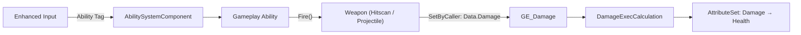
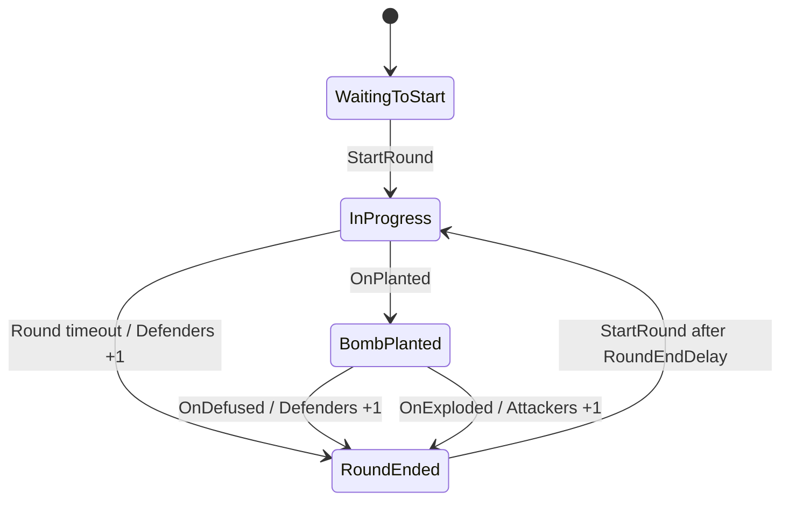

# Kiraverse — UE5.4 GAS

Kiraverse ([@Kiraversegame](https://x.com/Kiraversegame)) is a **free-to-play multiplayer game** played in PvP mode.
Players can team up to earn tokens and collectables, which they can trade freely or rent to other players.

A C++ multiplayer gameplay core built on Unreal Engine 5.4's **Gameplay Ability System** (GAS).
It includes Jump / Dash / Zoom / Fire abilities, Hitscan (single-shot and automatic) / Projectile weapons with a weapon-swap architecture,
and a Bomb Defusal (plant / defuse) round loop.

> [!NOTE]
> **Code excerpted for portfolio use**
> The code in this repository has been **excerpted for portfolio purposes** from the actual Kiraverse project.
> The excerpt covers the gameplay core of the competitive mode (the GAS-based combat system and the bomb plant / defuse round loop);
> economy systems such as tokens, collectables, and trading are not included.

## Project Highlights

- **Tag-driven Ability Architecture** — Native Gameplay Tags unify input routing and activation conditions (`ActivationBlockedTags` / `ActivationOwnedTags`), reducing coupling between abilities.
- **Data-driven Weapon System** — Hitscan / Projectile weapons are composed purely from weapon-actor data (`FireAbilityClass`, recoil, spread, zoom, and cost), and the Fire ability is granted and revoked on weapon swap.
- **Unified Damage Pipeline** — `SetByCaller` plus `UGameplayEffectExecutionCalculation` unifies the damage application path regardless of weapon type.
- **Event-driven Round Loop** — The bomb actor announces state changes through Multicast Delegates, and the GameMode subscribes to them to drive the round state machine.
- **Replication-aware Design** — Designed around `LocalPredicted` predictive execution, server-authoritative adjudication, and RepNotify-based state synchronization.

## Requirements
- Unreal Engine 5.4 or later
- Plugins: GameplayAbilities, GameplayTags, GameplayTasks, EnhancedInput

## Folder Structure
```
Source/Kiraverse/
└─ Public / Private
   ├─ AbilitySystem/
   │  ├─ KiraverseGameplayTags.*        Native tag registry
   │  ├─ KiraverseAttributeSet.*        Health / Stamina / Ammo / Damage (meta attribute)
   │  ├─ KiraverseGameplayAbility.*     Common base for all abilities (Instancing / NetExecution policy)
   │  ├─ Abilities/
   │  │  ├─ GA_Jump.*  GA_Dash.*  GA_Zoom.*
   │  │  ├─ GA_Fire_Base.* → GA_Fire_HitscanSingle / GA_Fire_HitscanAuto / GA_Fire_Projectile
   │  │  ├─ GA_Bomb_Interact.*         Pick up / drop the bomb
   │  │  └─ GA_Bomb_Channeled.* → GA_Bomb_Plant / GA_Bomb_Defuse   Common base for channeled abilities
   │  ├─ Effects/
   │  │  ├─ GE_Damage.*                Instant; uses DamageExecCalculation
   │  │  ├─ GE_Cost_Fire.*             Per-shot Ammo / Stamina cost (SetByCaller)
   │  │  └─ GE_Cooldown_Dash.*         Dash cooldown; grants a tag
   │  └─ Calculations/
   │     └─ DamageExecCalculation.*    Writes the SetByCaller damage to the Damage attribute
   ├─ Character/
   │  └─ KiraverseCharacter.*          Owns the ASC; Enhanced Input → tag-based ability activation
   ├─ Weapon/
   │  ├─ KiraverseWeaponBase.*         Pure virtual Fire() + weapon data (FireAbilityClass, etc.)
   │  ├─ KiraverseWeapon_Hitscan.*     Line trace
   │  ├─ KiraverseWeapon_Projectile.*  Projectile spawning
   │  ├─ KiraverseProjectile.*         Movement + damage application on impact
   │  └─ KiraverseWeaponComponent.*    Weapon equip / swap; ability grant and revoke
   ├─ Bomb/
   │  ├─ KiraverseBomb.*               Bomb actor (state machine, fuse timer, event delegates)
   │  ├─ KiraverseBombSite.*           Plant Zone volume
   │  └─ KiraverseBombComponent.*      Bomb carry state management
   └─ Game/
      ├─ KiraverseGameMode.*           Round loop, team assignment, win/loss adjudication
      ├─ KiraverseGameState.*          Round state · score · phase end time (Replicated)
      ├─ KiraversePlayerState.*        Team info (Replicated) + Team tag synchronization
      └─ KiraverseTypes.h              ETeam / ERoundState
```

## Architecture



> The code snippets below are excerpted from the actual source; comments and auxiliary statements have been partially condensed for readability.

### 1. GAS Core

#### Native Gameplay Tags

All tags are **Native Gameplay Tags** declared with `UE_DECLARE_GAMEPLAY_TAG_EXTERN` / `UE_DEFINE_GAMEPLAY_TAG_COMMENT`.
Because they are referenced as compile-time symbols — with no data tables or string literals — typos surface as compile errors and usages can be tracked in the IDE.

```cpp
// KiraverseGameplayTags.h — declarations
namespace KiraverseGameplayTags
{
    UE_DECLARE_GAMEPLAY_TAG_EXTERN(Ability_Fire);
    UE_DECLARE_GAMEPLAY_TAG_EXTERN(Cooldown_Dash);
    UE_DECLARE_GAMEPLAY_TAG_EXTERN(Data_Damage);
    // ...
}

// KiraverseGameplayTags.cpp — definitions (native tag registration)
UE_DEFINE_GAMEPLAY_TAG_COMMENT(Ability_Fire, "Ability.Fire", "Shared tag for every weapon fire ability.");
UE_DEFINE_GAMEPLAY_TAG_COMMENT(Cooldown_Dash, "Cooldown.Dash", "Blocks Dash while its cooldown effect is active.");
UE_DEFINE_GAMEPLAY_TAG_COMMENT(Data_Damage, "Data.Damage", "SetByCaller key for runtime damage magnitude.");
```

| Category | Tags | Purpose |
|---|---|---|
| Team | `Team.Attackers`, `Team.Defenders` | Team identity (supplementary gating for Plant / Defuse) |
| Ability | `Ability.Jump` / `Dash` / `Fire` / `Zoom`, `Ability.Bomb.PickUp` / `Drop` / `Plant` / `Defuse` | Ability activation identifiers (input → ability) |
| Cooldown | `Cooldown.Dash`, `Cooldown.BombAction` | Blocks re-activation (including duplicate bomb channels) |
| State | `State.Dashing` / `Firing` / `Zooming` / `Planting` / `Defusing` / `CarryingBomb` | State granted while an ability is running → gates other abilities |
| Data | `Data.Damage`, `Data.Cost.Ammo`, `Data.Cost.Stamina` | `SetByCaller` runtime magnitude keys |
| Weapon | `Weapon.Hitscan.Single` / `Auto`, `Weapon.Projectile` | Weapon classification (UI · inventory filtering · analytics) |

#### AttributeSet

`KiraverseAttributeSet` has Health / MaxHealth / Stamina / MaxStamina / Ammo, plus a meta attribute, `Damage`, that temporarily receives incoming damage.
It uses the standard GAS pattern in `PostGameplayEffectExecute`: move `Damage` into `Health`, then reset `Damage` to 0.

#### Common Ability Policy

`UKiraverseGameplayAbility` is the common base for all abilities and manages the default policy in one place.
Its defaults are `InstancedPerActor` (one instance per actor) and `LocalPredicted` (the owning client executes immediately with prediction and the server confirms), so abilities respond without input latency while server authority is preserved.

```cpp
UKiraverseGameplayAbility::UKiraverseGameplayAbility()
{
    // One instance per actor; executed locally with prediction, then confirmed by the server
    InstancingPolicy = EGameplayAbilityInstancingPolicy::InstancedPerActor;
    NetExecutionPolicy = EGameplayAbilityNetExecutionPolicy::LocalPredicted;
}
```

### 2. Character & Input Routing

`AKiraverseCharacter` owns the ASC, AttributeSet, WeaponComponent, and BombComponent.
The ASC is configured in `Mixed` replication mode (GameplayEffects replicate only to the owning client, while Gameplay Tags / Cues replicate to all clients),
and `InitAbilityActorInfo` is called from `PossessedBy` (server) and `OnRep_PlayerState` (client).

Enhanced Input actions are bound to **Ability Tags** rather than to concrete ability classes.
Because the input layer needs no knowledge of ability implementations, the input binding stays a single `Ability.Fire` even when each weapon uses a different Fire ability.
An `IsLocallyControlled()` guard ensures that activation requests originate only from the owning client (or the listen-server host).

```cpp
// AKiraverseCharacter — ASC setup (Mixed replication mode)
AbilitySystemComponent = CreateDefaultSubobject<UAbilitySystemComponent>(TEXT("AbilitySystemComponent"));
AbilitySystemComponent->SetIsReplicated(true);
AbilitySystemComponent->SetReplicationMode(EGameplayEffectReplicationMode::Mixed);

// SetupPlayerInputComponent — bind input actions to "ability tags"
EnhancedInput->BindAction(FireAction, ETriggerEvent::Started, this,
    &AKiraverseCharacter::ActivateAbilitiesWithTag, KiraverseGameplayTags::Ability_Fire.GetTag());

// Request activation only on the owning client → predicted via LocalPredicted, confirmed by the server
void AKiraverseCharacter::ActivateAbilitiesWithTag(FGameplayTag Tag)
{
    if (AbilitySystemComponent && AbilitySystemComponent->AbilityActorInfo.IsValid()
        && AbilitySystemComponent->AbilityActorInfo->IsLocallyControlled())
    {
        AbilitySystemComponent->TryActivateAbilitiesByTag(FGameplayTagContainer(Tag));
    }
}
```

Plant and Defuse share a single input key. Passing both tags together matches only the ability actually granted to that character (attackers = Plant, defenders = Defuse).

```cpp
void AKiraverseCharacter::ActivateBombChannelAbility()
{
    if (/* IsLocallyControlled() */)
    {
        FGameplayTagContainer BombChannelTags;
        BombChannelTags.AddTag(KiraverseGameplayTags::Ability_Bomb_Plant);
        BombChannelTags.AddTag(KiraverseGameplayTags::Ability_Bomb_Defuse);
        AbilitySystemComponent->TryActivateAbilitiesByTag(BombChannelTags);
    }
}
```

### 3. Jump / Dash / Zoom / Fire

- **GA_Jump**: Calls only `Character->Jump()` and ends immediately. The actual jump arc is handled by `CharacterMovementComponent`.
- **GA_Dash**: Applies a forward impulse via `LaunchCharacter` and applies `GE_Cooldown_Dash` to itself.
  By registering `State.Dashing` / `Cooldown.Dash` in `ActivationBlockedTags`, re-activation during a dash or cooldown is blocked by tags alone, with no separate bool flag.
- **GA_Zoom**: While the input is held, applies the equipped weapon's `ZoomFOV` to the camera; on release, restores the default FOV.
- **GA_Fire_Base** (abstract): Provides a helper that looks up the currently equipped weapon, plus the per-shot cost commit (`CommitFireCost`).
  - **GA_Fire_HitscanSingle**: Calls `Weapon->Fire()` once per activation and ends.
  - **GA_Fire_HitscanAuto**: Detects input release with `UAbilityTask_WaitInputRelease` while repeatedly calling `Fire()` on a timer whose period is the weapon's `FireRate`. When the input is released, the ability ends and the timer is cleaned up along with it.
  - **GA_Fire_Projectile**: Calls `Weapon->Fire()` once per activation to spawn a projectile.

**Cooldown as a Gameplay Effect** — The cooldown is a Duration GE that grants the `Cooldown.Dash` tag to its target.
It uses the UE 5.3+ **GE Component** (`UTargetTagsGameplayEffectComponent`) in place of the legacy `InheritableOwnedTagsContainer`.

```cpp
UGE_Cooldown_Dash::UGE_Cooldown_Dash()
{
    DurationPolicy = EGameplayEffectDurationType::HasDuration;
    DurationMagnitude = FGameplayEffectModifierMagnitude(FScalableFloat(1.5f));

    // Grant the Cooldown.Dash tag to the target via the UE 5.3+ GE Component
    UTargetTagsGameplayEffectComponent& TagsComponent = AddComponent<UTargetTagsGameplayEffectComponent>();
    FInheritedTagContainer TagChanges;
    TagChanges.Added.AddTag(KiraverseGameplayTags::Cooldown_Dash);
    TagsComponent.SetAndApplyTargetTagChanges(TagChanges);
}
```

**Zoom** — `ActivationOwnedTags` automatically grants and removes `State.Zooming` while the ability runs, and because FOV manipulation is a local camera effect, it is performed only on the owning client.

```cpp
UGA_Zoom::UGA_Zoom()
{
    AbilityTags.AddTag(KiraverseGameplayTags::Ability_Zoom);
    ActivationOwnedTags.AddTag(KiraverseGameplayTags::State_Zooming);
}

void UGA_Zoom::ActivateAbility(/* ... */)
{
    // Ability Task that watches for input release
    UAbilityTask_WaitInputRelease* WaitRelease = UAbilityTask_WaitInputRelease::WaitInputRelease(this, false);
    WaitRelease->OnRelease.AddDynamic(this, &UGA_Zoom::OnZoomInputReleased);
    WaitRelease->ReadyForActivation();

    // FOV is a local camera effect, so apply it only on the owning client
    if (!ActorInfo->IsLocallyControlled())
    {
        return;
    }
    // ...
    CameraManager->SetFOV(Weapon->GetZoomFOV());   // per-weapon ZoomFOV
}

void UGA_Zoom::EndAbility(/* ... */)
{
    if (ActorInfo && ActorInfo->IsLocallyControlled())
    {
        // ...
        CameraManager->UnlockFOV();                // restore the default FOV
    }
    Super::EndAbility(Handle, ActorInfo, ActivationInfo, bReplicateEndAbility, bWasCancelled);
}
```

### 4. Damage & Cost Pipeline

`GE_Damage` is an Instant effect that runs `DamageExecCalculation` (a GameplayEffectExecutionCalculation).
The weapon-side code attaches the damage value via `SetSetByCallerMagnitude(Data_Damage, BaseDamage)`; the ExecCalc reads it and writes it to the `Damage` attribute as an Additive modifier.
Because the damage application path is unified regardless of weapon type (Hitscan / Projectile), adding stats such as armor or resistance requires changing only the ExecCalc.

```cpp
// GE_Damage — the actual calculation is delegated to the ExecCalc
UGE_Damage::UGE_Damage()
{
    DurationPolicy = EGameplayEffectDurationType::Instant;

    FGameplayEffectExecutionDefinition ExecutionDefinition;
    ExecutionDefinition.CalculationClass = UDamageExecCalculation::StaticClass();
    Executions.Add(ExecutionDefinition);
}

// Weapon side — inject the damage magnitude as SetByCaller and apply it to the target ASC
const FGameplayEffectSpecHandle SpecHandle = SourceASC->MakeOutgoingSpec(UGE_Damage::StaticClass(), 1.f, EffectContext);
if (SpecHandle.IsValid())
{
    SpecHandle.Data->SetSetByCallerMagnitude(KiraverseGameplayTags::Data_Damage, GetBaseDamage());
    SourceASC->ApplyGameplayEffectSpecToTarget(*SpecHandle.Data.Get(), TargetASC);
}
```

Firing cost works the same way. `GE_Cost_Fire` places Additive Modifiers on the Ammo and Stamina attributes, and their magnitudes are injected at fire time through `SetByCaller` (`Data.Cost.Ammo`, `Data.Cost.Stamina`).
The consumption amounts come from weapon data (`AmmoCost`, `StaminaCost`), which `GA_Fire_Base::CommitFireCost` reads.

```cpp
UGE_Cost_Fire::UGE_Cost_Fire()
{
    DurationPolicy = EGameplayEffectDurationType::Instant;

    FGameplayModifierInfo AmmoModifier;
    AmmoModifier.Attribute = UKiraverseAttributeSet::GetAmmoAttribute();
    AmmoModifier.ModifierOp = EGameplayModOp::Additive;
    FSetByCallerFloat AmmoMagnitude;
    AmmoMagnitude.DataTag = KiraverseGameplayTags::Data_Cost_Ammo;
    AmmoModifier.ModifierMagnitude = FGameplayEffectModifierMagnitude(AmmoMagnitude);
    Modifiers.Add(AmmoModifier);

    // The Stamina Modifier has the same structure (Data_Cost_Stamina)
}
```

### 5. Weapon System and Swap Architecture

`AKiraverseWeaponBase` (abstract) abstracts the damage-delivery mechanism only through the pure virtual `Fire()`,
and **which Fire ability to use is data-driven through the `FireAbilityClass` property**.
There is only one Hitscan weapon class; the Single / Auto difference is determined solely by the `FireAbilityClass` set on the weapon BP (`GA_Fire_HitscanSingle` vs `GA_Fire_HitscanAuto`).

| Property | Default | Description |
|---|---|---|
| `FireAbilityClass` | — | Fire ability granted on equip (determines Single / Auto / Projectile) |
| `BaseDamage` | 10 | Damage per hit |
| `FireRate` | 0.15 | Interval between shots in seconds; the timer period of the Auto ability |
| `RecoilPitch` / `RecoilYaw` | 1.5 / 0.5 | Camera recoil per shot (degrees) |
| `RecoilRecoverySpeed` | 8 | Recoil recovery speed (degrees/second) |
| `SpreadAngle` | 1 | Half-angle of the spread cone (degrees); 0 means a straight line |
| `ZoomFOV` | 45 | FOV while `GA_Zoom` is held |
| `AmmoCost` / `StaminaCost` | 1 / 5 | Consumption per shot |

**Hitscan** — `Fire()` is also invoked on the client by the `LocalPredicted` ability, but a `HasAuthority()` guard consolidates hit detection and damage application on the server.
Spread is randomized within a cone around the view direction using `FMath::VRandCone`.

```cpp
void AKiraverseWeapon_Hitscan::Fire(AKiraverseCharacter* Shooter)
{
    // ...
    // Hit detection runs on the server only (the client's predicted call returns here)
    if (!Shooter->HasAuthority())
    {
        return;
    }

    const FVector TraceStart = Shooter->GetPawnViewLocation();
    FVector TraceDirection = Shooter->GetControlRotation().Vector();
    if (SpreadAngle > 0.f)
    {
        TraceDirection = FMath::VRandCone(TraceDirection, FMath::DegreesToRadians(SpreadAngle));
    }
    const FVector TraceEnd = TraceStart + TraceDirection * TraceRange;

    FCollisionQueryParams QueryParams;
    QueryParams.AddIgnoredActor(Shooter);
    QueryParams.AddIgnoredActor(this);

    FHitResult HitResult;
    if (!GetWorld()->LineTraceSingleByChannel(HitResult, TraceStart, TraceEnd, TraceChannel, QueryParams))
    {
        return;
    }
    // ... GE_Damage is applied afterwards (see Section 4)
}
```

**Projectile** — The server spawns a Replicated projectile actor at the weapon mesh's `Muzzle` socket.
The projectile (`AKiraverseProjectile`) consists of a `USphereComponent` + `UProjectileMovementComponent`, applies `GE_Damage` on first impact, and is then destroyed.
The shooter is excluded from collision with `IgnoreActorWhenMoving`, and `LifeSpanSeconds` (default 5 seconds) keeps projectiles that never hit anything from lingering.

```cpp
FTransform SpawnTransform = (Mesh && Mesh->DoesSocketExist(MuzzleSocketName))
    ? Mesh->GetSocketTransform(MuzzleSocketName)
    : GetActorTransform();

FActorSpawnParameters SpawnParams;
SpawnParams.Owner = Shooter;
SpawnParams.Instigator = Shooter;
SpawnParams.SpawnCollisionHandlingOverride = ESpawnActorCollisionHandlingMethod::AlwaysSpawn;

if (AKiraverseProjectile* Projectile = GetWorld()->SpawnActor<AKiraverseProjectile>(ProjectileClass, SpawnTransform, SpawnParams))
{
    Projectile->InitializeProjectile(Shooter, GetBaseDamage(), ProjectileSpeed);
}
```

**Weapon swap** — Handled by `KiraverseWeaponComponent::EquipWeapon()`.
① If a weapon is already equipped, revoke the Fire ability it granted via `ClearAbility` and destroy the actor → ② spawn the new weapon and attach it to `WeaponSocket` → ③ `GiveAbility` the new weapon's `FireAbilityClass`.
As a result, there is only one `Fire` input binding, yet the firing logic that actually runs depends on the currently equipped weapon.
`CurrentWeapon` is synchronized to clients as Replicated + RepNotify (`OnRep_CurrentWeapon`).

```cpp
CurrentWeapon->AttachToComponent(OwningCharacter->GetMesh(),
    FAttachmentTransformRules(EAttachmentRule::SnapToTarget, true), WeaponSocketName);

// Grant this weapon's Fire ability → the Ability.Fire input is routed straight to this weapon
if (UAbilitySystemComponent* ASC = OwningCharacter->GetAbilitySystemComponent())
{
    if (TSubclassOf<UGA_Fire_Base> FireAbilityClass = CurrentWeapon->GetFireAbilityClass())
    {
        CurrentFireAbilityHandle = ASC->GiveAbility(FGameplayAbilitySpec(FireAbilityClass, 1));
    }
}
```

### 6. Bomb Defusal Round Loop (Plant / Defuse)

A round-based mode in which the attacking side (Attackers) plants the bomb and the defending side (Defenders) defuses it.
The bomb carry state (`UKiraverseBombComponent`) reuses the same ownership pattern as the weapon system (a single Replicated `TObjectPtr` + RepNotify + Authority-only mutators).



| Class | Role |
|---|---|
| `AKiraverseBomb` | Bomb actor. Owns `EBombState` (Idle → Planted → Exploded / Defused), the fuse timer, and the event delegates |
| `AKiraverseBombSite` | Plant Zone (`UBoxComponent`) placed in the level, and the Plant Socket the bomb attaches to |
| `UKiraverseBombComponent` | The character's bomb carry state (`CarriedBomb`, Replicated). Grants `State.CarryingBomb` while carrying |
| `UGA_Bomb_Interact` | Pick up / drop the bomb (no team restriction) |
| `UGA_Bomb_Channeled` → `Plant` / `Defuse` | Channeled plant / defuse (Attackers / Defenders respectively) |
| `AKiraverseGameMode` | Team assignment, round loop, bomb carrier selection, win/loss adjudication (server only) |
| `AKiraverseGameState` | Round state · score · phase end time (Replicated) |
| `AKiraversePlayerState` | Team info (Replicated), Team tag synchronization |

**Round flow** — `StartPlay` → `AssignTeams` (split evenly by index parity) → `StartRound`.
`StartRound` proceeds in this order: restart the players, re-apply Team tags, grant the team-specific Plant / Defuse ability, hand the bomb to one randomly chosen attacker, and start the round timer.
The end conditions are ① the bomb is not planted within the time limit → defenders win, ② the bomb explodes → attackers win, ③ the bomb is defused → defenders win.

#### 6.1 Decoupling via Events (Observer)

The bomb actor owns only its own physical and timer state, and announces round-level outcomes (score, phase transitions) through the `OnPlanted` / `OnExploded` / `OnDefused` Multicast Delegates.
Because the GameMode subscribes to them, the bomb never needs to know about the GameMode, and "when does the bomb explode" is decided in exactly one place — the bomb's fuse timer (Single Source of Truth).

```cpp
bool AKiraverseBomb::PlantAtSite(AKiraverseBombSite* Site, float FuseTimeSeconds)
{
    if (!HasAuthority() || !Site || BombState != EBombState::Idle)
    {
        return false;
    }

    DetachFromActor(FDetachmentTransformRules::KeepWorldTransform);
    AttachToComponent(Site->GetPlantSocketComponent(),
        FAttachmentTransformRules(EAttachmentRule::SnapToTarget, true));

    PlantedAtSite = Site;
    BombState = EBombState::Planted;
    OnRep_BombState(); // OnRep is not called automatically on the server, so call it directly

    FuseEndTime = GetWorld()->GetTimeSeconds() + FuseTimeSeconds;
    GetWorldTimerManager().SetTimer(FuseTimerHandle, this, &AKiraverseBomb::Detonate, FuseTimeSeconds, false);

    OnPlanted.Broadcast();
    return true;
}
```

```cpp
// KiraverseGameMode — subscribe to the events when the bomb is spawned; round adjudication is then driven by those events
ActiveBomb->OnPlanted.AddDynamic(this, &AKiraverseGameMode::HandleBombPlanted);
ActiveBomb->OnExploded.AddDynamic(this, &AKiraverseGameMode::HandleBombExploded);
ActiveBomb->OnDefused.AddDynamic(this, &AKiraverseGameMode::HandleBombDefused);
BombComponent->AttachBombToCarrier(ActiveBomb);
```

#### 6.2 Channeled Abilities (Template Method)

`UGA_Bomb_Channeled` is an abstract base that factors out the flow of "must run for a set duration to complete".
Subclasses implement only two hooks (`CanStartChannel`, `OnChannelCompleted`).

- **Duplicate channel prevention**: On activation the `Cooldown.BombAction` loose tag is granted and removed on end; the same tag is registered in `ActivationBlockedTags` to block a second channel from starting.
- **Movement interrupt**: A 100 ms timer runs `CheckInterrupt()` every tick and cancels the channel if the character moves beyond `ChannelInterruptMoveRadius` from its start location.
- **Re-validation at completion**: `OnChannelCompleted` returns whether the action succeeded (`bool`), and on failure the ability ends with `bWasCancelled = true`. This is so that cases where the bomb exploded or the target disappeared mid-channel are not treated as a silent success.

```cpp
UGA_Bomb_Channeled::UGA_Bomb_Channeled()
{
    // Block starting a new channel while one is already running on the same ASC
    ActivationBlockedTags.AddTag(KiraverseGameplayTags::Cooldown_BombAction);
}

void UGA_Bomb_Channeled::ChannelTick()
{
    if (CheckInterrupt())
    {
        EndAbility(CachedHandle, &CachedActorInfo, CachedActivationInfo, true, true);
        return;
    }

    ElapsedChannelTime += ChannelTickInterval;
    if (ElapsedChannelTime < RequiredChannelTime)
    {
        return;
    }

    // The end reason follows "did the actual action succeed", not "did the time elapse"
    AKiraverseCharacter* Character = GetCachedCharacter();
    const bool bCompletedSuccessfully = Character && OnChannelCompleted(Character);

    EndAbility(CachedHandle, &CachedActorInfo, CachedActivationInfo, true, !bCompletedSuccessfully);
}

bool UGA_Bomb_Channeled::CheckInterrupt() const
{
    const AKiraverseCharacter* Character = GetCachedCharacter();
    if (!Character)
    {
        return true; // Character lost (died / disconnected)
    }

    const float DistanceMoved = FVector::Dist(Character->GetActorLocation(), ChannelStartLocation);
    return DistanceMoved > ChannelInterruptMoveRadius;
}
```

```cpp
// GA_Bomb_Defuse — the ability tag and blocked tag keep the attacking team out,
// so that only the defending team can remove the bomb
UGA_Bomb_Defuse::UGA_Bomb_Defuse()
{
    AbilityTags.AddTag(KiraverseGameplayTags::Ability_Bomb_Defuse);
    ActivationOwnedTags.AddTag(KiraverseGameplayTags::State_Defusing);
    ActivationBlockedTags.AddTag(KiraverseGameplayTags::Team_Attackers);
}

bool UGA_Bomb_Defuse::OnChannelCompleted(AKiraverseCharacter* Character)
{
    // Instead of caching the result from activation time, search again just before completion to re-verify the state
    AKiraverseBomb* Bomb = FindPlantedBombInRange(Character);
    return Bomb && Bomb->Defuse();
}
```

#### 6.3 State Consistency: Enforcing Call Order

`GA_Bomb_Plant::OnChannelCompleted` calls `PlantAtSite` **before** `ReleaseCarriedBomb`.
If `PlantAtSite` fails on its own guard (e.g., another interaction in the same frame left the state as something other than Idle) and the carry reference has already been released,
the bomb ends up "not carried, yet attached to the character", and both pickup (which requires no attach parent) and drop (no reference) become impossible.
Fixing the order so that the reference is released only after the plant is confirmed eliminates this state mismatch at the source.

```cpp
bool UGA_Bomb_Plant::OnChannelCompleted(AKiraverseCharacter* Character)
{
    UKiraverseBombComponent* BombComponent = Character ? Character->FindComponentByClass<UKiraverseBombComponent>() : nullptr;
    AKiraverseBomb* Bomb = BombComponent ? BombComponent->GetCarriedBomb() : nullptr;
    AKiraverseBombSite* Site = FindPlantSite(Character);

    // Re-check the targets at completion (do not trust the Bomb / Site values from activation time)
    if (!BombComponent || !Bomb || !Site)
    {
        return false;
    }

    // PlantAtSite first → release the carry reference only once success is confirmed
    if (!Bomb->PlantAtSite(Site, BombFuseTime))
    {
        return false;
    }

    BombComponent->ReleaseCarriedBomb();
    return true;
}
```

#### 6.4 Team Gating and Team Tag Synchronization

- **Primary gate — do not grant the ability**: The GameMode grants only Plant to attackers and only Defuse to defenders (`GrantTeamBombAbility`). The wrong team's ability simply does not exist on the ASC. An already-granted ability is detected with `FindAbilitySpecFromClass`, which prevents duplicate grants across repeated rounds.
- **Secondary gate — block via tags**: `ActivationBlockedTags` (`Team.Defenders` for Plant, `Team.Attackers` for Defuse) acts as a supplementary safety net.
- **Team tag synchronization**: Because loose tags are not replicated, the server (`SetTeam`) and the client (`OnRep_Team`) each apply the Team tag to their own ASC, using the replicated source-of-truth state, `PlayerState::Team`.

```cpp
// KiraverseGameMode::GrantTeamBombAbility — grant only the ability that matches the team
TSubclassOf<UGameplayAbility> AbilityClass;
if (Team == ETeam::Attackers && BombPlantAbilityClass)
{
    AbilityClass = BombPlantAbilityClass;
}
else if (Team == ETeam::Defenders && BombDefuseAbilityClass)
{
    AbilityClass = BombDefuseAbilityClass;
}
// ...
if (ASC->FindAbilitySpecFromClass(AbilityClass))
{
    return; // prevent duplicate grants
}
ASC->GiveAbility(FGameplayAbilitySpec(AbilityClass, 1));
```

```cpp
// KiraversePlayerState — the replicated Team is the source of truth; each machine applies the tag locally
void AKiraversePlayerState::SetTeam(ETeam NewTeam)
{
    if (!HasAuthority() || Team == NewTeam)
    {
        return;
    }

    const ETeam OldTeam = Team;
    Team = NewTeam;
    ApplyTeamTagToPawnASC(OldTeam, NewTeam);
}

void AKiraversePlayerState::OnRep_Team(ETeam OldTeam)
{
    ApplyTeamTagToPawnASC(OldTeam, Team);
}
```

#### 6.5 Round Timer

The round timer is not a countdown float replicated every tick, but an **end time** (`RoundPhaseEndTime`) that is replicated only once, when the phase changes.
Each machine computes the remaining time (`GetPhaseTimeRemaining()`) by subtracting the current time from the end time, so replication frequency is low and there is no countdown jitter from packet loss.
When the bomb is planted, the bomb's `FuseEndTime` is mirrored into the same field, so the UI can display the fuse countdown by reading only the GameState.

#### Design Notes

- `ChannelInterruptMoveRadius` (default 30) is independent of the Plant Zone / Defuse Range, so it must be kept at or below the smaller of the two.
- `BombFuseTime` is also kept on the ability so that the Plant / Defuse abilities do not reference the GameMode. The trade-off is that the two values must be kept in sync, in exchange for lower coupling.
- A player who joins mid-round (`PostLogin`) is assigned to the team with fewer players and becomes eligible as a bomb carrier from the next round.

### 7. Replication Design Summary

| Concern | Strategy |
|---|---|
| ASC replication | `Mixed` mode — GameplayEffects replicate to the owning client only; Gameplay Tags / Cues replicate to everyone |
| Ability execution | `LocalPredicted` — the owning client predicts execution and the server confirms |
| Hit detection / projectile spawning / bomb state changes | Authority (server) only (`HasAuthority()` guard) |
| State synchronization | `CurrentWeapon`, `CarriedBomb`, `BombState`, `Team` — Replicated + RepNotify |
| Round timer | End timestamp replicated once per phase transition |
| Loose Gameplay Tag | Not replicated, so each machine grants it locally from the replicated source-of-truth state (`Team`) |

## Additional Editor Work
These are binary assets that cannot be created with C++ alone.
1. **Input assets**: Create `IMC_Kiraverse` (Input Mapping Context) and `IA_Jump` / `IA_Dash` / `IA_Fire` / `IA_Zoom` / `IA_BombInteract` / `IA_BombAction` (Input Actions), then map the desired keys in the IMC.
2. **BP_KiraverseCharacter**: Create a Blueprint that inherits from `AKiraverseCharacter` and set up the mesh / camera boom (add one if desired).
   - Register `GA_Jump` / `GA_Dash` / `GA_Zoom` / `GA_Bomb_Interact` in `DefaultAbilities` (the Fire ability is granted by the weapon; Plant / Defuse are granted by the GameMode)
   - Connect the input assets above to `DefaultMappingContext` and to `JumpAction` / `DashAction` / `FireAction` / `ZoomAction` / `BombInteractAction` / `BombActionAction`
3. **The GEs are fully implemented in C++**, so `GE_Damage`, `GE_Cost_Fire`, and `GE_Cooldown_Dash` can be referenced as they are.
4. Create **three weapon Blueprints**.
   - `BP_Weapon_Pistol` (inherits `AKiraverseWeapon_Hitscan`): `FireAbilityClass = GA_Fire_HitscanSingle`
   - `BP_Weapon_Rifle` (inherits `AKiraverseWeapon_Hitscan`): `FireAbilityClass = GA_Fire_HitscanAuto`,
     and adjust `FireRate` to the desired firing interval
   - `BP_Weapon_RocketLauncher` (inherits `AKiraverseWeapon_Projectile`):
     `FireAbilityClass = GA_Fire_Projectile`, `ProjectileClass = BP_KiraverseProjectile`
5. Attach the projectile mesh / VFX to `BP_KiraverseProjectile` (inherits `AKiraverseProjectile`).
6. Register the three weapon BPs above under `WeaponComponent → DefaultWeaponClasses` on `BP_KiraverseCharacter`,
   and the weapon at index 0 is equipped automatically at BeginPlay. Binding `EquipWeaponAtIndex()`
   to number-key input or similar gives you a weapon-swap demo right away.
7. **Sockets**: Add `WeaponSocket` and `BombSocket` to the character mesh and a `Muzzle` socket to the weapon mesh
   (the names can be changed via each class's `WeaponSocketName` / `BombCarrySocketName` / `MuzzleSocketName` properties).
8. **Bomb and round setup**
   - Assign the bomb mesh in `BP_KiraverseBomb` (inherits `AKiraverseBomb`).
   - Place an `AKiraverseBombSite` in the level and set the Plant Zone size and `SiteLabel`.
   - In a BP that inherits `AKiraverseGameMode`, set `DefaultPawnClass` (`BP_KiraverseCharacter`), `GameStateClass` (`AKiraverseGameState`), `PlayerStateClass` (`AKiraversePlayerState`), `BombClass`, `BombPlantAbilityClass`, and `BombDefuseAbilityClass`, and use it as the GameMode Override.
   - Round tuning: `RoundTimeLimit` (default 120 seconds), `RoundEndDelay` (default 5 seconds), and the GameState's `ScoreToWinMatch` (default 5).
   - The actual fuse time is determined by `GA_Bomb_Plant::BombFuseTime` (default 45 seconds), so keep it at the same value as the GameMode's `BombFuseTime`.
