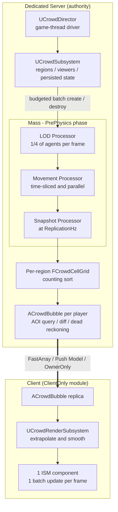
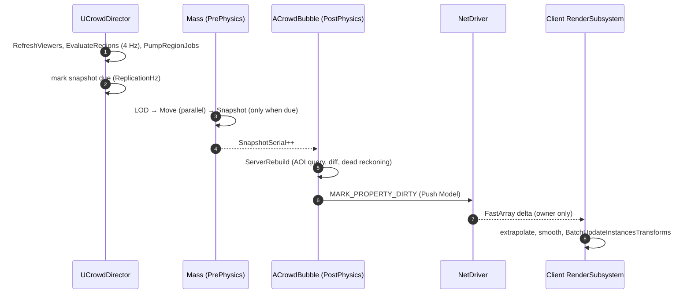

# MassBubble - UE 5.8 MassEntity

**Unreal Engine 5.8 데디케이티드 대규모 서버 최적화 샘플**

서버 권위(Server-Authoritative) **Mass Entity** 시뮬레이션 · 플레이어별 **AOI(Area of Interest) 복제** · 클라이언트 **ISM 배칭 렌더링**


---

## 목차

- [개요](#개요)
- [핵심 요약](#핵심-요약)
- [아키텍처](#아키텍처)
- [구현 상세](#구현-상세)
- [계측과 실험 설계](#계측과-실험-설계)
- [검증 (Automation Tests)](#검증-automation-tests)
- [설계 수치](#설계-수치)
- [시작하기](#시작하기)
- [설정](#설정)
- [Trade-off와 한계](#trade-off와-한계)
- [코드 맵](#코드-맵)

---

## 개요

수천~수만 규모의 대규모 NPC를 **데디케이티드 서버에서 시뮬레이션**하고, 접속한 각 플레이어에게 **자기 주변(AOI)만** 복제하는 파이프라인의 레퍼런스 구현입니다.

NPC 규모가 커져도 아래 세 가지 비용이 모두 **관측 가능한 상한**을 갖도록 설계했습니다. 모든 최적화는 CVar 킬스위치로 개별 on/off 할 수 있어, 시뮬레이션을 통해서 확인합니다.

| 비용 축 | Naive 구현 (Actor-per-NPC) | MassBubble 프로젝트 |
|---|---|---|
| 서버 CPU · 시뮬레이션 | NPC마다 Actor/Component Tick, 전원을 매 프레임 갱신 | Mass chunk 단위 연속된 배열로 처리, 거리 기반 LOD + time-slicing, 병렬 chunk 처리 |
| 서버 CPU · 대역폭 · 복제 | NPC마다 ActorChannel, 프로퍼티 비교, 풀 상태 전송 | **플레이어당 Actor 1개**, Push Model, FastArray delta, Dead reckoning, 10 B 양자화 레코드 |
| 클라이언트 · 렌더링 | NPC마다 Actor + Component + Draw call | **ISM 1개**, 프레임당 batch update 1회 |

**Non-goals** — AI(행동 트리 · 길찾기 · 충돌 회피), 애니메이션, 외부 저장소 저장, 안티치트는 범위 밖입니다. NPC 로직은 의도적으로 단순하게 움직이며, 최적화 대상 파이프라인(시뮬레이션 → 스냅샷 → 복제 → 렌더)을 검증하기 위한 워크로드 역할만 합니다.

---

## 핵심 요약

| 영역 | 접근 방식 | 효과 | 주요 파일 |
|---|---|---|---|
| 시뮬레이션 | 접근 패턴 단위 fragment 분리, 단일 Archetype, **LOD를 값(fragment)으로 저장** | Cache Miss 방지를 위한 연속 배열 접근, LOD 변경 시 메모리 성능 오버헤드를 유발하는 무거운 재배치 연산(Structural Change)을 원천 차단하도록 설계 | `CrowdFragments.h` |
| 시뮬레이션 | 거리 기반 **LOD + time-slicing** (1 / 2 / 6 / 0 프레임) + hysteresis | 기본 설정 · 뷰어 1명 기준 실제 이동 연산 **≈ 830 / 10,000** (해석적 추정) | `CrowdProcessors.cpp`, `CrowdMath.h` |
| 시뮬레이션 | `ParallelForEachEntityChunk`, chunk-local write | Worker thread 분산, lock 불필요 | `CrowdProcessors.cpp` |
| 스트리밍 | **Region 소유 상태** + 프레임 버짓 기반 spawn/despawn + 결정론적 복원 | WP 셀 unload/reload와 무관, spawn으로 인한 프레임 드랍 방지 | `CrowdSubsystem.cpp` |
| 공간 질의 | Region별 균일 격자 + **counting sort** 재구축 | build O(N + cells), warm-up 이후 할당 없음, 월드 크기와 무관 | `CrowdCellGrid.h` |
| 복제 | **플레이어당 Actor 1개** (`bOnlyRelevantToOwner` + `COND_OwnerOnly`) + **Push Model** | NPC당 ActorChannel 제거, dirty가 없으면 비교 비용 0 | `CrowdBubble.cpp` |
| 복제 | int16 / int8 **양자화** + 200 m 격자 **origin rebasing** | agent당 **10 B** (naive ≈ 52 B 대비 −81%) | `CrowdNetMath.h` |
| 복제 | **Dead reckoning** (거리별 허용 오차) | 등속 직진 agent는 재전송 0. 시뮬레이션 테스트가 naive 대비 메시지 **15% 미만**을 assert | `CrowdNetMath.h`, `CrowdTests.cpp` |
| 클라이언트 | 외삽 + 지수 보간 + **ISM 1개 batch update** | 400 agent = Actor 1 / Component 1 / 렌더 상태 갱신 1회 | `CrowdRenderSubsystem.cpp` |
| 빌드 | **`ClientOnly` 모듈 분리** | 서버 타깃에 렌더 모듈이 포함되지 않음 | `MassBubble*.Target.cs` |
| 검증 | CVar 킬스위치, stat / CSV / Insights 통합 계측, Automation Test 4종 | 최적화를 측정하고 불변식을 증명 | `CrowdSettings.cpp`, `MassBubbleStats.h`, `CrowdTests.cpp` |

---

## 아키텍처

### 구성도



### 데이터 흐름



### 스레딩 모델

| 컴포넌트 | 실행 위치 | 근거 |
|---|---|---|
| `UCrowdDirector`, `UCrowdSubsystem` | Game thread | Entity create/destroy 같은 structural change는 Mass 처리 중에는 불가 → `IsProcessing()` 확인 후 실행 |
| `UCrowdLODProcessor` | Game thread (`bRequiresGameThreadExecution`) | Game-thread-only 서브시스템(뷰어 목록)에 접근 |
| `UCrowdMovementProcessor` | Worker threads (`ParallelForEachEntityChunk`) | 자기 chunk 데이터만 write, 설정은 불변 POD 스냅샷으로 read |
| `UCrowdSnapshotProcessor` | Game thread | 서브시스템이 소유한 region grid에 write |
| `ACrowdBubble::Tick` | Game thread, `TG_PostPhysics` | PrePhysics Mass phase가 만든 스냅샷을 같은 프레임에 소비 |
| `UCrowdRenderSubsystem::Tick` | Client game thread | ISM transform 갱신 |

### 설계 원칙

- **서버만 원본 상태를 소유** — Mass entity는 서버 / standalone에서만 존재합니다 (`ExecutionFlags`, `ShouldCreateSubsystem`). 클라이언트는 양자화된 AOI 뷰만 가집니다.
- **액터 외부 상태 분리** — NPC 상태의 소유자는 Actor가 아니라 Region(서버 서브시스템)입니다. World Partition 셀 스트리밍과 생명주기가 분리됩니다.
- **최적화 항목마다 비활성화 수단(킬 스위치) 구현** — A/B 측정이 가능해야 최적화를 증명할 수 있습니다.
- **순수 로직은 헤더 온리(Header-Only)로 구현** — `CrowdMath.h`, `CrowdCellGrid.h`, `CrowdNetMath.h`는 월드 · Mass · 네트워크 없이 단위 테스트됩니다.
- **유효하지 않은 상태는 설계 단계에서 원천 차단** — 설정값을 불변식에 맞게 clamp 합니다 (예: bubble 반경은 int16 안전 범위 이하).

---
## 구현 상세

### 1. Data-Oriented 시뮬레이션 (Mass Entity)

agent는 단일 Archetype(`FCrowdAgentTag` + fragment 4종)으로 표현합니다. fragment를 **접근 패턴 단위**로 쪼개, LOD 패스는 `Location`을 읽어 `LOD`만 쓰고, 이동 패스는 `Location` · `Motion` · `PendingDelta`를 갱신하며, snapshot 패스는 전부 읽기 전용으로 접근합니다. Mass는 chunk 안에 fragment별 연속된 배열로 저장하므로 쓰지 않는 데이터가 캐시 라인을 오염시키지 않고, 프로세서의 읽기/쓰기 선언(`EMassFragmentAccess`)을 통해 안전한 병렬 처리를 위한 데이터 의존성 관계가 확립됩니다.

```cpp
// Crowd/CrowdFragments.h (요약) — 합계 56 B / agent
struct FCrowdAgentTag         : FMassTag      {};
struct FCrowdIdFragment       : FMassFragment { uint32 NetId; int32 HomeX; int32 HomeY; int32 RegionSlot; };  // 16 B, read-mostly
struct FCrowdLocationFragment : FMassFragment { FVector2D Location; };                                        // 16 B, double (LWC)
struct FCrowdMotionFragment   : FMassFragment { FVector2f Velocity; float RetargetTimer; uint32 Rng; };      // 16 B
struct FCrowdLODFragment      : FMassFragment { ECrowdLOD Tier; float PendingDelta; };                        //  8 B
```

- **LOD는 Tag가 아니라 Fragment 값입니다.** Tag 추가/제거는 Archetype 간 이동(structural change)이지만, 값 쓰기는 O(1)입니다.
- **`RegionSlot` 인덱스**로 snapshot 패스에서 agent당 hash lookup을 제거했습니다.
- **`FVector2D`(double) 위치**는 LWC(Large World Coordinates)에 안전하며, 양자화는 복제 경계에서만 수행합니다.
- 첫 agent는 런타임에 spawn되므로 시작 시점에는 매칭되는 Archetype이 없고, Mass는 매칭되는 Archetype이 없는 프로세서를 **최적화 대상에서 제외**(Query Pruning)합니다. 세 프로세서 모두 `ShouldAllowQueryBasedPruning()`이 `false`를 반환하고, 최초 spawn은 tickable subsystem(`UCrowdDirector`)이 초기화 및 트리거 역할을 수행합니다.

### 2. Region 기반 Population 스트리밍

NPC 상태의 소유자를 Actor가 아니라 서버 서브시스템의 **Region**으로 두었습니다 (기본 128 m — World Partition 런타임 그리드 셀 크기와 맞추도록 설계). World Partition 셀이 unload/reload 되어도 NPC가 사라지거나 초기화되지 않습니다.

```cpp
// Crowd/CrowdSubsystem.h
enum class ECrowdRegionState : uint8
{
	Inactive,   // 엔티티가 없으며, 보존된 압축 상태만 남음
	Spawning,   // 엔티티가 슬라이스 단위로 생성되는 중 (프레임당 할당된 생성 제한에 맞춤)
	Active,     // 엔티티가 배치가 완료되었고 시뮬레이션이 활성화된 상태
	Despawning, // 상태를 파일에 저장하고 엔티티를 차례대로 소멸시키는 중
};
```

```cpp
// Crowd/CrowdSubsystem.cpp — TickDirector / PumpRegionJobs
// Mass 프레임워크가 프로세싱 중이 아닐 때만 구조적 변경(생성 / 소멸)이 허용됩니다.
if (!EntityManager->IsProcessing())
{
	PumpRegionJobs();
}

int32 SpawnBudget = T.MaxSpawnPerFrame;
while (SpawnBudget > 0 && SpawnQueue.Num() > 0)
{
	FCrowdRegion& Region = Regions[SpawnQueue[0]];
	// BatchCreateEntities(엔티티 일괄 생성)
	SpawnBudget -= SpawnSlice(Region, SpawnBudget);
	if (Region.State == ECrowdRegionState::Active) { SpawnQueue.RemoveAt(0); }
	else { break; }  // 현재 프레임별 스폰 한도를 모두 소모함, 다음 프레임에 이어서 진행
}
```

- **스트리밍 대상 연산** — 각 뷰어(플레이어 및 가상 뷰어) 주변 체비쇼프(Chebyshev) 반경을 중심으로 `ActiveRegionRadius`(기본 2 → 5×5)를 **4 Hz** 주기로 활성화 대상을 실시간으로 관리합니다.
- **우선순위** — 새로 활성화할 region은 가장 가까운 뷰어 기준 오름차순으로 처리해 플레이어 주변부터 채웁니다.
- **비활성화 유예 (Hysteresis 완충 처리)** — 더 이상 필요 없는 region은 `RegionDeactivateDelaySec`(10초) 동안 유지한 뒤 despawn 처리합니다. 이를 통해 영역 경계를 반복해서 오가는 플레이어로 인해 발생하는 불필요한 Spawn/Despawn 처리를 방지합니다.
- **프레임 버짓 기반 타임슬라이싱 (Time-slicing)** — 프레임당 spawn 500 / despawn 1,000 (`BatchCreateEntities` / `BatchDestroyEntities`)으로 프레임 드롭(Hitch)을 방지합니다.
- **결정론적 복원** — despawn 시 `FCrowdSavedAgent`(NetId, 위치, 속도, retarget timer, RNG state)를 저장하고 재활성화 때 그대로 복원합니다. 최초 생성은 `Seed = Hash32(regionCoordHash ^ WorldSeed)`와 agent별 xorshift32로 재현 가능합니다.

### 3. 거리 기반 LOD와 Time-slicing

| Tier | 거리 (가장 가까운 뷰어 기준) | 시뮬레이션 주기 |
|---|---|---|
| High | < 40 m | 매 프레임 |
| Medium | 40 – 100 m | 2 프레임마다 |
| Low | 100 – 200 m | 6 프레임마다 |
| Off | ≥ 200 m | 동결 |

```cpp
// Crowd/CrowdMath.h — hysteresis 완충 구역을 적용한 LOD 티어 계산
inline ECrowdLOD ComputeTier(float Dist, ECrowdLOD Current, const FCrowdTuning& T)
{
	const ECrowdLOD Wanted =
		Dist < T.LODDistanceCm[0] ? ECrowdLOD::High :
		Dist < T.LODDistanceCm[1] ? ECrowdLOD::Medium :
		Dist < T.LODDistanceCm[2] ? ECrowdLOD::Low : ECrowdLOD::Off;

	if (Wanted == Current) { return Current; }
  
	// 더 하위 티어로 전환: '경계선 + 완충 거리(Hysteresis)'를 초과해야만 전환
	if (static_cast<uint8>(Wanted) > static_cast<uint8>(Current))
	{
		return Dist > T.LODDistanceCm[static_cast<int32>(Current)] + T.LODHysteresisCm ? Wanted : Current;
	}
	// 더 상위(세밀한) 티어로 전환: '경계선 - 완충 거리(Hysteresis)' 안으로 진입해야만 전환
	return Dist < T.LODDistanceCm[static_cast<int32>(Wanted)] - T.LODHysteresisCm ? Wanted : Current;
}
```

```cpp
// Crowd/CrowdProcessors.cpp — UCrowdMovementProcessor : 티어별 타임슬라이싱(Time-slicing) 수행
// 0 = 동결, 1 = 매 프레임 업데이트, N = N 프레임마다 업데이트 (NetId를 기준으로 에이전트들을 여러 프레임에 균등 분산)
const int32 Interval = bTimeSlice ? Tuning.LODIntervalFrames[static_cast<int32>(LOD.Tier)] : 1;
if (Interval == 0) { continue; }
if (Interval > 1 && ((Frame + Ids[i].NetId) % static_cast<uint32>(Interval)) != 0u)
{
	LOD.PendingDelta += DeltaTime;   // 업데이트가 스킵된 프레임의 누적 델타 시간을 기록
	continue;
}
const float Step = FMath::Min(LOD.PendingDelta + DeltaTime, Tuning.MaxStepDeltaSec);
LOD.PendingDelta = 0.f;

```

- **LOD 분산 처리(Time-slicing)** — 에이전트 NetId와 프레임 카운트에 비트 연산(& 3)을 적용해서 매 프레임 전체의 1/4씩만 LOD를 재분류하여 CPU 스파이크 방지합니다.
- **델타 시간 누적 및 상한 제어** — 스킵된 프레임 시간을 누적해 다음 업데이트 때 일괄 연산하되, 상한선(MaxStepDeltaSec, 0.5초)을 두어 순간이동 현상 방지합니다.
- **시각적 불일치(Desync) 차단** — 동결(Off 티어)된 에이전트의 스냅샷 속도를 0으로 강제하여, 클라이언트 외삽(Extrapolation) 시 멈춘 NPC가 걸어 다니는 시각적 오류 차단합니다.

```cpp
// Crowd/CrowdProcessors.cpp — UCrowdSnapshotProcessor
// 클라이언트 측 외삽(Extrapolation)으로 인해 서버에서 동결된 에이전트가 이동하는 시각적 오류를 방지하고자, Off 티어는 속도를 0으로 강제함
const FVector2f Velocity = (LODs[i].Tier == ECrowdLOD::Off) ? FVector2f::ZeroVector : Motions[i].Velocity;
```

### 4. 병렬 이동 처리

Movement Processor는 `bRequiresGameThreadExecution = false`이며 `ParallelForEachEntityChunk`로 chunk를 worker thread에 분산합니다.

```cpp
// Crowd/CrowdProcessors.cpp — UCrowdMovementProcessor::Execute
std::atomic<int32> Simulated{ 0 };

// 자체 Chunk의 데이터만 수정하므로, 여러 Chunk에서 병렬로 안전하게 실행할 수 있습니다.
auto ProcessChunk = [&](FMassExecutionContext& ChunkContext)
{
	int32 LocalSimulated = 0;
	// ... agent 루프: time-slicing(시간 분할) → 배회 → 물리 상태 반영 → 홈 구역 경계에서 반영
	Simulated.fetch_add(LocalSimulated, std::memory_order_relaxed);   // chunk당 atomic 1회
};

if (CrowdCVars::ParallelMove != 0) { EntityQuery.ParallelForEachEntityChunk(Context, ProcessChunk); }
else                               { EntityQuery.ForEachEntityChunk(Context, ProcessChunk); }
```

- **Thread-safety 근거** — (1) chunk-local write만 수행, (2) 설정은 UObject가 아니라 불변 POD 스냅샷 `FCrowdTuning`에서 읽음, (3) RNG state가 agent별 fragment 안에 있어 공유 난수 생성기가 없음, (4) 통계 카운터는 chunk 단위로 모아 atomic 1회.
- `UCrowdSubsystem`은 `TMassExternalSubsystemTraits`에서 `GameThreadOnly = true`로 선언해, 이 서브시스템을 요구하는 프로세서(LOD, Snapshot)가 game thread에서만 접근하도록 명시합니다.

### 5. Snapshot과 공간 격자

복제 계층이 Mass `EntityManager`를 직접 순회하지 않도록, Snapshot Processor가 `ReplicationHz`(기본 10 Hz)마다 위치 · 속도 · ID를 region별 평탄(flat) 배열로 복사합니다. 스냅샷이 필요 없는 프레임은 쿼리를 아예 실행하지 않고 반환합니다.

```cpp
// Crowd/CrowdProcessors.cpp — UCrowdSnapshotProcessor::Execute
UCrowdSubsystem* Crowd = Context.GetMutableSubsystem<UCrowdSubsystem>();
if (Crowd == nullptr || !Crowd->IsSnapshotDue())
{
	return; 
}
```

Region(128 m)마다 8×8 셀(셀 16 m)의 **균일 격자**를 두고, 스냅샷마다 **counting sort**로 처음부터 다시 만듭니다.

```cpp
// Crowd/CrowdCellGrid.h — EndBuild
for (int32 i = 0; i < Num; ++i)                      // 히스토그램 (셀별 에이전트 수 카운트)
{
	const int32 Cell = CellIndex(Agents[i].Pos);
	CellOfAgent[i] = Cell;
	++CellStart[Cell + 1];
}
for (int32 c = 0; c < NumCells; ++c)                 // 셀별 시작 offset 계산
{
	CellStart[c + 1] += CellStart[c];
}
// ... Cursor = copy of CellStart
for (int32 i = 0; i < Num; ++i)                      // 셀 정렬 순서대로 에이전트 인덱스 배치
{
	Order[Cursor[CellOfAgent[i]]++] = i;
}
```

- **복잡도** — build O(N + cells), 질의 O(방문 셀 + 그 안의 agent). 배열은 `Reset()` / `EAllowShrinking::No`로 재사용하므로 warm-up 이후 할당이 없습니다.
- **Region별 격자인 이유** — 격자가 작아(8×8) 캐시에 상주하고, 월드가 수십 km여도 비용이 늘지 않습니다. 전역 단일 dense 격자는 수 km 떨어진 플레이어들을 모두 덮는 bounding box가 필요합니다.
- **질의** — 원의 AABB(사각형) → 셀 범위 → 제곱거리(`sqrt` 없음)로 정확한 원 판정. region 밖으로 삐져나온 agent는 경계 셀로 clamp되어 **유실되지 않으며**, 이 성질은 테스트로 검증합니다.

### 6. 플레이어별 AOI 복제 — `ACrowdBubble`

400명짜리 이웃을 400개의 replicated Actor로 만들지 않고, **플레이어당 Actor 1개**가 AOI 전체를 FastArray로 복제합니다 (Epic의 MassReplication 플러그인이 쓰는 Client Bubble 계열의 접근과 같은 아이디어를 최소 구현으로 작성했습니다).

```cpp
// Net/CrowdBubble.cpp — 생성자와 복제 프로퍼티
ACrowdBubble::ACrowdBubble()
{
	bReplicates = true;
	bOnlyRelevantToOwner = true;        // 소유 클라이언트에게만 relevant
	bAlwaysRelevant = false;
	bNetLoadOnClient = false;
	SetNetUpdateFrequency(20.f);        // Push Model이 비교 대상을 결정 → dirty가 없으면 비용 0
	SetMinNetUpdateFrequency(2.f);
	PrimaryActorTick.TickGroup = TG_PostPhysics;   // PrePhysics Mass phase가 만든 snapshot을 같은 프레임에 소비
}

void ACrowdBubble::GetLifetimeReplicatedProps(TArray<FLifetimeProperty>& OutLifetimeProps) const
{
	Super::GetLifetimeReplicatedProps(OutLifetimeProps);

	FDoRepLifetimeParams Params;
	Params.bIsPushBased = true;
	Params.Condition = COND_OwnerOnly;
	DOREPLIFETIME_WITH_PARAMS_FAST(ACrowdBubble, AgentArray, Params);
	DOREPLIFETIME_WITH_PARAMS_FAST(ACrowdBubble, OriginLattice, Params);
}
```

`ServerRebuild()`는 `SnapshotSerial`이 바뀐 프레임(≈ `ReplicationHz`)에만 실행되며 네 단계로 구성됩니다.

1. **기준점 이동** — 뷰어가 origin에서 110 m를 넘어 벗어났을 때만 갱신합니다.
2. **관심구역 필터링** — `ForEachAgentInCircle`로 반경 내 후보를 모으고, `MaxAgentsPerBubble`(400)을 넘으면 거리순 상위 N개만 남깁니다.
3. **진입/유지/이탈 판정** — `NetId → index` 맵과 epoch mark-and-sweep으로 진입 / 유지 / 이탈을 판정합니다.
4. **Dirty 마킹** — 바뀐 item만 `MarkItemDirty`, 구조가 바뀌면 `MarkArrayDirty`, 마지막에 Push Model dirty.

```cpp
// Net/CrowdBubble.cpp — ServerRebuild (요약)
++Epoch;
for (const FCandidate& Candidate : Candidates)
{
	const int32* IndexPtr = IdToIndex.Find(Agent.NetId);
	if (IndexPtr == nullptr)                          // 1) interest set에 진입
	{
		const int32 NewIndex = Items.AddDefaulted();
		FillItem(Items[NewIndex], Agent, OriginWorld, Now);
		Items[NewIndex].SeenEpoch = Epoch;
		IdToIndex.Add(Agent.NetId, NewIndex);
		AgentArray.MarkItemDirty(Items[NewIndex]);
		++NumDirty;
		bStructural = true;
		continue;
	}

	FCrowdAgentItem& Item = Items[*IndexPtr];         // 2) 유지: 클라이언트의 믿음에서 벗어났을 때만 재전송 (§8)
	Item.SeenEpoch = Epoch;
	if (bRebase || CrowdNet::ShouldResend(Agent.Pos, Agent.Vel, Item.SentPos, Item.SentVel,
	                                      Now - Item.SentTime, Tolerance, Tuning.VelocityEpsCmPerSec))
	{
		FillItem(Item, Agent, OriginWorld, Now);
		AgentArray.MarkItemDirty(Item);
		++NumDirty;
	}
}

for (int32 i = Items.Num() - 1; i >= 0; --i)         // 3) 이탈: swap-remove, 항목당 O(1)
{
	if (Items[i].SeenEpoch == Epoch) { continue; }
	IdToIndex.Remove(Items[i].NetId);
	Items.RemoveAtSwap(i);
	if (i < Items.Num()) { IdToIndex[Items[i].NetId] = i; }   // 마지막 요소가 i로 이동했다
	bStructural = true;
}

if (bStructural)                 { AgentArray.MarkArrayDirty(); }
if (bStructural || NumDirty > 0) { MARK_PROPERTY_DIRTY_FROM_NAME(ACrowdBubble, AgentArray, this); }
// Push Model: 이 호출이 없으면 프로퍼티는 비교조차 되지 않는다 (FastArray의 MarkItemDirty와는 별개)
```

> `opt.crowd.DeadReckoning 0`이면 `ShouldResend` 대신 "움직이거나 방금 멈춘 agent는 매 tick 재전송"하는 naive baseline 경로가 실행됩니다 (A/B 측정용).

### 7. 와이어 포맷 (Wire Format) — 데이터 양자화 및 격자 원점 설정

| 필드 | 타입 | 크기 | 단위 / 범위 |
|---|---|---|---|
| `NetId` | `uint32` | 4 B | 안정 ID (region이 despawn → respawn 되어도 유지) |
| `X`, `Y` | `int16` × 2 | 4 B | bubble origin 기준 오프셋, 1 cm 단위, ±327 m |
| `VX`, `VY` | `int8` × 2 | 2 B | 5 cm/s 단위, ±635 cm/s |
| **합계** | | **10 B** | FastArray per-item 헤더 별도 |

최적화 전 방식(`FVector` 위치 24 B + `FVector` 속도 24 B + `int32` id ≈ **52 B**) 대비 약 **81% 감소**입니다.

```cpp
// Net/CrowdBubble.h (요약) — UPROPERTY가 없는 필드는 복제되지 않는 양쪽 bookkeeping
USTRUCT()
struct FCrowdAgentItem : public FFastArraySerializerItem
{
	GENERATED_BODY()

	UPROPERTY() uint32 NetId = 0;
	UPROPERTY() int16  X = 0;     // 1 cm 단위, 격자 원점(Origin) 기준 오프셋
	UPROPERTY() int16  Y = 0;
	UPROPERTY() int8   VX = 0;    // 5 cm/s 단위
	UPROPERTY() int8   VY = 0;

	// server only: 클라이언트가 현재 믿고 있는 값 (dequantized)
	FVector2D SentPos; FVector2f SentVel; double SentTime = 0.0; uint32 SeenEpoch = 0;
	// client (and standalone): 수신 시각, 외삽의 기준
	double RecvTime = 0.0;
};
```

int16 오프셋의 한계(±327.67 m)를 극복하고 네트워크 대역폭(패킷 크기)을 극단적으로 줄이기 위해서 위치 데이터는 **200 m 격자에 스냅(Snap)된 버블별 기준 원점의 상대 좌표**로 전송합니다.
시스템이 보장하는 불변 조건은 다음과 같습니다.
- 뷰어는 원점(Origin) 기준 항상 ≤ 110 m (RebaseDistanceCm)
- 에이전트는 뷰어 기준 항상 ≤ 210 m (MaxBubbleRadiusCm)
- 결과: 최대 오프셋은 320 m이므로, int16 데이터 범위(< 327.67 m)를 안전하게 만족합니다.
- 버블별 기준 원점은 `ACrowdBubble`에 `FIntPoint OriginLattice` 형식으로 저장됩니다.
```cpp
// Net/CrowdNetMath.h
constexpr double OriginLatticeCm   = 20000.0;  // origin을 200 m 격자에 snap
constexpr double RebaseDistanceCm  = 11000.0;  // 110 m: 격자 반칸(100 m) + 10 m hysteresis
constexpr float  MaxBubbleRadiusCm = 21000.f;  // 110 m + 210 m = 320 m < 327.67 m (int16 @ 1 cm)

FORCEINLINE int16 QuantizeOffset(double RelativeCm)
{
	return static_cast<int16>(FMath::Clamp(FMath::RoundToInt(RelativeCm / PosUnitCm), -32768, 32767));
}

/** True when the viewer has left the safe zone around the current origin and the origin has to move (full resend). */
FORCEINLINE bool NeedsRebase(const FVector2D& Viewer, const FVector2D& OriginWorld)
{
	return FMath::Max(FMath::Abs(Viewer.X - OriginWorld.X), FMath::Abs(Viewer.Y - OriginWorld.Y)) > RebaseDistanceCm;
}
```

```cpp
// Crowd/CrowdSettings.cpp — 잘못된 설정이 불변식을 깨지 못하도록 clamp
Out.BubbleRadiusCm = FMath::Clamp(S.BubbleRadiusCm, 1000.f, CrowdNet::MaxBubbleRadiusCm);
```
- **원점 재설정**(Origin Rebase) 최적화
	- Rebase는 플레이어 대상 전체 재전송을 유발하므로 비용이 높습니다. 격자 경계의 플레이어 지터링으로 인한 빈번한 원점 교체를 방지하고자 10m의 히스테리시스를 적용했습니다.
	- 테스트 결과: ±3m 지터 환경에서 단순 반올림(Naive) 방식은 매 스텝마다 원점이 Flip 되었지만, 히스테리시스 적용 시 Rebase 0회 기록.
- **패킷 제외를 통한 대역폭 최적화**:
	- Yaw: 클라이언트가 이동 속도 방향(정지 시 NetId 해시)으로 자체 유도.
	- Z: 평면 월드 기반의 클라이언트 설정값 적용.
	- Sent* / SeenEpoch: 서버 내부 로직용(Server-Only) 변수로 패킷 전송 제외.

### 8. 데드 레코닝 (Dead Reckoning)

- **클라이언트**: 최신 수신 데이터를 바탕으로 SentPos + SentVel × Δt 연산을 수행해 실시간 위치를 외삽(Extrapolation)합니다.
- **서버**: 서버가 시뮬레이션하는 클라이언트의 예측값이 실제 위치(True Position) 기준 허용 오차를 벗어나거나, 에이전트의 속도가 크게 변한 경우에만 데이터를 재전송(네트워크 갱신)합니다.

```cpp
// Net/CrowdNetMath.h
inline bool ShouldResend(
	const FVector2D& TruePos, const FVector2f& TrueVel,
	const FVector2D& SentPos, const FVector2f& SentVel,
	double SecondsSinceSent, float ToleranceCm, float VelocityEpsCmPerSec)
{
	const FVector2D Predicted = SentPos + FVector2D(SentVel.X, SentVel.Y) * SecondsSinceSent;
	if (FVector2D::DistSquared(TruePos, Predicted) > static_cast<double>(ToleranceCm) * ToleranceCm)
	{
		return true;
	}

	const FVector2f DeltaV = TrueVel - SentVel;
	return DeltaV.SizeSquared() > VelocityEpsCmPerSec * VelocityEpsCmPerSec;
}
```

```cpp
// Net/CrowdBubble.cpp — FillItem: 양자화 round-trip
// 양자화 처리 후 복원된 값 기준: 데드 레코닝 오차 검사는 클라이언트가 인지하는 값(예측치)과 비교해야 합니다.
Item.SentPos = OriginWorld + FVector2D(CrowdNet::DequantizeOffset(Item.X), CrowdNet::DequantizeOffset(Item.Y));
Item.SentVel = FVector2f(CrowdNet::DequantizeVelocity(Item.VX), CrowdNet::DequantizeVelocity(Item.VY));
```

```cpp
// Net/CrowdBubble.cpp — 클라이언트 절반: 수신 상태 + 속도 × 경과 시간 
FVector2D FCrowdAgentItem::GetExtrapolatedPosition(const FVector2D& OriginWorld, double Now, double MaxExtrapolationSec) const
{
	const double Elapsed = FMath::Clamp(Now - RecvTime, 0.0, MaxExtrapolationSec);
	const FVector2D Base = OriginWorld + FVector2D(CrowdNet::DequantizeOffset(X), CrowdNet::DequantizeOffset(Y));
	const FVector2f Vel = GetVelocity();
	return Base + FVector2D(Vel.X, Vel.Y) * Elapsed;
}
```

- **서버 상태 비용** — agent × 플레이어마다 `SentPos` / `SentVel` / `SentTime`을 서버가 보유합니다 (복제되지 않는 bookkeeping).
- **양자화 round-trip** — 양자화 오차까지 포함해, 클라이언트가 보는 값과 같은 기준으로 비교합니다.
- **거리별 허용 오차** — 30 m 이내 `NearErrorCm`(30 cm), 그 밖 `FarErrorCm`(150 cm). 가까운 agent는 부드러움, 먼 agent는 대역폭을 우선합니다.
- **속도 임계(25 cm/s)** — 방향 전환이 위치 오차로 드러나기 전에 선제적으로 재전송합니다.
- **외삽 상한** — `MaxExtrapolationSec`(1.5초). 연결이 멈춰도 agent가 멀리 움직이지 않습니다.

### 9. 클라이언트 렌더링

`UCrowdRenderSubsystem`이 매 프레임 (1) 외삽, (2) 보간, (3) 단일 ISM에 batch write를 수행합니다.

```cpp
// MassBubbleRender/CrowdRenderSubsystem.cpp — Tick
const double Alpha = (Settings->SmoothingRate > 0.f)
	? 1.0 - FMath::Exp(-static_cast<double>(Settings->SmoothingRate) * static_cast<double>(DeltaTime))
	: 1.0;                                            // 프레임 레이트에 독립적인 지수 보간

for (int32 Index = 0; Index < Count; ++Index)
{
	const FCrowdAgentItem& Item = Items[Index];
	const FVector2D Target = Item.GetExtrapolatedPosition(Origin, Now, MaxExtrapolation);   // dead reckoning, client half
	// ... Visuals(NetId)로 Target을 향해 glide. 첫 등장 / 재진입은 snap
	Transforms.Emplace(FRotator(0.0, Yaw, 0.0), FVector(Shown.X, Shown.Y, Z), Scale);
}

// one call, one render-state update for the whole crowd
Instances->BatchUpdateInstancesTransforms(0, Transforms, /*bWorldSpace=*/false, /*bMarkRenderStateDirty=*/true, /*bTeleport=*/true);
```

- **`ACrowdRenderHost`** — Transient, 비복제, Tick 없음, 충돌 없음. 단일 `UInstancedStaticMeshComponent`만 보유합니다.
- **보간 처리** — `α = 1 − e^(−k·Δt)` (k = `SmoothingRate`, 기본 15/s). 프레임레이트와 무관한 지수 보간식입니다. 데드 레코닝 위치 보정 시 캐릭터가 순간 이동하듯 튀는 현상을 방지합니다.
- **재진입 처리** — `Epoch`를 통해 직전 프레임의 렌더링 여부를 판단합니다. 이를 통해 버블(Bubble) 범위에 다시 들어온 에이전트가 이전 위치에서부터 미끄러지듯 날아오는 오작동을 방지하고, 현재 위치로 즉시 이동시킵니다.
- **버퍼 재사용** — `Transforms` 배열은 warm-up 이후 할당이 없고, 인스턴스 수가 변하더라도 뒤에서부터 add/remove 하므로 생존 인스턴스의 인덱스가 바뀌지 않습니다.
- **단일 코드 경로** — standalone / listen host에서도 동일하게 동작합니다. Authoritive 측은 `FCrowdAgentItem::PostReplicatedAdd*` 콜백을 받지 않으므로 `FillItem` 단계에서 `RecvTime`을 직접 기록하도록 처리했습니다.
- **Nanite 미사용** — 단순한 저폴리곤 실린더 메시를 사용하므로 Nanite가 고폴리곤 지오메트리를 처리할 때 발생하는 최적화 오버헤드가 필요하지 않습니다.

### 10. 모듈 분리 — `ClientOnly`

렌더링 코드는 `MassBubbleRender`(ClientOnly) 모듈에 두고, 서버 타깃에는 포함하지 않습니다.

```csharp
// MassBubbleServer.Target.cs
public class MassBubbleServerTarget : TargetRules
{
	public MassBubbleServerTarget(TargetInfo Target) : base(Target)
	{
		Type = TargetType.Server;
		ExtraModuleNames.Add("MassBubble");      // 서버 타켓에서 명시적으로 MassBubbleRender 모듈 제외
		bUseLoggingInShipping = true;           // 원인 분석을 위해 Shipping 서버에도 로그 유지
	}
}
```

```cpp
// MassBubbleRender/CrowdRenderSubsystem.cpp — 명시적으로 서버에서는 생성되지 않도록 이중 방어
bool UCrowdRenderSubsystem::ShouldCreateSubsystem(UObject* Outer) const
{
	if (!Super::ShouldCreateSubsystem(Outer)) { return false; }
	if (IsRunningDedicatedServer() || IsRunningCommandlet()) { return false; }
	const UWorld* World = Cast<UWorld>(Outer);
	return World != nullptr && World->GetNetMode() != NM_DedicatedServer;
}
```

| Target | Type | 로드되는 모듈 | 용도 |
|---|---|---|---|
| `MassBubbleServer` | Server | `MassBubble` | 데디케이티드 서버 |
| `MassBubbleClient` | Client | `MassBubble`, `MassBubbleRender` | 서버 접속용 클라이언트 |
| `MassBubble` | Game | `MassBubble`, `MassBubbleRender` | Standalone / listen server |
| `MassBubbleEditor` | Editor | `MassBubble`, `MassBubbleRender` | PIE에서 *dedicated server + N clients*를 한 프로세스로 실행 |

참고: 렌더 모듈은 자체 stat group(`STATGROUP_OptRender`)과 CSV category(`OptRender`)를 정의합니다. `MassBubble` 모듈의 CSV category 심볼을 모듈 경계 너머로 `dllimport` 하는 비용을 피하기 위해서입니다.

### 11. World Partition Streaming Anchor

서버 스트리밍(`wp.Runtime.EnableServerStreaming=1`)에서는 기본적으로 PlayerController만 streaming source이므로, 아무도 보고 있지 않은 AI 전용 구역은 unload 됩니다. `AMassBubbleStreamingAnchor`는 **한 위치에 (1) WP streaming source와 (2) crowd viewer 등록**을 함께 걸어, 셀 스트리밍과 NPC population이 같은 기준으로 움직이게 합니다.

```cpp
// World/MassBubbleStreamingAnchor.cpp — BeginPlay 
if (World->GetNetMode() == NM_Client)
{
	// 배치된 앵커는 클라이언트의 레벨 복사본에도 존재합니다. 클라이언트에서는 스트리밍을 수행해서는 안 됩니다.
	SetActorTickEnabled(false);
	StreamingSource->DisableStreamingSource();
	return;
}

if (bStreamWorldPartition)  { StreamingSource->EnableStreamingSource(); }
if (bRegisterAsCrowdViewer) { Crowd->RegisterVirtualViewer(this); }   // 이 위치 주변 population 유지
```

- **서버 전용 virtual viewer**라서 `ACrowdBubble`을 갖지 않습니다. 복제 비용 없이 *시뮬레이션 · region 스트리밍 · WP 스트리밍* 부하만 재현하는 **부하 테스트 봇**으로 쓸 수 있습니다 (`opt.crowd.SpawnBots N` 또는 `-OptBots=N`). 복제 비용은 실제 클라이언트로 측정해야 합니다.
- 레벨에 직접 배치하는 anchor는 World Partition 디테일에서 **"Is Spatially Loaded"를 비활성화**해야 합니다. 그렇지 않으면 anchor가 자신이 유지해야 할 바로 그 셀 안에 존재하게 됩니다.

---
## 계측과 실험 설계

통합 프로파일링 매크로 구현을 통한 교차 분석 편의성 극대화합니다.

```cpp
// Core/MassBubbleStats.h — 한 줄로 cycle stat + CSV timing + Insights 이벤트
#define OPT_SCOPE(StatId, CsvName, TraceName) \
	SCOPE_CYCLE_COUNTER(StatId); \
	CSV_SCOPED_TIMING_STAT(OptCrowd, CsvName); \
	TRACE_CPUPROFILER_EVENT_SCOPE_STR(TraceName)

// 사용 예 (CrowdBubble.cpp)
OPT_SCOPE(STAT_OptCrowd_Bubble, Bubble, "Opt.Crowd.Bubble");
```
- 실시간 모니터링: SCOPE_CYCLE_COUNTER를 이용한 기본 인게임 인스턴트 스탯 수집
- 지표 데이터 수집: CSV_SCOPED_TIMING_STAT를 이용한 경량 타임스탬프 로깅 (엑셀 분석용)
- 정밀 타임라인 분석: TRACE_CPUPROFILER_EVENT_SCOPE_STR를 이용한 Unreal Insights 트레이스 이벤트 전송

| 도구 | 사용법 | 볼 수 있는 것 |
|---|---|---|
| Stat | 서버 `stat OptCrowd` · 클라이언트 `stat OptRender` | Director / Spawn / Despawn / LOD / Move / Snapshot / Bubble cycle, `Agents Alive`, `Active Regions`, `Agents Simulated / frame`, `Bubble Items`, `Bubble Dirty Items`, `Agents Drawn` |
| Unreal Insights | `-trace=cpu,net,frame` | `Opt.Crowd.*`, `Opt.Render.Update` 스코프, Networking Insights |
| CSV Profiler | `csvprofile start` / `csvprofile stop` | 카테고리 `OptCrowd`, `OptRender` (Test 빌드에서도 동작) |
| 로그 | `opt.crowd.Stats` | region 상태별 개수, LOD tier 분포, viewer 수, spawn/despawn 큐 길이, 현재 스위치 값 |

### A/B 킬스위치 (CVar)

각 최적화는 런타임에 끌 수 있으며, **한 번에 하나**의 명령어만 바꿔가면서 실행합니다.

| CVar | 기본값 | 동작 / 격리되는 비용 |
|---|---|---|
| `opt.crowd.Enable` | 1 | 시뮬레이션 마스터 스위치 |
| `opt.crowd.TimeSlicing` | 1 | `0` = 모든 agent를 매 프레임 갱신 → time-slicing 효과 |
| `opt.crowd.LOD` | 1 | `0` = 전원 High LOD → LOD 분류와 이동 연산량 |
| `opt.crowd.ParallelMove` | 1 | `0` = 단일 스레드 `ForEachEntityChunk` → 병렬화 효과 |
| `opt.crowd.Replicate` | 1 | `0` = snapshot / bubble 갱신 정지 → **시뮬레이션 비용만 분리** |
| `opt.crowd.DeadReckoning` | 1 | `0` = 움직이는 agent를 매 tick 재전송 (naive baseline) → 대역폭 · 직렬화 비용 |
| `opt.crowd.ReplicationHz` | 0 | `> 0`이면 프로젝트 설정의 Replication Hz를 덮어씀 |
| `opt.crowd.Render` (client) | 1 | `0` = NPC 렌더 숨김 → **네트워크 비용만 분리** |
| `opt.crowd.RenderStats` (client) | 0 | `1` = bubble 크기 / 그려진 수 / 최근 1초 내 갱신 수를 화면에 출력 (non-shipping) |

콘솔 명령 (non-shipping): `opt.crowd.Stats` · `opt.crowd.SpawnBots [N=4]` · `opt.crowd.ClearBots` · `opt.crowd.Reload` (설정 재로딩, region / grid 크기는 월드 재시작 전까지 유지).

### 측정 절차

```text
# 서버 콘솔 (또는 -ExecCmds) 
stat OptCrowd
opt.crowd.Stats
csvprofile start
  ...
csvprofile stop

# A/B: 한 번에 하나만 변경
opt.crowd.DeadReckoning 0      # naive 재전송 baseline
opt.crowd.TimeSlicing 0
opt.crowd.LOD 0
opt.crowd.ParallelMove 0
opt.crowd.Replicate 0          # 시뮬레이션 비용만 분리

# 클라이언트
opt.crowd.Render 0             # 렌더 비용 없이 네트워크 비용만 분리
opt.crowd.RenderStats 1
```

---

## 검증 (Automation Tests)

알고리즘은 header-only 순수 함수(`CrowdMath.h`, `CrowdCellGrid.h`, `CrowdNetMath.h`)로 분리해, 월드 · Mass · 네트워크 연결 없이 테스트합니다.

| 테스트 | 증명하는 것 |
|---|---|
| `MassBubble.Crowd.CellGrid` | 3,000 agent / 300 질의를 **brute-force oracle**과 비교 — 불일치 0, 중복 보고 0, 제곱거리 정확. region 밖 agent가 경계 셀로 clamp 되어 유실되지 않음. origin을 일부러 (25600, −12800)에 두어 오프셋 누락을 검출. 재구축이 이전 내용을 완전히 대체하는지, `Clear()` 후 비어 있는지 확인 |
| `MassBubble.Crowd.Quantization` | 위치 / 속도 round-trip 오차 ≤ 양자화 step의 절반, 범위 밖 값은 clamp. **불변식 검증** — 1.6 km × 0.8 km 대각선 이동 경로에서 뷰어가 항상 origin 안전 영역 안에 있고, bubble 정사각형 4개 모서리의 agent 오프셋이 항상 int16 범위에 들어감. rebase 횟수가 8–20회 (≈ 200 m당 1회). **Hysteresis 대조군** — 격자 경계 ±3 m 지터에서 rebase 0회, naive 반올림은 200 스텝 중 150회 초과 flip |
| `MassBubble.Crowd.DeadReckoning` | 임계값 경계 (31 cm → 재전송 / 29 cm → 유지, 속도 변화 26 cm/s → 재전송 / 24 cm/s → 유지), 등속 직진 agent는 재전송 0. **400 agent × 60 s × 10 Hz 시뮬레이션** — DR 메시지가 naive의 15% 미만이고 클라이언트 예측 오차가 상한 이내. 실제 비율과 최대 오차는 `AddInfo`로 테스트 로그에 출력 |
| `MassBubble.Crowd.Math` | LOD hysteresis (경계 진동 시 tier 변경 0, 이탈/복귀 임계 정확), xorshift32 결정론, `Random01` ∈ [0, 1), `Hash32`가 0..9999 구간에서 충돌 없음, region 경계 규칙 (음수 좌표, 경계는 상위 region) |

```cpp
// CrowdTests.cpp 
// 데드 레코닝을 사용할 때 전송되는 메시지 수가 최적화 전 메시지 수의 15% 미만인지 검증합니다.
TestTrue(TEXT("dead reckoning sends under 15% of the naive messages"),
	DeadReckoningMessages * 100 < NaiveMessages * 15);

// 오차 수정이 일어나기 직전 틱까지는 오차가 허용 오차 이내였다가,
// 이후 |v - vSent| * dt 만큼 오차가 누적되며 커집니다.
// (예: 220 cm/s의 속도로 달릴 때 180도 급회전을 하면 속도 차이는 440 cm/s가 되며, 
//  이는 0.1초 짜리 1틱 동안 44 cm의 오차가 발생함을 의미합니다.)
TestTrue(TEXT("client prediction error stays bounded"),
	MaxPredictionError < Tolerance + 2.0 * 220.0 * Dt + 5.0);

// 히스테리시스(Hysteresis) 대조군 설정: 경계면에서 미세한 흔들림(Jitter)이 발생할 때, 
// 동일한 입력 조건에서 일반적인 반올림(Naive Rounding) 방식을 쓰면 거의 매 스텝마다 값이 뒤집히게(Flip) 됩니다.
TestEqual(TEXT("hysteresis: no rebase while jittering on the border"), HysteresisRebases, 0);
TestTrue(TEXT("(for contrast) naive rounding would flip on almost every step"), NaiveFlips > 150);
```

---

## 설계 수치

### 해석적 추정 (기본 설정)

기본 설정, 뷰어 1명, 균일 agent 밀도를 가정해 **코드 상수에서 도출한 값**입니다. 실측이 아닙니다.

| 항목 | 값 | 산식 |
|---|---|---|
| Agent 밀도 | 0.0244 / m² | 400 / (128 m)² |
| 활성 agent (뷰어 1명) | 10,000 | `AgentsPerRegion`(400) × 5×5 region |
| Fragment 메모리 | ≈ 0.56 MB | 56 B × 10,000 |
| 비활성 region 영속 상태 | ≈ 16 KB / region | `FCrowdSavedAgent` 40 B × 400 |
| LOD 분포(Agent 수) | High ≈ 123 / Medium ≈ 644 / Low ≈ 2,301 / Off ≈ 6,932 | 밀도 × 거리 구간 면적 (40 m / 100 m / 200 m) |
| 프레임당 실제 이동 연산 | **≈ 830** (naive 10,000) | 123 × 1(=1/1 프레임) + 644 / 2(=1/2 프레임) + 2,301 / 6(=1/6 프레임) |
| 복제 레코드 | **10 B / agent** | 4 + 2 × 2 + 1 × 2 (naive ≈ 52 B) |
| Bubble 최대 payload (전체 재전송) | ≈ 4 KB | 400 × 10 B (FastArray 헤더 · 패킷 오버헤드 제외) |
| Origin rebase 빈도 | ≈ 200 m 이동당 1회 | 200 m 격자 |
| 클라이언트 렌더 | Actor 1 / Component 1 | ISM 단일 인스턴스 |

> 프레임당 이동 연산 수는 *실제로 배회 + 적분이 실행되는 agent 수*입니다. 프로세서가 모든 entity를 순회하는 O(N) 오버헤드(분기 후 skip)는 별도입니다. 

<!--
실측 결과 템플릿 (측정 후 이 주석을 해제하고 값을 채우세요.
측정하지 않은 행은 삭제하고, 섹션 제목을 "설계 수치와 실측"으로 바꾸고 목차 링크도 갱신하세요.)

### 실측 결과

> 측정 환경: CPU / RAM / OS · 빌드 구성 (Development 또는 Test) · 서버 tick rate · bot 수 · 클라이언트 수

| 실험 | 스위치 | 지표 | OFF | ON | 개선 |
|---|---|---|---|---|---|
| Time-slicing | `opt.crowd.TimeSlicing` 0 → 1 | `Opt.Crowd.Move` (ms / frame) | | | |
| LOD | `opt.crowd.LOD` 0 → 1 | `Agents Simulated / frame` | | | |
| 병렬 이동 | `opt.crowd.ParallelMove` 0 → 1 | `Opt.Crowd.Move` wall time (ms) | | | |
| Dead reckoning | `opt.crowd.DeadReckoning` 0 → 1 | `Bubble Dirty Items`, 서버 송신량 (KB/s) | | | |
| 렌더 분리 | `opt.crowd.Render` 0 → 1 (client) | `Crowd Render Update` (ms) | | | |
-->

---

## 시작하기

### 요구 사항

- **Unreal Engine 5.8** — `MassBubbleServer` / `MassBubbleClient` 타깃은 **소스 빌드 엔진**이 필요합니다.
- Mass 모듈 — `MassEntity`, `MassCommon`, `MassSimulation`, 그리고 5.8에서 추가된 `MassCore`. UE 5.7 이하에서 빌드하려면 `MassBubble.Build.cs`의 `MassCore` 의존성을 제거하세요.
- **Push Model 활성** — `[SystemSettings] net.IsPushModelEnabled=1`. 꺼져 있으면 dirty 마킹이 효과가 없고 프로퍼티가 일반 경로로 비교됩니다.
- World Partition 맵 + 서버 스트리밍 `wp.Runtime.EnableServerStreaming=1`.

### 빌드

```bash
# 소스 빌드 엔진 루트 기준 (경로는 환경에 맞게 수정)
Engine\Build\BatchFiles\Build.bat MassBubbleServer Win64 Development -Project="D:\MassBubble\MassBubble.uproject"
Engine\Build\BatchFiles\Build.bat MassBubbleClient Win64 Development -Project="D:\MassBubble\MassBubble.uproject"
```

### 실행

```bash
# 1) 데디케이티드 서버 + 서버 전용 virtual viewer 8개
#    (클라이언트 없이 시뮬레이션 / region 스트리밍 / WP 스트리밍 부하 재현)
MassBubbleServer.exe /Game/Maps/L_MassBubbleWorld -log -OptBots=8

# 2) 클라이언트 접속 (복제 · 렌더 비용은 실제 클라이언트로 측정)
MassBubbleClient.exe 127.0.0.1 -log
```

에디터에서는 **Play As Client + Run Dedicated Server**로 *dedicated server + N clients*를 한 프로세스에서 실행할 수 있습니다 (`MassBubbleEditor` 타깃은 두 모듈을 모두 로드합니다). 조작은 WASD / E / Space / Q / 마우스이며, 폰은 flying 모드로 고정되어 있습니다 (30 m/s로 128 m region을 약 4초에 횡단 → 스트레스 테스트용).

### 테스트

```bash
# Editor: Session Frontend > Automation > 필터 "MassBubble.Crowd"
# Headless:
UnrealEditor-Cmd MassBubble.uproject -ExecCmds="Automation RunTests MassBubble.Crowd; Quit" -unattended -nullrhi -log
```

---

## 설정

**Project Settings > Game > MassBubble Crowd** (`DefaultGame.ini`) 와 **MassBubble Crowd Rendering**. 프로세서는 UObject를 직접 읽지 않고 불변(Immutable) POD(Plain Old Data, 구조체) 스냅샷 `FCrowdTuning`(`GetCrowdTuning()`)을 읽습니다.

| 그룹 | 설정 | 기본값 | 의미 |
|---|---|---|---|
| Regions | `RegionSizeCm` | 12800 | Region 한 변 (WP 런타임 그리드 셀 크기와 맞출 것) |
| | `ActiveRegionRadius` | 2 | 뷰어 주변 활성 region 반경 (Chebyshev) → 5×5 |
| | `AgentsPerRegion` | 400 | Region당 agent 수 |
| | `RegionDeactivateDelaySec` | 10 | despawn 유예 (경계 flicker 방어) |
| | `MaxSpawnPerFrame` / `MaxDespawnPerFrame` | 500 / 1000 | 프레임당 spawn / despawn 예산 |
| LOD | `High` / `Medium` / `LowLODDistanceCm` | 4000 / 10000 / 20000 | tier 경계 (40 / 100 / 200 m) |
| | `LODHysteresisCm` | 500 | tier 전환 hysteresis |
| | `High` / `Medium` / `Low` / `OffIntervalFrames` | 1 / 2 / 6 / 0 | 시뮬레이션 주기 (0 = 동결) |
| Movement | `Min` / `MaxSpeedCmPerSec` | 80 / 220 | wander 속도 범위 |
| | `Min` / `MaxRetargetSec` | 2 / 6 | 방향 재선택 주기 |
| | `MaxStepDeltaSec` | 0.5 | time-slicing 누적 delta 상한 |
| Replication | `ReplicationHz` | 10 | Snapshot 주기 (1–60) |
| | `BubbleRadiusCm` | 15000 | AOI 반경 (≤ 21000, int16 불변식) |
| | `MaxAgentsPerBubble` | 400 | AOI 내 최대 agent 수 |
| | `NearErrorCm` / `FarErrorCm` | 30 / 150 | Dead reckoning 허용 오차 |
| | `NearDistanceCm` | 3000 | near / far 경계 |
| | `VelocityEpsCmPerSec` | 25 | 속도 변화 재전송 임계 |
| | `GridCellSizeCm` | 1600 | 공간 격자 셀 크기 |
| Bots | `BotOrbitRadiusCm` / `BotSpeedCmPerSec` | 60000 / 1500 | virtual viewer 궤도 반경 / 속도 |
| Render | `MaxInstances` | 2048 | 최대 인스턴스 수 |
| | `MaxExtrapolationSec` | 1.5 | 외삽 상한 |
| | `SmoothingRate` | 15 | 지수 보간 계수 (1/s, 0 = 끔) |
| | `BubbleSearchIntervalSec` | 1 | bubble 도착 전 탐색 주기 |

---

## 시스템 구조 선택과 최적화 비용

| 설계 요약 | 최적화 효과 | 트레이드오프 |
|---|---|---|
| NPC = Mass entity, 복제 단위 = 플레이어당 Bubble | NPC당 Actor / ActorChannel / 복제 상태 제거 | diff · 직렬화 · 클라이언트 보간을 직접 구현하고 유지해야 함 |
| Dead reckoning | 등속 agent 재전송 0, 대역폭 대폭 감소 | 서버가 agent × 플레이어마다 `SentPos` / `SentVel` / `SentTime` 보유, 클라이언트 외삽 필요 |
| 200 m 격자 origin + int16 | agent당 위치 4 B | rebase 시 해당 플레이어에게 전체 재전송 (hysteresis로 빈도 억제) |
| LOD를 fragment 값으로 사용 | structural change 없음 | LOD 분기가 hot loop 안에 존재 |
| Time-slicing | 원거리 연산 비용 감소 | 갱신 지연 → `PendingDelta` 누적과 `MaxStepDeltaSec` 상한으로 보정 |
| Region이 상태 소유 | WP 스트리밍과 생명주기 분리, 정확한 복원 | region 테이블 / 영속 상태 / 상태 기계 관리 코드 |
| POD tuning 스냅샷 | worker thread에서 안전한 설정 읽기 | 런타임 리로드 시 region / grid 기하는 고정 (`bKeepGeometry`) |
| Region별 균일 격자 | 소형 · 캐시 친화 · 월드 크기와 무관 | AOI 질의가 region 경계를 넘으면 여러 격자를 순회 |

---

## 코드 맵

| 파일 | 역할 |
|---|---|
| `MassBubble.{h,cpp}` | Primary game module, `LogMassBubble` |
| `Core/MassBubbleStats.{h,cpp}` | stat group · CSV category · `OPT_SCOPE` |
| `Crowd/CrowdTypes.h` | `ECrowdLOD`, `FCrowdTuning`(POD), `FCrowdSavedAgent` |
| `Crowd/CrowdFragments.h` | Mass tag / fragment 정의 |
| `Crowd/CrowdMath.h` | xorshift32, avalanche hash, LOD hysteresis, region 수학 (header-only) |
| `Crowd/CrowdCellGrid.h` | counting-sort 균일 격자 (header-only) |
| `Crowd/CrowdSettings.{h,cpp}` | `UDeveloperSettings`, CVar, POD 스냅샷, 리로드 |
| `Crowd/CrowdSubsystem.{h,cpp}` | Region 상태 기계, 뷰어, spawn / despawn, snapshot |
| `Crowd/CrowdDirector.{h,cpp}` | Game-thread 구동 (최초 spawn 부트스트랩) |
| `Crowd/CrowdProcessors.{h,cpp}` | LOD / Movement / Snapshot 프로세서 |
| `Net/CrowdNetMath.h` | 양자화 · origin lattice · dead reckoning (header-only) |
| `Net/CrowdBubble.{h,cpp}` | 플레이어별 AOI 복제 Actor |
| `Game/MassBubbleGameMode.{h,cpp}` | 로그인 시 bubble 생성, `-OptBots=N` 처리 |
| `Game/MassBubbleCharacter.{h,cpp}` | Flying 모드 고정 테스트 폰 (모든 머신에서 동일 설정 → 이동 모드 desync / 보정 폭주 방지) |
| `World/MassBubbleStreamingAnchor.{h,cpp}` | virtual viewer + WP streaming source + 부하 테스트 봇 |
| `CrowdConsole.cpp` | `opt.crowd.*` 콘솔 명령 (non-shipping) |
| `CrowdTests.cpp` | Automation Tests 4종 |
| `MassBubbleRender/` | ClientOnly 모듈 — `CrowdRenderSubsystem`, `CrowdRenderHost`, `CrowdRenderSettings` |
| `*.Build.cs`, `*.Target.cs` | 모듈 / 타깃 정의 (Game · Client · Server · Editor) |