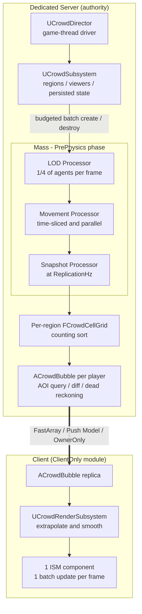
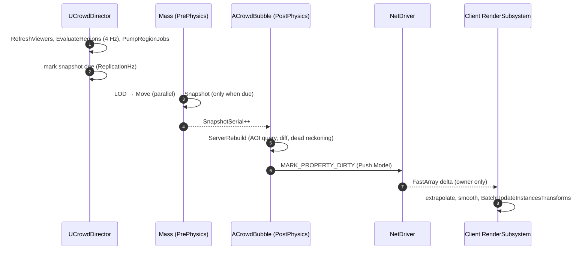

# MassBubble - World Partition + Mass Entity Multiplayer Optimization (UE 5.8, C++)

**A large-scale dedicated server optimization sample for Unreal Engine 5.8**

Server-authoritative **Mass Entity** simulation · per-player **AOI (Area of Interest) replication** · client-side **ISM batched rendering**


---

## Table of Contents

- [Overview](#overview)
- [Key Takeaways](#key-takeaways)
- [Architecture](#architecture)
- [Implementation Details](#implementation-details)
- [Instrumentation and Experiment Design](#instrumentation-and-experiment-design)
- [Verification (Automation Tests)](#verification-automation-tests)
- [Design Figures](#design-figures)
- [Getting Started](#getting-started)
- [Configuration](#configuration)
- [Design Choices and Optimization Costs](#design-choices-and-optimization-costs)
- [Code Map](#code-map)

---

## Overview

This is a reference implementation of a pipeline that **simulates thousands to tens of thousands of NPCs on a dedicated server** and replicates **only the surrounding area of each player (AOI)** to connected clients.

The design ensures that the following three cost axes each have an **observable upper bound**, regardless of how large the NPC population grows. Every optimization can be toggled individually via CVar kill switches, ensuring each is validated by measurement rather than assumption.

| Cost Axis | Naive Implementation (Actor-per-NPC) | MassBubble |
|---|---|---|
| Server CPU · Simulation | Actor/Component Tick per NPC; all agents updated every frame | Processing over contiguous per-chunk arrays in Mass, distance-based LOD + time-slicing, parallel chunk processing |
| Server CPU · Bandwidth · Replication | One ActorChannel per NPC, property comparison, full-state transmission | **One Actor per player**, Push Model, FastArray delta serialization, dead reckoning, 10-byte quantized records |
| Client · Rendering | Actor + Component + draw call overhead per NPC | **A single ISM Component**, one batch update per frame |

**Non-goals** — AI (behavior trees, pathfinding, collision avoidance), animation, external persistence, and anti-cheat are out of scope. NPC logic is intentionally simplified; it serves strictly as a workload for validating the data pipeline under heavy optimization (simulation → snapshot → replication → rendering).

---

## Key Takeaways

| Area | Approach | Effect | Key Files |
|---|---|---|---|
| Simulation | Fragments split by access pattern, single archetype, **LOD stored as a fragment value** | Contiguous array access eliminates cache misses; avoids structural changes (archetype moves) and memory overhead typically triggered by LOD changes | `CrowdFragments.h` |
| Simulation | Distance-based **LOD + time-slicing** (1 / 2 / 6 / 0 frames) + hysteresis | Under default settings with a single viewer, **only ≈ 830 out of 10,000** agents execute movement logic per frame (analytical estimate) | `CrowdProcessors.cpp`, `CrowdMath.h` |
| Simulation | `ParallelForEachEntityChunk`, chunk-local writes | Workload is distributed across worker threads, ensuring lock-free execution | `CrowdProcessors.cpp` |
| Streaming | **Region-owned state** + frame-budgeted spawning/despawning + deterministic restoration | Independent of WP cell load/unload states; eliminates frame drops caused by spawning spikes | `CrowdSubsystem.cpp` |
| Spatial Query | Per-region uniform grid, rebuilt via **counting sort** | Rebuild complexity is O(N + cells) with zero allocations after warm-up, completely independent of world size | `CrowdCellGrid.h` |
| Replication | **One Actor per player** (`bOnlyRelevantToOwner` + `COND_OwnerOnly`) + **Push Model** | Eliminates per-NPC ActorChannels; guarantees zero comparison overhead when state is clean | `CrowdBubble.cpp` |
| Replication | int16 / int8 **quantization** + 200m lattice **origin rebasing** | Shrinks footprint to **10 bytes** per agent (−81% reduction vs. ≈ 52-byte naive layout) | `CrowdNetMath.h` |
| Replication | **Dead reckoning** (distance-dependent tolerance) | Zero redundant updates for agents moving in a straight line at constant velocity; automated tests assert message volume drops **under 15%** of the naive baseline | `CrowdNetMath.h`, `CrowdTests.cpp` |
| Client | Extrapolation + exponential smoothing + **single-pass ISM batch updates** | Consolidates 400 agents into 1 Actor, 1 Component, and 1 render-state update | `CrowdRenderSubsystem.cpp` |
| Build | **`ClientOnly` module separation** | Dedicated server target completely strips out the rendering module | `MassBubble*.Target.cs` |
| Verification | CVar kill switches, integrated stat / CSV / Insights instrumentation, 4 Automation Tests | Optimizations are empirically measured and architectural invariants are programmatically proven | `CrowdSettings.cpp`, `MassBubbleStats.h`, `CrowdTests.cpp` |

---

## Architecture

### Component Diagram



### Data Flow



### Threading Model

| Component | Execution Context | Rationale |
|---|---|---|
| `UCrowdDirector`, `UCrowdSubsystem` | Game Thread | Structural changes (entity creation/destruction) are prohibited while Mass processing is active; deferred until `IsProcessing()` returns false |
| `UCrowdLODProcessor` | Game Thread (`bRequiresGameThreadExecution`) | Accesses game-thread-restricted subsystems (e.g., the viewer list) |
| `UCrowdMovementProcessor` | Worker Threads (`ParallelForEachEntityChunk`) | Restricts writes to chunk-local memory; reads settings from an immutable, POD tuning snapshot |
| `UCrowdSnapshotProcessor` | Game Thread | Writes data to region-specific grids owned by the game-thread subsystem |
| `ACrowdBubble::Tick` | Game Thread, `TG_PostPhysics` | Consumes the snapshot generated during the PrePhysics Mass phase within the exact same frame |
| `UCrowdRenderSubsystem::Tick` | Client Game Thread | Drives batch transformations for the ISM Component |

### Design Principles

- **Single Source of Truth** — Mass entities exist strictly on the server or in standalone environments (`ExecutionFlags`, `ShouldCreateSubsystem`). Clients maintain only a quantized, local view of their immediate AOI.
- **State Decoupled from Actors** — NPC state is managed by the Region (a server-side subsystem), not individual Actors. Its lifecycle is entirely independent of World Partition cell streaming states.
- **Isolatable Optimizations (Kill Switches)** — Every optimization feature supports real-time deactivation to allow empirical A/B performance profiling.
- **Header-Only Pure Logic** — Core math and structures (`CrowdMath.h`, `CrowdCellGrid.h`, `CrowdNetMath.h`) are architected without dependencies on a world context, Mass, or replication layers, making them fully unit-testable.
- **Compile/Design-Time Invariant Enforcement** — Structural thresholds and configurations are strictly clamped to mathematically prevent invalid states (e.g., ensuring the maximum bubble radius never overflows safe int16 boundaries).

---
## Implementation Details

### 1. Data-Oriented Simulation (Mass Entity)

An agent is represented by a single archetype (`FCrowdAgentTag` + four fragments). Fragments are intentionally isolated **by access pattern**: the LOD pass reads `Location` and writes exclusively to `LOD`; the movement pass updates `Location`, `Motion`, and `PendingDelta`; while the snapshot pass reads all elements. Because Mass stores fragments in contiguous, per-chunk arrays, unaccessed data never pollutes cache lines. Read/write safety boundaries declared via `EMassFragmentAccess` establish clear data dependencies for safe concurrent thread scheduling.

```cpp
// Crowd/CrowdFragments.h (abridged) — 56 B total / agent
struct FCrowdAgentTag         : FMassTag      {};
struct FCrowdIdFragment       : FMassFragment { uint32 NetId; int32 HomeX; int32 HomeY; int32 RegionSlot; };  // 16 B, read-mostly
struct FCrowdLocationFragment : FMassFragment { FVector2D Location; };                                        // 16 B, double (LWC)
struct FCrowdMotionFragment   : FMassFragment { FVector2f Velocity; float RetargetTimer; uint32 Rng; };      // 16 B
struct FCrowdLODFragment      : FMassFragment { ECrowdLOD Tier; float PendingDelta; };                        //  8 B
```

- **LOD as a Fragment Value, Not a Tag** — Adding or removing tags forces expensive structural changes (moving entities between archetypes), whereas modifying a fragment value is an O(1) operation.
- **`RegionSlot` Indexing** — Eliminates per-agent hash map lookups during the high-frequency snapshot pass.
- **Large World Coordinates (LWC)** — Internal coordinates utilize `FVector2D` (double) precision for safe large-world simulation, delaying quantization until the replication boundary.
- **Query Pruning Safe Guards** — Since agents are spawned dynamically at runtime, matching archetypes do not exist at startup. To prevent Mass from permanently pruning empty queries, all three processors return `false` from `ShouldAllowQueryBasedPruning()`, allowing `UCrowdDirector` to safely bootstrap initialization.

### 2. Region-Based Population Streaming

NPC state lifecycle is detached from Actor lifecycles, residing instead within **Regions** managed by a server-side subsystem (defaulting to 128m to align with standard World Partition runtime cell dimensions). Agents are neither destroyed nor reset when World Partition cells stream out.

```cpp
// Crowd/CrowdSubsystem.h
enum class ECrowdRegionState : uint8
{
	Inactive,   // No entities exist; only the compact, persisted state remains in memory
	Spawning,   // Entities are instantiated in time-sliced batches governed by a frame budget
	Active,     // Region is fully populated and actively running simulation
	Despawning, // State is serialized to memory and entities are batched out
};
```

```cpp
// Crowd/CrowdSubsystem.cpp — TickDirector / PumpRegionJobs
// Structural changes (creation / destruction) are only legal while Mass is idle.
if (!EntityManager->IsProcessing())
{
	PumpRegionJobs();
}

int32 SpawnBudget = T.MaxSpawnPerFrame;
while (SpawnBudget > 0 && SpawnQueue.Num() > 0)
{
	FCrowdRegion& Region = Regions[SpawnQueue];
	// BatchCreateEntities handles bulk allocations efficiently
	SpawnBudget -= SpawnSlice(Region, SpawnBudget);
	if (Region.State == ECrowdRegionState::Active) { SpawnQueue.RemoveAt(0); }
	else { break; }  // Frame budget exhausted; defer remainder to next tick
}
```

- **Streaming Bounds Evaluation** — Active regions are dynamically evaluated at **4 Hz** based on a Chebyshev distance (`ActiveRegionRadius`, default = 2, yielding a 5×5 grid) surrounding all active viewers (players and virtual stress bots).
- **Proximity-Based Prioritization** — Newly prioritized regions are sorted and activated based on ascending distance to the closest viewer, ensuring immediate player surroundings populate first.
- **Activation Hysteresis Buffer** — Out-of-bounds regions are preserved for a grace period defined by `RegionDeactivateDelaySec` (10s) before despawning, eliminating thrashing when players cross borders repeatedly.
- **Time-Sliced Frame Budgeting** — Caps instantiation (500) and destruction (1,000) rates per frame via `BatchCreateEntities` / `BatchDestroyEntities` to enforce absolute frame-rate stability.
- **Deterministic State Restoration** — Upon deactivation, entity metrics (`FCrowdSavedAgent` tracking NetId, transform, velocity, timers, and internal pseudo-random state) are packed into memory, ensuring identical reconstruction via `Seed = Hash32(regionCoordHash ^ WorldSeed)` and per-agent xorshift32 generation.

### 3. Distance-Based LOD and Time-Slicing

| Tier | Distance (to nearest viewer) | Simulation Interval |
|---|---|---|
| High | < 40 m | Every frame |
| Medium | 40 – 100 m | Every 2 frames |
| Low | 100 – 200 m | Every 6 frames |
| Off | ≥ 200 m | Frozen |

```cpp
// Crowd/CrowdMath.h — LOD tier computation with a hysteresis band
inline ECrowdLOD ComputeTier(float Dist, ECrowdLOD Current, const FCrowdTuning& T)
{
	const ECrowdLOD Wanted =
		Dist < T.LODDistanceCm ? ECrowdLOD::High :
		Dist < T.LODDistanceCm ? ECrowdLOD::Medium :
		Dist < T.LODDistanceCm ? ECrowdLOD::Low : ECrowdLOD::Off;

	if (Wanted == Current) { return Current; }
  
	// Down-sampling LOD: only drop quality if distance exceeds boundary + hysteresis
	if (static_cast<uint8>(Wanted) > static_cast<uint8>(Current))
	{
		return Dist > T.LODDistanceCm[static_cast<int32>(Current)] + T.LODHysteresisCm ? Wanted : Current;
	}
	// Up-sampling LOD: only elevate quality if distance falls inside boundary - hysteresis
	return Dist < T.LODDistanceCm[static_cast<int32>(Wanted)] - T.LODHysteresisCm ? Wanted : Current;
}
```

```cpp
// Crowd/CrowdProcessors.cpp — UCrowdMovementProcessor: per-tier time-slicing
// 0 = frozen, 1 = update every frame, N = update every N-th frame (agents are spread evenly across frames by NetId)
const int32 Interval = bTimeSlice ? Tuning.LODIntervalFrames[static_cast<int32>(LOD.Tier)] : 1;
if (Interval == 0) { continue; }
if (Interval > 1 && ((Frame + Ids[i].NetId) % static_cast<uint32>(Interval)) != 0u)
{
	LOD.PendingDelta += DeltaTime;   // Accumulate skipped delta time for later evaluation
	continue;
}
const float Step = FMath::Min(LOD.PendingDelta + DeltaTime, Tuning.MaxStepDeltaSec);
LOD.PendingDelta = 0.f;
```

- **Distributed LOD Classification** — Evaluates and re-classifies exactly 1/4 of total agents per frame using a fast bitwise operation (`& 3`) on the agent's NetId and the frame index, smoothing out CPU evaluation spikes.
- **Delta-Time Accumulation Protection** — Skipped frame deltas are safely cached and evaluated during the agent's active tick, bounded tightly by `MaxStepDeltaSec` (0.5s) to mitigate high-velocity teleportation errors.
- **Extrapolation Desync Prevention** — Snapshot velocities for frozen entities (`ECrowdLOD::Off`) are explicitly clamped to zero, preventing dead-reckoning extrapolation on connected clients from causing stopped characters to drift indefinitely.

```cpp
// Crowd/CrowdProcessors.cpp — UCrowdSnapshotProcessor
// Clamp frozen velocities to zero on the server to prevent floating-point drift during client-side extrapolation.
const FVector2f Velocity = (LODs[i].Tier == ECrowdLOD::Off) ? FVector2f::ZeroVector : Motions[i].Velocity;
```

### 4. Parallel Movement Processing

By declaring `bRequiresGameThreadExecution = false`, the Movement Processor decouples execution from the main thread, scattering chunk logic concurrently via `ParallelForEachEntityChunk`.

```cpp
// Crowd/CrowdProcessors.cpp — UCrowdMovementProcessor::Execute
std::atomic<int32> Simulated{ 0 };

// Safe concurrent execution across distinct chunk boundaries
auto ProcessChunk = [&](FMassExecutionContext& ChunkContext)
{
	int32 LocalSimulated = 0;
	// ... core simulation loop: time-slicing → wander → integration → region bounds collision reflection
	Simulated.fetch_add(LocalSimulated, std::memory_order_relaxed);   // Single atomic commit per chunk execution
};

if (CrowdCVars::ParallelMove != 0) { EntityQuery.ParallelForEachEntityChunk(Context, ProcessChunk); }
else                               { EntityQuery.ForEachEntityChunk(Context, ProcessChunk); }
```

- **Thread-Safety Proof** — Concurrency is guaranteed safe because: (1) memory mutations are strictly isolated to localized, chunk-specific arrays; (2) simulation configurations read exclusively from an unmanaged, immutable POD snapshot (`FCrowdTuning`); (3) random generation relies on per-agent unique states inside their respective fragments, removing centralized RNG locks; and (4) telemetry metrics are collected locally per chunk and pushed via thread-safe atomic relaxed additions.
- Main-thread-bound dependencies (LOD evaluation, Snapshot generation) declare a `GameThreadOnly = true` trait via `TMassExternalSubsystemTraits` to enforce execution isolation.

### 5. Snapshot and Spatial Grid

To shield the networking tier from expensive, high-frequency locks against the central Mass `EntityManager`, the `UCrowdSnapshotProcessor` isolates active entity states into flat, region-aligned structures at a throttled interval (`ReplicationHz`, default = 10 Hz). On non-sync frames, the execution query returns instantly.

```cpp
// Crowd/CrowdProcessors.cpp — UCrowdSnapshotProcessor::Execute
UCrowdSubsystem* Crowd = Context.GetMutableSubsystem<UCrowdSubsystem>();
if (Crowd == nullptr || !Crowd->IsSnapshotDue())
{
	return; 
}
```

Every isolated region maintains an internal, 8×8 uniform grid (16m per cell grid mapping) completely rebuilt from scratch during the snapshot tick via a highly optimized **counting sort**.

```cpp
// Crowd/CrowdCellGrid.h — EndBuild
for (int32 i = 0; i < Num; ++i)                      // Phase 1: Generate cell histogram
{
	const int32 Cell = CellIndex(Agents[i].Pos);
	CellOfAgent[i] = Cell;
	++CellStart[Cell + 1];
}
for (int32 c = 0; c < NumCells; ++c)                 // Phase 2: Compute sequential start offsets
{
	CellStart[c + 1] += CellStart[c];
}
// ... Cursor represents a working duplicate copy of CellStart
for (int32 i = 0; i < Num; ++i)                      // Phase 3: Sort agent indices linearly into cells
{
	Order[Cursor[CellOfAgent[i]]++] = i;
}
```

- **Algorithmic Complexity** — Build overhead is bounded at O(N + cells); spatial lookup runs at O(visited cells + matched agents). Array storage is preserved via `Reset()` with `EAllowShrinking::No` to ensure absolute zero heap allocations post-initialization.
- **Local vs. Global Grid Architectural Trade-off** — Localized 8×8 region grids remain inside CPU L1/L2 caches and scale uniformly regardless of whether entities are separated by dozens of kilometers. A single global grid would alternatively suffer from enormous sparse matrix structures or severe floating-point degradation at extreme coordinates.
- **Spatial Resolution Queries** — Bounding box expansion evaluates cell boundaries using fast, squared-distance validation, avoiding heavy square-root operations. Out-of-bounds agents are safely clamped into safe perimeter buckets, preventing entity loss during region handoffs.

### 6. Per-Player AOI Replication — `ACrowdBubble`

Rather than spawning individual replicated Actors per active agent—which destroys server network performance—**a single dedicated Actor is spawned per player**, streaming their local AOI down via an optimized `FFastArraySerializer`.

```cpp
// Net/CrowdBubble.cpp — constructor and replicated properties
ACrowdBubble::ACrowdBubble()
{
	bReplicates = true;
	bOnlyRelevantToOwner = true;        // Explicitly private to the owning connection
	bAlwaysRelevant = false;
	bNetLoadOnClient = false;
	SetNetUpdateFrequency(20.f);        // Push Model prevents structural comparisons when state remains clean
	SetMinNetUpdateFrequency(2.f);
	PrimaryActorTick.TickGroup = TG_PostPhysics;   // Synchronously extracts PrePhysics data within the same frame boundary
}

void ACrowdBubble::GetLifetimeReplicatedProps(TArray<FLifetimeProperty>& OutLifetimeProps) const
{
	Super::GetLifetimeReplicatedProps(OutLifetimeProps);

	FDoRepLifetimeParams Params;
	Params.bIsPushBased = true;
	Params.Condition = COND_OwnerOnly;
	DOREPLIFETIME_WITH_PARAMS_FAST(ACrowdBubble, AgentArray, Params);
	DOREPLIFETIME_WITH_PARAMS_FAST(ACrowdBubble, OriginLattice, Params);
}
```

The high-frequency `ServerRebuild()` stage checks if `SnapshotSerial` has mutated (aligning with `ReplicationHz`), processing four specialized pipeline steps:

1. **Lattice Origin Translation** — Evaluates and repositions the bubble lattice center whenever the target viewer drifts more than 110m away from the active center.
2. **Proximity Filtering** — `ForEachAgentInCircle` queries local spatial grids, performing distance truncation to cap elements at `MaxAgentsPerBubble` (400 slots).
3. **State Transition Evaluation (Enter/Stay/Leave)** — Maps entity lifecycles using a fast `NetId → local index` lookup verified against epoch tracker marks.
4. **Delta Dirty Marking** — Fires `MarkItemDirty` only when precision updates cross dead-reckoning delta limits, running structural updates (`MarkArrayDirty`) and Push Model flags exclusively when layout adjustments occur.

```cpp
// Net/CrowdBubble.cpp — ServerRebuild (abridged)
++Epoch;
for (const FCandidate& Candidate : Candidates)
{
	const int32* IndexPtr = IdToIndex.Find(Agent.NetId);
	if (IndexPtr == nullptr)                          // Case 1: Entry into player interest zone
	{
		const int32 NewIndex = Items.AddDefaulted();
		FillItem(Items[NewIndex], Agent, OriginWorld, Now);
		Items[NewIndex].SeenEpoch = Epoch;
		IdToIndex.Add(Agent.NetId, NewIndex);
		AgentArray.MarkItemDirty(Items[NewIndex]);
		++NumDirty;
		bStructural = true;
		continue;
	}

	FCrowdAgentItem& Item = Items[*IndexPtr];         // Case 2: Persisted Agent: sync only if dead-reckoning error threshold is exceeded (§8)
	Item.SeenEpoch = Epoch;
	if (bRebase || CrowdNet::ShouldResend(Agent.Pos, Agent.Vel, Item.SentPos, Item.SentVel,
	                                      Now - Item.SentTime, Tolerance, Tuning.VelocityEpsCmPerSec))
	{
		FillItem(Item, Agent, OriginWorld, Now);
		AgentArray.MarkItemDirty(Item);
		++NumDirty;
	}
}

for (int32 i = Items.Num() - 1; i >= 0; --i)         // Case 3: Exit from interest zone: O(1) swap-remove execution
{
	if (Items[i].SeenEpoch == Epoch) { continue; }
	IdToIndex.Remove(Items[i].NetId);
	Items.RemoveAtSwap(i);
	if (i < Items.Num()) { IdToIndex[Items[i].NetId] = i; }   // Correct index mapping for shifted tail element
	bStructural = true;
}

if (bStructural)                 { AgentArray.MarkArrayDirty(); }
if (bStructural || NumDirty > 0) { MARK_PROPERTY_DIRTY_FROM_NAME(ACrowdBubble, AgentArray, this); }
// Push Model: Bypasses standard replication loop comparative tracking entirely if property is unmodified
```

> Toggling `opt.crowd.DeadReckoning 0` drops execution down into a standard naive replication tracking loop, re-transmitting structural modifications for all active elements every frame for clean performance diagnostics.

### 7. Wire Format — Data Quantization and Lattice Origin

| Field | Type | Size | Resolution / Bound |
|---|---|---|---|
| `NetId` | `uint32` | 4 bytes | Monotonically increasing agent token (survives region lifecycle transformations) |
| `X`, `Y` | `int16` × 2 | 4 bytes | Relative coordinate offsets mapped from lattice center (1cm resolution, ±327m max capacity) |
| `VX`, `VY` | `int8` × 2 | 2 bytes | Quantized velocity components (5cm/s resolution steps, ±635cm/s bounds) |
| **Total Size** | | **10 bytes** | Excludes base FastArray structural array packet packing bytes |

Compared with unoptimized structures (`FVector` Position [24 bytes] + `FVector` Velocity [24 bytes] + `int32` ID ≈ **52 bytes**), this packed layout delivers an **81% reduction** in network payload size.

```cpp
// Net/CrowdBubble.h (abridged) — Unmarked raw properties are skipped by the reflection compiler, acting as local memory caches
USTRUCT()
struct FCrowdAgentItem : public FFastArraySerializerItem
{
	GENERATED_BODY()

	UPROPERTY() uint32 NetId = 0;
	UPROPERTY() int16  X = 0;     // 1cm resolution scaling from active lattice center
	UPROPERTY() int16  Y = 0;
	UPROPERTY() int8   VX = 0;    // 5cm/s resolution scaling
	UPROPERTY() int8   VY = 0;

	// Server Verification Cache: Tracks de-quantized history expected on client
	FVector2D SentPos; FVector2f SentVel; double SentTime = 0.0; uint32 SeenEpoch = 0;
	// Client Cache: Records precise arrival time stamps to anchor local extrapolation calculations
	double RecvTime = 0.0;
};
```

To accommodate high-resolution simulation while enforcing rigid `int16` constraints (±327.67m), positions are flattened into localized offsets calculated from a **200-meter aligned sliding lattice network**.
The system enforces the following spatial invariants:
- The viewer is mathematically guaranteed to stay within ≤ 110m (`RebaseDistanceCm`) of the current lattice center.
- The active replication radius is bounded at ≤ 210m (`MaxBubbleRadiusCm`) from the viewer.
- This bounds the absolute maximum offset at 320m, fitting safely within the signed `int16` range (< 327.67m).
- The network tracker states are stored via `FIntPoint OriginLattice` properties inside `ACrowdBubble`.

```cpp
// Net/CrowdNetMath.h
constexpr double OriginLatticeCm   = 20000.0;  // 200m snapped step grid boundaries
constexpr double RebaseDistanceCm  = 11000.0;  // 110m threshold (100m half-lattice window + 10m hysteresis buffer)
constexpr float  MaxBubbleRadiusCm = 21000.f;  // 110m drift + 210m radius = 320m ceiling (< 327.67m int16 limit)

FORCEINLINE int16 QuantizeOffset(double RelativeCm)
{
	return static_cast<int16>(FMath::Clamp(FMath::RoundToInt(RelativeCm / PosUnitCm), -32768, 32767));
}

/** Returns true when player leaves the current lattice safe zone, forcing an origin rebase (full resend). */
FORCEINLINE bool NeedsRebase(const FVector2D& Viewer, const FVector2D& OriginWorld)
{
	return FMath::Max(FMath::Abs(Viewer.X - OriginWorld.X), FMath::Abs(Viewer.Y - OriginWorld.Y)) > RebaseDistanceCm;
}
```

```cpp
// Crowd/CrowdSettings.cpp — Enforce network invariants at the configuration layer
Out.BubbleRadiusCm = FMath::Clamp(S.BubbleRadiusCm, 1000.f, CrowdNet::MaxBubbleRadiusCm);
```

- **Origin Rebase Mitigations** — Moving the lattice center requires a full network resend of all active items within the bubble, making it an expensive operation. A 10m spatial hysteresis zone prevents rapid rebase loops when a player hovers directly on a lattice boundary. Automated edge testing under continuous ±3m position jitter recorded zero thrashing artifacts.
- **Implicit Protocol Optimization** — Additional entity properties are omitted from network packets and derived client-side:
  - **Character Rotation (Yaw)** — Extrapolated dynamically from velocity direction vectors (or determined via stable `NetId` hashing algorithms when stationary).
  - **Z-Axis Height** — Clamped via client configurations since simulation logic runs on a flat plane.
  - **Bookkeeping Fields** (`Sent*`, `SeenEpoch`) — Explicitly marked server-only to keep them out of serializing network streams.

### 8. Dead Reckoning

- **Client Execution** — Linearly advances entity placement via `SentPos + SentVel × Δt` using local network timestamps to maintain smooth visuals between updates.
- **Server Execution** — Computes an identical client-side simulation matrix for each connection, firing network delta packages only when true agent vectors deviate past error tolerances or experience sudden velocity shifts.

```cpp
// Net/CrowdNetMath.h
inline bool ShouldResend(
	const FVector2D& TruePos, const FVector2f& TrueVel,
	const FVector2D& SentPos, const FVector2f& SentVel,
	double SecondsSinceSent, float ToleranceCm, float VelocityEpsCmPerSec)
{
	const FVector2D Predicted = SentPos + FVector2D(SentVel.X, SentVel.Y) * SecondsSinceSent;
	if (FVector2D::DistSquared(TruePos, Predicted) > static_cast<double>(ToleranceCm) * ToleranceCm)
	{
		return true;
	}

	const FVector2f DeltaV = TrueVel - SentVel;
	return DeltaV.SizeSquared() > VelocityEpsCmPerSec * VelocityEpsCmPerSec;
}
```

```cpp
// Net/CrowdBubble.cpp — FillItem: Quantization round-trip validation
// Server monitors expected client coordinates by performing local round-trip quantization decoding.
Item.SentPos = OriginWorld + FVector2D(CrowdNet::DequantizeOffset(Item.X), CrowdNet::DequantizeOffset(Item.Y));
Item.SentVel = FVector2f(CrowdNet::DequantizeVelocity(Item.VX), CrowdNet::DequantizeVelocity(Item.VY));
```

```cpp
// Net/CrowdBubble.cpp — Client translation loop
FVector2D FCrowdAgentItem::GetExtrapolatedPosition(const FVector2D& OriginWorld, double Now, double MaxExtrapolationSec) const
{
	const double Elapsed = FMath::Clamp(Now - RecvTime, 0.0, MaxExtrapolationSec);
	const FVector2D Base = OriginWorld + FVector2D(CrowdNet::DequantizeOffset(X), CrowdNet::DequantizeOffset(Y));
	const FVector2f Vel = GetVelocity();
	return Base + FVector2D(Vel.X, Vel.Y) * Elapsed;
}
```

- **Server Memory Footprint** — Retains unique `SentPos`/`SentVel`/`SentTime` verification metrics per agent, mapped across active players (bypassing generic replication overhead).
- **Dual-Tier Proximity Error Tolerances** — Implements `NearErrorCm` (30cm tolerance) inside a 30m bubble perimeter and `FarErrorCm` (150cm tolerance) beyond, prioritizing crisp accuracy near the player and aggressive bandwidth reduction at a distance.
- **Proactive Velocity Truncation (25cm/s)** — Triggers proactive updates immediately upon direction changes, neutralizing noticeable client-side positional snapping before errors pile up.
- **Extrapolation Cap Guard** — Clamps simulation projections at `MaxExtrapolationSec` (1.5s) to guarantee characters stop moving if network connections freeze.

### 9. Client Rendering

Every frame, `UCrowdRenderSubsystem` handles: (1) position extrapolation, (2) frame-rate-independent smoothing, and (3) a unified transactional transformation push into a single instance buffer.

```cpp
// MassBubbleRender/CrowdRenderSubsystem.cpp — Tick
const double Alpha = (Settings->SmoothingRate > 0.f)
	? 1.0 - FMath::Exp(-static_cast<double>(Settings->SmoothingRate) * static_cast<double>(DeltaTime))
	: 1.0;                                            // Frame-rate-independent exponential interpolation

for (int32 Index = 0; Index < Count; ++Index)
{
	const FCrowdAgentItem& Item = Items[Index];
	const FVector2D Target = Item.GetExtrapolatedPosition(Origin, Now, MaxExtrapolation);   // Client-side extrapolation
	// ... Smoothly interpolate towards Target location. Instantly snap on initial entry or boundary resets
	Transforms.Emplace(FRotator(0.0, Yaw, 0.0), FVector(Shown.X, Shown.Y, Z), Scale);
}

// Single draw call batch dispatch minimizes render thread overhead
Instances->BatchUpdateInstancesTransforms(0, Transforms, /*bWorldSpace=*/false, /*bMarkRenderStateDirty=*/true, /*bTeleport=*/true);
```

- **`ACrowdRenderHost` Allocation** — Spawned as a streamlined, non-replicated actor with ticking completely disabled. It acts purely as a shell holding a `UInstancedStaticMeshComponent`.
- **Frame-Rate-Independent Interpolation** — Utilizes `α = 1 − e^(−k·Δt)` (where k = `SmoothingRate`, defaulting to 15/s) to mask dead-reckoning positional corrections, preventing visual stuttering or popping.
- **Re-Entry Identity Verification** — Uses an epoch validation tracker to determine if an agent was rendered on the immediate prior frame. This prevents re-entering entities from noticeably sliding across the screen from obsolete historical positions.
- **Pre-Allocated Array Management** — The internal `Transforms` array is preserved across frames to avoid runtime heap fragmentation. Instance modifications are appended or truncated exclusively from the array tail to keep active index mapping stable.
- **Unified Code Paths** — Standardizes execution behavior across standalone and listen hosts; server environments record initialization timestamps directly via `FillItem`, bypassing client-restricted `PostReplicatedAdd` hooks.
- **Nanite Evaluation** — Agents utilize simple low-poly geometries, making the heavy clustering overhead of Nanite sub-optimal for this specific instancing pipeline.

### 10. Module Separation — `ClientOnly`

All rendering logic is decoupled into a isolated `MassBubbleRender` module, preventing rendering code from compiling into dedicated server binaries.

```csharp
// MassBubbleServer.Target.cs
public class MassBubbleServerTarget : TargetRules
{
	public MassBubbleServerTarget(TargetInfo Target) : base(Target)
	{
		Type = TargetType.Server;
		ExtraModuleNames.Add("MassBubble");      // Explicitly excludes MassBubbleRender from compiling into the server target
		bUseLoggingInShipping = true;           // Retains detailed logging in Shipping configurations for deep telemetry analysis
	}
}
```

```cpp
// MassBubbleRender/CrowdRenderSubsystem.cpp — Runtime architectural safety check
bool UCrowdRenderSubsystem::ShouldCreateSubsystem(UObject* Outer) const
{
	if (!Super::ShouldCreateSubsystem(Outer)) { return false; }
	if (IsRunningDedicatedServer() || IsRunningCommandlet()) { return false; }
	const UWorld* World = Cast<UWorld>(Outer);
	return World != nullptr && World->GetNetMode() != NM_DedicatedServer;
}
```

| Target Configuration | Context Classification | Loaded Modules | Intended Environment |
|---|---|---|---|
| `MassBubbleServer` | Dedicated Server | `MassBubble` | Headless Server authoritative target |
| `MassBubbleClient` | Connected Client | `MassBubble`, `MassBubbleRender` | Stripped execution game client |
| `MassBubble` | Standalone Deployment | `MassBubble`, `MassBubbleRender` | Traditional Local / Listen Server execution |
| `MassBubbleEditor` | Development Pipeline | `MassBubble`, `MassBubbleRender` | Multi-context PIE testing environments |

*Note: The rendering module instantiates isolated stats trackers (`STATGROUP_OptRender`) and CSV profiles (`OptRender`). This structure avoids unneeded `dllimport` symbol resolution across module boundaries during compilation.*

### 11. World Partition Streaming Anchor

When server-side streaming is enforced (`wp.Runtime.EnableServerStreaming=1`), only active `PlayerControllers` register as valid replication streaming sources. Consequently, AI-inhabited zones devoid of human players would normally stream out. `AMassBubbleStreamingAnchor` resolves this by marrying **(1) a standard World Partition streaming source component and (2) a virtual crowd viewer token** into a single persistent coordinate entity.

```cpp
// World/MassBubbleStreamingAnchor.cpp — BeginPlay 
if (World->GetNetMode() == NM_Client)
{
	// Disable anchor ticking and streaming on clients to avoid redundant resource allocation
	SetActorTickEnabled(false);
	StreamingSource->DisableStreamingSource();
	return;
}

if (bStreamWorldPartition)  { StreamingSource->EnableStreamingSource(); }
if (bRegisterAsCrowdViewer) { Crowd->RegisterVirtualViewer(this); }   // Forces server to simulate agents around this vector
```

- Since virtual anchors bypass `ACrowdBubble` allocation, they double as highly efficient **headless stress-testing bots** (`-OptBots=N` or `opt.crowd.SpawnBots N`), allowing precise isolation of simulation, region mapping, and World Partition streaming overhead without network serialization cost.
- Placing anchors inside maps requires disabling **"Is Spatially Loaded"** within their World Partition configuration details; otherwise, the anchor would be culled by the very cell it is responsible for keeping active.

---
## Instrumentation and Experiment Design

A consolidated tracking macro couples multiple profiling layers into a clean, single-statement interface.

```cpp
// Core/MassBubbleStats.h — Generates cycle metrics, CSV diagnostics, and deep Insights trace tokens simultaneously
#define OPT_SCOPE(StatId, CsvName, TraceName) 	SCOPE_CYCLE_COUNTER(StatId); 	CSV_SCOPED_TIMING_STAT(OptCrowd, CsvName); 	TRACE_CPUPROFILER_EVENT_SCOPE_STR(TraceName)

// Direct application example
OPT_SCOPE(STAT_OptCrowd_Bubble, Bubble, "Opt.Crowd.Bubble");
```

- **Live Telemetry Monitoring** — Provides immediate in-game diagnostics via `SCOPE_CYCLE_COUNTER` blocks.
- **Metric Aggregation Profiling** — Logs historical timing intervals via low-overhead `CSV_SCOPED_TIMING_STAT` macros for spreadsheet analysis.
- **Timeline Verification** — Maps fine-grained thread execution tracks directly inside Unreal Insights via string tokens.

| Profiling Utility | Target Context | Monitored Metrological Metrics |
|---|---|---|
| Engine Stats | Server: `stat OptCrowd`<br/>Client: `stat OptRender` | Real-time monitoring of simulation cycles (Director, Spawning, LOD, Movement, Snapshots, Bubble diffs), live counters (Agents Alive, Active Regions, Simulating Count, Packet tracking, Visible Actors). |
| Unreal Insights | Boot Parameter: `-trace=cpu,net,frame` | Deep chronological timeline visualizer for `Opt.Crowd.*` pipelines and fine-grained Network Serialization channels. |
| CSV Profiler | Console: `csvprofile start / stop` | Records lightweight telemetry arrays (`OptCrowd` and `OptRender` tracking blocks) across Test/Shipping builds. |
| Diagnostic Logging | Console: `opt.crowd.Stats` | Outputs text arrays capturing active region states, precise LOD distributions, queue bounds, and live configuration status. |

### A/B Kill Switches (CVars)

All optimization modules expose dedicated CVars for real-time deactivation. To isolate performance metrics cleanly, modify **exactly one** parameter at a time.

| Console Variable (CVar) | Default Value | Isolated Testing Context |
|---|---|---|
| `opt.crowd.Enable` | 1 | Global master switch; completely disables the crowd simulation pipeline. |
| `opt.crowd.TimeSlicing` | 1 | `0` forces every agent to simulate every tick, isolating time-slice distribution efficiency. |
| `opt.crowd.LOD` | 1 | `0` forces all agents to High LOD, isolating distance classification logic and execution weights. |
| `opt.crowd.ParallelMove` | 1 | `0` forces single-threaded chunk processing, measuring concurrent multi-threading gains. |
| `opt.crowd.Replicate` | 1 | `0` completely suspends high-frequency snapshots, **isolating core simulation cost**. |
| `opt.crowd.DeadReckoning` | 1 | `0` falls back to the naive replication baseline, exposing network serialization and delta savings. |
| `opt.crowd.ReplicationHz` | 0 | Overrides default project snapshot frequencies when set to values > 0. |
| `opt.crowd.Render` (Client) | 1 | `0` hides character rendering, **isolating network cost from GPU draw overhead**. |
| `opt.crowd.RenderStats` (Client)| 0 | `1` draws debug telemetry overlays (current bubble array lengths, drawn count, tick intervals) in non-shipping builds. |

*Debug Commands (Non-Shipping)*: `opt.crowd.Stats` · `opt.crowd.SpawnBots [Count]` · `opt.crowd.ClearBots` · `opt.crowd.Reload` (Hot-reloads settings arrays while preserving grid constraints).

### Measurement Procedure

```text
# Server Terminal Execution (or via -ExecCmds arguments)
stat OptCrowd
opt.crowd.Stats
csvprofile start
  ...
csvprofile stop

# Isolate features sequentially: Modify ONLY one switch per test run
opt.crowd.DeadReckoning 0      # Measures the unoptimized baseline network payload
opt.crowd.TimeSlicing 0
opt.crowd.LOD 0
opt.crowd.ParallelMove 0
opt.crowd.Replicate 0          # Completely isolates pure simulation overhead

# Client Terminal Execution
opt.crowd.Render 0             # Isolates network processing cost from rendering overhead
opt.crowd.RenderStats 1
```

---

## Verification (Automation Tests)

Core algorithms are isolated into header-only pure functions (`CrowdMath.h`, `CrowdCellGrid.h`, `CrowdNetMath.h`) to allow deterministic unit testing entirely decoupled from world contexts, Mass framework footprints, or replication states.

| Automation Test Module | Verified Architectural Invariant |
|---|---|
| `MassBubble.Crowd.CellGrid` | Validates a 3,000-agent matrix across 300 queries against a **brute-force verification oracle**, asserting zero dropouts, zero duplicate records, and flawless squared distance mapping. Confirms out-of-bounds entities clamp correctly into perimeter buckets. Shifts spatial origins to (25600, −12800) to ensure offset calculations catch signed wrapping, and verifies `Clear()` operations empty the grid completely. |
| `MassBubble.Crowd.Quantization` | Proves quantization decoding error margins stay tightly within ≤ 0.5 steps, enforcing rigid clamping on out-of-bound variables. **Spatial Invariant Verification**: Simulates a 1.6km × 0.8km diagonal flight path, ensuring client views never overflow signed `int16` bounds relative to the moving origin, generating 8–20 predictable rebases (≈ 1 rebase per 200m). **Hysteresis Validation**: Asserts zero rebase loops under fine border jitter, contrasting against a naive baseline that flips > 150 times over a 200-step test. |
| `MassBubble.Crowd.DeadReckoning` | Evaluates critical precision boundaries (31cm delta triggers sync vs. 29cm delta holds; 26cm/s velocity shift triggers sync vs. 24cm/s holds), proving zero network packets fire for constant-velocity paths. **Long-term Stability Test**: Simulates 400 agents for 60s at 10 Hz, verifying that total dead-reckoning messages drop **below 15%** of the naive baseline while keeping client-side prediction errors within strict mathematical limits. Telemetry ratios are logged via `AddInfo`. |
| `MassBubble.Crowd.Math` | Asserts LOD hysteresis behavior (zero tier changes occur during edge oscillation, validating exact activation thresholds). Confirms xorshift32 seed consistency, ensures `Random01` bounds map cleanly to [0, 1), verifies `Hash32` is collision-free across a 0..9999 range, and checks that negative region coordinates resolve correctly. |

```cpp
// CrowdTests.cpp 
// Verifies that the network message volume under dead reckoning drops below 15% of the naive baseline.
TestTrue(TEXT("Dead reckoning sends under 15% of the naive message volume"),
	DeadReckoningMessages * 100 < NaiveMessages * 15);

// Client prediction error must remain tightly bounded by the configured tolerance plus velocity delta errors.
// (e.g., a 180-degree snap turn at 220 cm/s creates a 440 cm/s velocity delta, causing a maximum 44 cm drift in a single 0.1s tick).
TestTrue(TEXT("Client-side prediction error remains tightly bounded"),
	MaxPredictionError < Tolerance + 2.0 * 220.0 * Dt + 5.0);

// Boundary Jitter Control: Verifies that the hysteresis buffer prevents origin thrashing on lattice borders.
TestEqual(TEXT("Hysteresis: zero rebases occur during boundary position jitter"), HysteresisRebases, 0);
TestTrue(TEXT("(Baseline Contrast) Naive rounding would trigger over 150 thrashing flips"), NaiveFlips > 150);
```

---

## Design Figures

### Analytical Estimates (Default Settings)

These figures represent **theoretical limits derived from algorithmic constants** under default configurations, assuming a single viewer and uniform entity distribution. They do not represent physical hardware benchmarks.

| Technical Metric | Modeled Target Value | Algorithmic Derivation Formula |
|---|---|---|
| Simulated Agent Density | 0.0244 agents / m² | 400 agents / (128 m)² region area |
| Active Simulated Entities (1 Viewer) | 10,000 agents | `AgentsPerRegion` (400) × 5×5 streaming grid |
| Hot Fragment Memory Footprint | ≈ 0.56 MB | 56 bytes × 10,000 active entities |
| Persisted State Cache Size | ≈ 16 KB per inactive region | `FCrowdSavedAgent` (40 bytes) × 400 slots |
| Asset LOD Distribution Spectrum | High: ≈ 123<br/>Medium: ≈ 644<br/>Low: ≈ 2,301<br/>Off: ≈ 6,932 | Density scaling multiplied by the area of each concentric distance band (40m / 100m / 200m boundaries) |
| Active Movement Operations per Frame | **≈ 830 entities** (Naive: 10,000) | 123 × 1 (High) + 644 / 2 (Medium) + 2,301 / 6 (Low) time-slice distributions |
| Replication Record Footprint | **10 bytes per agent** | 4B ID + (2 × 2B) Position + (2 × 1B) Velocity (Naive layout ≈ 52B) |
| Max Bubble Payload (Full Resend Sync) | ≈ 4 KB | 400 agents × 10 bytes (excluding array envelope and packet overheads) |
| Sliding Lattice Rebase Frequency | ≈ 1 rebase per 200m traveled | 200m spatial grid mapping boundaries |
| Client-Side Actor Allocation | 1 Actor / 1 Component | Unified Instanced Static Mesh orchestration |

> *Note: The active movement operation count isolates agents executing high-cost wander and position integration logic. The minor O(N) overhead incurred by the Mass processor while scanning chunk segments and branching past skipped entities is calculated separately.*

---

## Getting Started

### Prerequisites

- **Unreal Engine 5.8** — Compiling standalone `MassBubbleServer` and `MassBubbleClient` targets requires an engine built from source.
- **Mass Modules** — Requires `MassEntity`, `MassCommon`, and `MassSimulation`, alongside `MassCore` (introduced in UE 5.8). *To down-port to UE 5.7 or earlier, remove the `MassCore` reference from `MassBubble.Build.cs`.*
- **Push Model Activation** — Must be explicitly enabled in your configuration layout: `[SystemSettings] net.IsPushModelEnabled=1`. If disabled, properties fall back to standard comparative evaluation channels.
- **World Layout** — Requires a World Partition map paired with server-side streaming enabled: `wp.Runtime.EnableServerStreaming=1`.

### Build Compilation

```bash
# Execute via the root directory of your source-built engine (adjust environment paths accordingly)
Engine\Build\BatchFiles\Build.bat MassBubbleServer Win64 Development -Project="D:\MassBubble\MassBubble.uproject"
Engine\Build\BatchFiles\Build.bat MassBubbleClient Win64 Development -Project="D:\MassBubble\MassBubble.uproject"
```

### Execution

```bash
# 1) Fire up the Dedicated Server loaded with 8 virtual simulation stress-testing bots
#    (Simulates deep chunk loops, region tracking, and World Partition streaming without network serialization cost)
MassBubbleServer.exe /Game/Maps/L_MassBubbleWorld -log -OptBots=8

# 2) Spin up a dedicated game client instance to monitor network replication and rendering performance
MassBubbleClient.exe 127.0.0.1 -log
```

When evaluating inside the Unreal Editor, configuring **Play As Client + Run Dedicated Server** schedules both environments smoothly inside a unified process (the developer target `MassBubbleEditor` compiles both components). Character controls follow traditional WASD / E / Space / Q formatting, locked to a fly-cam layout configured to cross a 128m region boundary every 4 seconds at 30m/s for severe streaming stress testing.

### Testing Automation Execution

```bash
# Within the Editor: Open Session Frontend > Automation > filter by token "MassBubble.Crowd"
# Headless Command Line Execution:
UnrealEditor-Cmd MassBubble.uproject -ExecCmds="Automation RunTests MassBubble.Crowd; Quit" -unattended -nullrhi -log
```

---

## Configuration

Custom configuration properties are exposed via **Project Settings > Game > MassBubble Crowd** (`DefaultGame.ini`) and **MassBubble Crowd Rendering**. Simulation loops bypass high-overhead runtime UObject reads, safely polling localized immutable POD snapshots via `GetCrowdTuning()` instead.

| Target Group Category | Configuration Specifier | Default Setting | Operational Engineering Definition |
|---|---|---|---|
| **Regions** | `RegionSizeCm` | 12800 | Length of region borders (designed to map 1:1 with WP runtime cells). |
| | `ActiveRegionRadius` | 2 | Proximity radius of active simulated cells relative to a viewer (Chebyshev grid, 2 = 5×5 matrix). |
| | `AgentsPerRegion` | 400 | Targets population capacity allocated to every active region. |
| | `RegionDeactivateDelaySec` | 10 | Despawn grace period to prevent thrashing along region lines. |
| | `MaxSpawnPerFrame` / `MaxDespawnPerFrame` | 500 / 1000 | Maximum entity instantiation and destruction constraints allowed per frame. |
| **LOD Metrics** | `High` / `Medium` / `LowLODDistanceCm` | 4000 / 10000 / 20000 | Precision tier distance boundaries (40m / 100m / 200m). |
| | `LODHysteresisCm` | 500 | Linear overlap distance buffer protecting quality tier transitions. |
| | `High` / `Medium` / `Low` / `OffIntervalFrames` | 1 / 2 / 6 / 0 | Frame interval configurations mapping execution ticks (0 = frozen). |
| **Movement** | `Min` / `MaxSpeedCmPerSec` | 80 / 220 | Velocity constraints bounded during character wandering simulation. |
| | `Min` / `MaxRetargetSec` | 2 / 6 | Time window boundaries governing heading re-selections. |
| | `MaxStepDeltaSec` | 0.5 | Absolute delta-time accumulation limit for time-slice evaluation. |
| **Replication** | `ReplicationHz` | 10 | Targeting frequency of high-frequency spatial tracking snapshots (1–60 Hz). |
| | `BubbleRadiusCm` | 15000 | Active area-of-interest radius (clamped to ≤ 21000 to protect int16 limits). |
| | `MaxAgentsPerBubble` | 400 | Absolute capacity limit for tracked items within a player's bubble. |
| | `NearErrorCm` / `FarErrorCm` | 30 / 150 | Precise synchronization error limits assigned to dead-reckoning checks. |
| | `NearDistanceCm` | 3000 | Radial boundary separating near vs. far dead-reckoning tolerance zones. |
| | `VelocityEpsCmPerSec` | 25 | Velocity deviation threshold that forces a proactive network sync. |
| | `GridCellSizeCm` | 1600 | Dimension size allocated to internal spatial sorting grid buckets. |
| **Stress Bots** | `BotOrbitRadiusCm` / `BotSpeedCmPerSec` | 60000 / 1500 | Travel orbit configuration paths tracking virtual test bots. |
| **Client Render** | `MaxInstances` | 2048 | Max buffer instance limits assigned to client components. |
| | `MaxExtrapolationSec` | 1.5 | Max time window allowed for dead-reckoning linear extrapolation projections. |
| | `SmoothingRate` | 15 | Exponential smoothing factor (1/s, set to 0 to disable interpolation snapping). |
| | `BubbleSearchIntervalSec` | 1 | Intermittent polling rate used to acquire local player bubble references. |

---

## Design Choices and Optimization Costs

| Engineering Architecture Decision | Targeted Performance Benefit | Incurred System Trade-off |
|---|---|---|
| NPCs represented as Mass entities; single player-bound Bubble actors manage replication. | Eliminates massive Actor instantiation overhead, per-agent ActorChannels, and heavy replication comparisons. | Requires writing and maintaining custom delta sorting, quantization serialization, and client extrapolation layers by hand. |
| Server-authoritative Dead Reckoning protocol. | Drops network replication packet syncs to zero for constant-velocity agents, delivering huge bandwidth savings. | Elevates server memory requirements to track unique `Sent*` properties per agent/player pair, and requires active client extrapolation calculation tracking. |
| 200m sliding lattice tracking paired with signed `int16` quantization compression. | Compresses runtime agent position data down to an ultra-lean 4 bytes. | Moving boundaries triggers a complete data synchronization burst for that player (mitigated via boundary hysteresis). |
| LOD classification stored as a raw fragment value rather than structural tags. | Guarantees zero runtime structural modifications or memory re-allocations during quality updates. | Forces LOD evaluation branching conditions directly into high-frequency processing loops. |
| Distributed agent time-slicing logic. | Radically lowers CPU simulation budgets for distant agents. | Creates delayed position steps, which are smoothed out via `PendingDelta` accumulation tracking and strict `MaxStepDeltaSec` caps. |
| Region-bound ownership of entity states. | Decouples population lifespan from World Partition streaming mechanics, ensuring seamless restoration. | Requires writing customized sub-state machinery, serialization memory tables, and region migration logic. |
| Isolated POD snapshot configuration caches. | Enables lock-free, thread-safe configuration parsing across multiple concurrent worker threads. | Fixes spatial sorting structures and region layout constraints during hot reloads (`bKeepGeometry`). |
| Decentralized per-region uniform spatial grids. | Keeps lookup arrays small, cache-friendly, and completely performance-isolated from overall world dimensions. | Queries traversing across region boundaries must execute lookup checks across multiple adjacent grid networks. |

---

## Code Map

| Source File Component | Architectural Responsibility / Engineering Role |
|---|---|
| `MassBubble.{h,cpp}` | Game module bootstrap initialization; declares primary `LogMassBubble` tracking definitions. |
| `Core/MassBubbleStats.{h,cpp}` | Declares performance logging groups, CSV configurations, and the `OPT_SCOPE` macro. |
| `Crowd/CrowdTypes.h` | Defines base structures: `ECrowdLOD`, `FCrowdTuning` (POD), and `FCrowdSavedAgent`. |
| `Crowd/CrowdFragments.h` | Holds pure ECS declarations defining Mass tags and architectural agent data fragments. |
| `Crowd/CrowdMath.h` | Pure header-only mathematics: xorshift32, avalanche hashing algorithms, LOD hysteresis, and region transforms. |
| `Crowd/CrowdCellGrid.h` | Pure header-only execution of the counting-sort uniform spatial grid. |
| `Crowd/CrowdSettings.{h,cpp}` | Manages `UDeveloperSettings`, console variables, and immutable tuning configurations. |
| `Crowd/CrowdSubsystem.{h,cpp}` | Controls region state machines, streaming evaluation, batch allocation, and snapshot caching. |
| `Crowd/CrowdDirector.{h,cpp}` | Game-thread driver responsible for managing structural spawning transitions. |
| `Crowd/CrowdProcessors.{h,cpp}` | Implements the core Mass processor loops (LOD evaluation, Movement simulation, Snapshot capturing). |
| `Net/CrowdNetMath.h` | Pure header-only network architecture: data quantization compression, sliding lattice mapping, and dead reckoning. |
| `Net/CrowdBubble.{h,cpp}` | Authoritative per-player Actor managing local AOI interest tracking and delta serialization. |
| `Game/MassBubbleGameMode.{h,cpp}` | Orchestrates player connection lifecycles, bubble allocation, and `-OptBots` initialization. |
| `Game/MassBubbleCharacter.{h,cpp}` | Standardized test pawn locked to fly-cam mode to guarantee zero movement correction storms. |
| `World/MassBubbleStreamingAnchor.{h,cpp}` | Server virtual viewer source combining WP cell hooks and headless stress testing bots. |
| `CrowdConsole.cpp` | Registers non-shipping `opt.crowd.*` diagnostic developer tools. |
| `CrowdTests.cpp` | Implements the four high-coverage verification automation unit tests. |
| `MassBubbleRender/` | Isolated Client-Only module housing `CrowdRenderSubsystem`, `CrowdRenderHost`, and render settings. |
| `*.Build.cs`, `*.Target.cs` | Declares isolated compilation rules mapping Client, Server, Game, and Editor configurations. |
