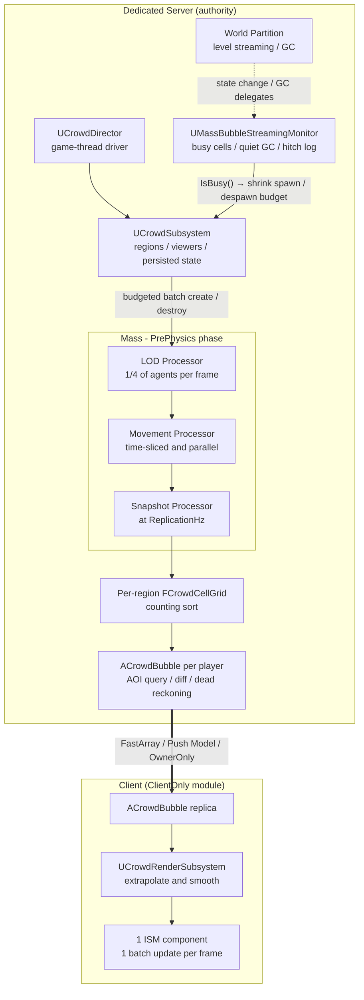
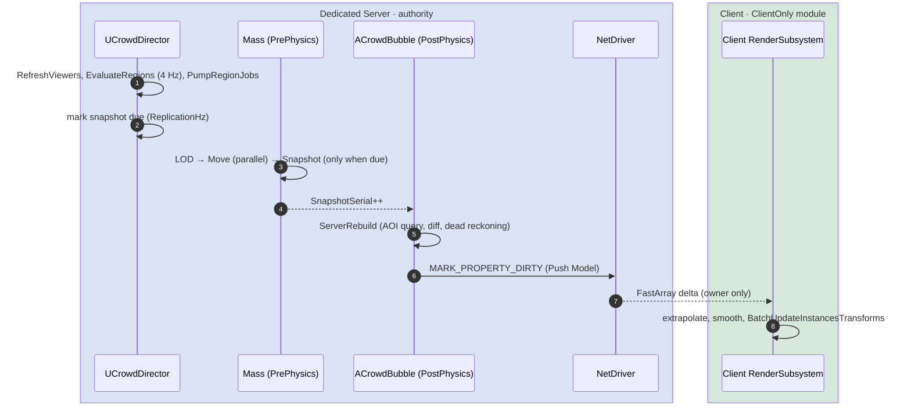
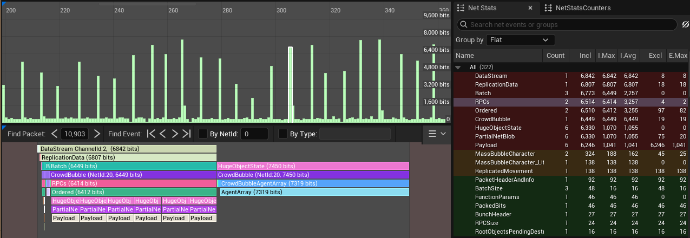
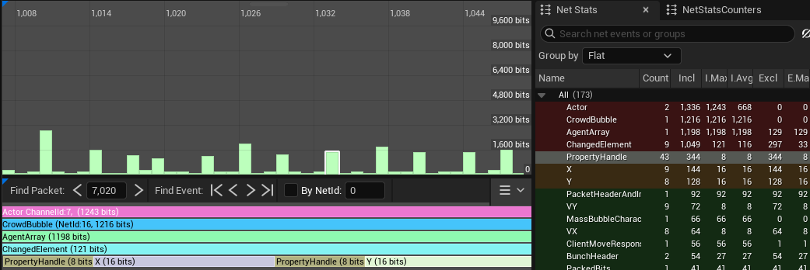
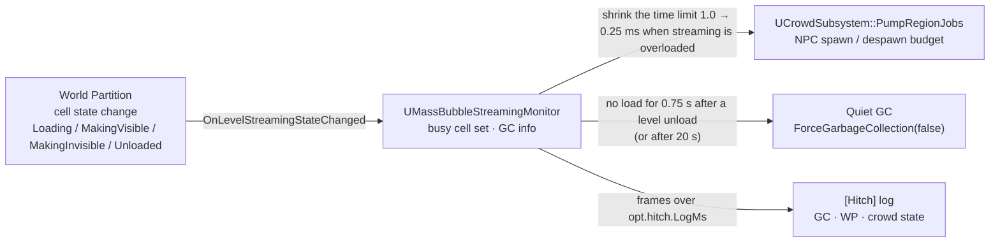

# MassBubble - World Partition + Mass Entity Multiplayer Optimization (UE 5.8, C++)

**A large-scale dedicated server optimization sample for Unreal Engine 5.8**

Server-authoritative **Mass Entity** simulation · per-player **AOI (Area of Interest) replication** · client-side **ISM batched rendering**


---

## Table of Contents

- [Overview](#overview)
- [Key Takeaways](#key-takeaways)
- [Architecture](#architecture)
- [Implementation Details](#implementation-details)
- [Instrumentation and Experiment Design](#instrumentation-and-experiment-design)
- [Verification (Automation Tests)](#verification-automation-tests)
- [Design Figures](#design-figures)
- [Getting Started](#getting-started)
- [Configuration](#configuration)
- [Design Choices and Optimization Costs](#design-choices-and-optimization-costs)
- [Code Map](#code-map)

---

## Overview

This is a reference implementation of a pipeline that **simulates thousands to tens of thousands of NPCs on a dedicated server** and replicates **only the surrounding area of each player (AOI)** to connected clients.

The design ensures that the following four cost axes each have an **observable upper bound**, regardless of how large the NPC population grows. Every optimization can be toggled individually via CVar kill switches, ensuring each is validated by measurement rather than assumption.

| Cost Axis | Naive Implementation (Actor-per-NPC) | MassBubble |
|---|---|---|
| Server CPU · Simulation | Actor/Component Tick per NPC; all agents updated every frame | Processing over contiguous per-chunk arrays in Mass, distance-based LOD + time-slicing, parallel chunk processing |
| Server CPU · Bandwidth · Replication | One ActorChannel per NPC, property comparison, full-state transmission | **One Actor per player**, Push Model, FastArray delta serialization, dead reckoning, 10-byte quantized records |
| Server · World Partition Streaming | A GC the engine forces right after every cell load / unload; bulk NPC spawns / despawns pile onto the same frame | Engine streaming time-limit profile, **Quiet GC**, reduced spawn / despawn budget while WP is under load, hitch log |
| Client · Rendering | Actor + Component + draw call overhead per NPC | **A single ISM Component**, one batch update per frame |

**Non-goals** — AI (behavior trees, pathfinding, collision avoidance), animation, external persistence, and anti-cheat are out of scope. NPC logic is intentionally simplified; it serves strictly as a workload for validating the data pipeline under heavy optimization (simulation → snapshot → replication → rendering).

---

## Key Takeaways

| Area | Approach | Effect | Key Files |
|---|---|---|---|
| Simulation | Fragments split by access pattern, single archetype, **LOD stored as a fragment value** | Contiguous array access eliminates cache misses; avoids structural changes (archetype moves) and memory overhead typically triggered by LOD changes | `CrowdFragments.h` |
| Simulation | Distance-based **LOD + time-slicing** (1 / 2 / 6 / 0 frames) + hysteresis | Under default settings with a single viewer, **only ≈ 830 out of 10,000** agents execute movement logic per frame (analytical estimate) | `CrowdProcessors.cpp`, `CrowdMath.h` |
| Simulation | `ParallelForEachEntityChunk`, chunk-local writes | Workload is distributed across worker threads, ensuring lock-free execution | `CrowdProcessors.cpp` |
| Streaming | **Region-owned state** + wall-clock-bounded processing + spawn / despawn scaled down under load + **deterministic restoration** | Independent of WP cell load/unload states; eliminates frame drops caused by spawning spikes | `CrowdSubsystem.cpp` |
| Streaming | **Prevents hitches at the moment WP loads / unloads** + engine streaming CVar profile + busy-cell monitoring + **Quiet GC** | While cells are loading or being removed, GC and NPC structural changes are deferred and engine work is spread across frames; the cause of a hitch (GC / WP / crowd) is told apart in the log | `MassBubbleStreamingMonitor.cpp`, `MassBubbleRuntimeConfig.cpp` |
| Spatial Query | Per-region uniform grid, rebuilt via **counting sort** | Rebuild complexity is O(N + cells) with zero allocations after warm-up, completely independent of world size | `CrowdCellGrid.h` |
| Spatial Query | Snapshot only the regions that touch a real player's bubble | Regions seen only by bots skip the grid build (copy + counting sort) | `CrowdSubsystem.cpp` |
| Replication | **One Actor per player** (`bOnlyRelevantToOwner` + `COND_OwnerOnly`) + **Push Model** | Eliminates per-NPC ActorChannels; guarantees zero comparison overhead when state is clean | `CrowdBubble.cpp` |
| Replication | int16 / int8 **quantization** + 200m lattice **origin rebasing** | Shrinks footprint to **10 bytes** per agent (−81% reduction vs. ≈ 52-byte naive layout) | `CrowdNetMath.h` |
| Replication | **Dead reckoning** (distance-dependent tolerance) | Zero redundant updates for agents moving in a straight line at constant velocity; automated tests assert message volume drops **under 15%** of the naive baseline | `CrowdNetMath.h`, `CrowdTests.cpp` |
| Replication | **Iris / legacy dual-compatible** FastArray | The same build can compare performance and compatibility by switching the replication system with a launch option. Network Insights confirmed that `AgentArray` is replicated to the client on both paths; the Iris path sends the whole `AgentArray`, unlike legacy, which sends only the changed elements (§6) | `CrowdBubble.cpp`, `MassBubbleRuntimeConfig.cpp` |
| Client | Extrapolation + exponential smoothing + **single-pass ISM batch updates** | Consolidates 400 agents into 1 Actor, 1 Component, and 1 render-state update | `CrowdRenderSubsystem.cpp` |
| Build | **`ClientOnly` module separation** | Dedicated server target completely strips out the rendering module | `MassBubble*.Target.cs` |
| Verification | CVar kill switches, integrated stat / CSV / Insights instrumentation, **hitch log**, 4 Automation Tests | Optimizations are measured and their performance verified; hitches are told apart by cause | `CrowdSettings.cpp`, `MassBubbleStats.h`, `MassBubbleStreamingMonitor.cpp`, `CrowdTests.cpp` |

---

## Architecture

### Component Diagram



### Data Flow



### Threading Model

| Component | Execution Context | Rationale |
|---|---|---|
| `UCrowdDirector`, `UCrowdSubsystem` | Game Thread | Structural changes (entity creation/destruction) are prohibited while Mass processing is active; deferred until `IsProcessing()` returns false |
| `UMassBubbleStreamingMonitor` | Game Thread (tickable world subsystem) | Level-streaming state changes and GC delegates are invoked on the game thread. `UCrowdSubsystem` reads `IsBusy()` on the same thread, so no lock is needed |
| `UCrowdLODProcessor` | Game Thread (`bRequiresGameThreadExecution`) | Accesses game-thread-restricted subsystems (e.g., the viewer list) |
| `UCrowdMovementProcessor` | Worker Threads (`ParallelForEachEntityChunk`) | Restricts writes to chunk-local memory; reads settings from an immutable, POD tuning snapshot |
| `UCrowdSnapshotProcessor` | Game Thread | Writes data to region-specific grids owned by the game-thread subsystem |
| `ACrowdBubble::Tick` | Game Thread, `TG_PostPhysics` | Consumes the snapshot generated during the PrePhysics Mass phase within the exact same frame |
| `UCrowdRenderSubsystem::Tick` | Client Game Thread | Drives batch transformations for the ISM Component |

### Design Principles

- **Single Source of Truth** — Mass entities exist strictly on the server or in standalone environments (`ExecutionFlags`, `ShouldCreateSubsystem`). Clients maintain only a quantized, local view of their immediate AOI.
- **State Decoupled from Actors** — NPC state is managed by the Region (a server-side subsystem), not individual Actors. Its lifecycle is entirely independent of World Partition cell streaming states.
- **Heavy Work Deferred to Streaming-Idle Moments** — While World Partition cells are loading or being removed, the NPC spawn / despawn budget is reduced, and the GC that follows a cell unload runs only once no busy cell is left. A one-frame delay on the server is a delay for every player.
- **Isolatable Optimizations (Kill Switches)** — Every optimization feature supports real-time deactivation to allow empirical A/B performance profiling.
- **Header-Only Pure Logic** — Core math and structures (`CrowdMath.h`, `CrowdCellGrid.h`, `CrowdNetMath.h`) are architected without dependencies on a world context, Mass, or replication layers, making them fully unit-testable.
- **Compile/Design-Time Invariant Enforcement** — Structural thresholds and configurations are strictly clamped to mathematically prevent invalid states (e.g., ensuring the maximum bubble radius never overflows safe int16 boundaries).

---
## Implementation Details

### 1. Data-Oriented Simulation (Mass Entity)

An agent is represented by a single archetype (`FCrowdAgentTag` + four fragments). Fragments are intentionally isolated **by access pattern**: the LOD pass reads `Location` and writes exclusively to `LOD`; the movement pass updates `Location`, `Motion`, and `PendingDelta`; while the snapshot pass reads all elements. Because Mass stores fragments in contiguous, per-chunk arrays, unaccessed data never pollutes cache lines. Read/write safety boundaries declared via `EMassFragmentAccess` establish clear data dependencies for safe concurrent thread scheduling.

```cpp
// Crowd/CrowdFragments.h (abridged) — 56 B total / agent
struct FCrowdAgentTag         : FMassTag      {};
struct FCrowdIdFragment       : FMassFragment { uint32 NetId; int32 HomeX; int32 HomeY; int32 RegionSlot; };  // 16 B, read-mostly
struct FCrowdLocationFragment : FMassFragment { FVector2D Location; };                                        // 16 B, double (LWC)
struct FCrowdMotionFragment   : FMassFragment { FVector2f Velocity; float RetargetTimer; uint32 Rng; };      // 16 B
struct FCrowdLODFragment      : FMassFragment { ECrowdLOD Tier; float PendingDelta; };                        //  8 B
```

- **LOD as a Fragment Value, Not a Tag** — Adding or removing tags forces expensive structural changes (moving entities between archetypes), whereas modifying a fragment value is an O(1) operation.
- **`RegionSlot` Indexing** — Eliminates per-agent hash map lookups during the high-frequency snapshot pass.
- **Large World Coordinates (LWC)** — Internal coordinates utilize `FVector2D` (double) precision for safe large-world simulation, delaying quantization until the replication boundary.
- **Query Pruning Safe Guards** — Since agents are spawned dynamically at runtime, matching archetypes do not exist at startup. To prevent Mass from permanently pruning empty queries, all three processors return `false` from `ShouldAllowQueryBasedPruning()`, allowing `UCrowdDirector` to safely bootstrap initialization.

#### MassEntity Memory and Performance Metrics — Mass Debugger (PIE)

| Evaluation Item | Measured Value / Spec | Optimization Result and Technical Significance |
| :--- | :--- | :--- |
| **Single archetype** | `0xFFC5A8E9` (consolidated into one) | LOD tiers are designed as Fragment values rather than Tags, which **fundamentally eliminates the dynamic archetype-relocation operations (Structural Changes)** that a state change would otherwise cause. |
| **Per-entity memory** | **64 B** (Fragment 56 B + Handle 8 B) | Agent data is packed into a 64-byte linear layout, giving a memory arrangement that is friendly to CPU cache lines. |
| **Chunk occupancy** | **99.2%** (avg 2,030.8 / max 2,047 entities) | Entities are packed densely, without gaps, into 13 chunks of 128 KiB each. |
| **Fragmentation waste** | **only 0.637%** (about 14 KiB) | Unlike a typical object-oriented layout, the linear data layout **holds memory waste down to nearly 0%**. |
| **Spatial complexity** | Build: `O(N + cells)` / query: `O(visited cells + agents)` | Complexity is minimal, and internal arrays are reused through `Reset()` and `EAllowShrinking::No`, achieving **zero additional runtime memory allocations after warm-up**. |
| **Network data savings** | **10 B per agent** | Data quantization and origin rebasing **cut network send / receive volume by about 81%** compared with the previous layout. |

The captures below show the Mass Debugger in editor PIE, confirming that Mass behaves as configured above. They check the configuration and are not a performance benchmark.

<p align="center">
  <br>
  <sub>Mass Debugger › Archetypes — <code>0xFFC5A8E9</code></sub>
</p>

<p align="center">
  <br>
  <sub>Mass Debugger › Fragments</sub>
</p>

- **All four fragments are attached to the same entity set**: the `Crowd Id` · `Location` · `Motion` · `LOD` fragments are all listed with 1 archetype / 26,400 entities (the same row repeats in the list, but the values are identical).

<p align="center">
  <br>
  <sub>Mass Debugger › Entities</sub>
</p>

- **Entity handles**: the handles in the Entities tab (`i`: index, `sn`: serial number) confirm that agents are actually created as entities.

<p align="center">
  <br>
  <sub>Mass Debugger › Processors</sub>
</p>

- **Processor registration**: `CrowdLODProcessor_0` · `CrowdMovementProcessor_0` · `CrowdSnapshotProcessor_0` are registered under *Phase-executed processors* (not as observers). The SmartObject · DebugVis · EnvQuery families in the same list are default engine / plugin processors.

<p align="center">
  <br>
  <sub>Mass Debugger › Process Graphs › Pre Physics Group</sub>
</p>

- **Execution order**: in the `Pre Physics Group`, `CrowdLODProcessor` → `CrowdMovementProcessor` → `CrowdSnapshotProcessor` are linked as a dependency chain, so the order declared with `ExecuteAfter` (LOD → Move → Snapshot) can be seen exactly as it was compiled. The default engine processors are shown under a separate root.

### 2. Region-Based Population Streaming

NPC state lifecycle is detached from Actor lifecycles, residing instead within **Regions** managed by a server-side subsystem (defaulting to 128m to align with standard World Partition runtime cell dimensions). Agents are neither destroyed nor reset when World Partition cells stream out.

```cpp
// Crowd/CrowdSubsystem.h
enum class ECrowdRegionState : uint8
{
	Inactive,   // No entities exist; only the compact, persisted state remains in memory
	Spawning,   // Entities are instantiated in time-sliced batches governed by a frame budget
	Active,     // Region is fully populated and actively running simulation
	Despawning, // State is serialized to memory and entities are batched out
};
```

```cpp
// Crowd/CrowdSubsystem.cpp — TickDirector / PumpRegionJobs
// Structural changes (creation / destruction) are only allowed while Mass is not processing.
if (!EntityManager->IsProcessing())
{
	PumpRegionJobs();
}

// PumpRegionJobs: bounded by wall-clock time, not by count (abridged)
const bool bBudgeted = CrowdCVars::BudgetedPump != 0;                          // 0 = previous fixed-count behavior (A/B)
const bool bStreamingBusy = Monitor.IsValid() && Monitor->IsBusy();            // is WP loading / adding / removing cells?
const double BudgetMs = bStreamingBusy ? T.SpawnBudgetBusyMs : T.SpawnBudgetMs; // 0.25 ms : 1.0 ms
const double Deadline = FPlatformTime::Seconds() + 0.001 * BudgetMs;
const int32 Batch = bBudgeted ? T.StructuralBatchSize : T.MaxSpawnPerFrame;    // 64

int32 Budget = T.MaxSpawnPerFrame;                                             // hard cap per frame
bool bDidWork = false;
while (Budget > 0 && SpawnQueue.Num() > 0)
{
	// At least one batch always runs per frame; once the budget is exceeded, the rest is deferred to the next frame.
	if (bBudgeted && bDidWork && FPlatformTime::Seconds() >= Deadline)
	{
		break;
	}

	FCrowdRegion& Region = Regions[SpawnQueue[0]];
	// BatchCreateEntities (bulk entity creation)
	const int32 Used = SpawnSlice(Region, FMath::Min(Budget, Batch));
	Budget -= FMath::Max(Used, 1);
	bDidWork = true;
	if (Region.State == ECrowdRegionState::Active)
	{
		SpawnQueue.RemoveAt(0);
	}
	// A region that still has agents left is continued by the next iteration (or the next frame).
}
// Despawn follows the same rule (DespawnBudgetMs / DespawnBudgetBusyMs, BatchDestroyEntities)
```

- **Streaming Bounds Evaluation** — Active regions are dynamically evaluated at **4 Hz** based on a Chebyshev distance (`ActiveRegionRadius`, default = 2, yielding a 5×5 grid) surrounding all active viewers (players and virtual stress bots).
- **Proximity-Based Prioritization** — Newly prioritized regions are sorted and activated based on ascending distance to the closest viewer, ensuring immediate player surroundings populate first.
- **Activation Hysteresis Buffer** — Out-of-bounds regions are preserved for a grace period defined by `RegionDeactivateDelaySec` (10s) before despawning, eliminating thrashing when players cross borders repeatedly.
- **Wall-Clock Time-Slicing** — Limits by **time**, not by count. `BatchCreateEntities` / `BatchDestroyEntities` are called `StructuralBatchSize` (64) agents at a time and the clock is checked after every batch; once `SpawnBudgetMs` / `DespawnBudgetMs` (1.0 ms each) is exceeded, the rest is deferred to the next frame. At least one batch always runs per frame, so the queue never stalls, and `MaxSpawnPerFrame` (500) / `MaxDespawnPerFrame` (1,000) remain as hard caps.
- **Streaming-Linked Budget** — While `UMassBubbleStreamingMonitor` detects World Partition cells loading / being added to the world / being removed (`IsBusy()`), the budget shrinks to `SpawnBudgetBusyMs` / `DespawnBudgetBusyMs` (0.25 ms each). The point is not to pile NPC structural changes onto a stretch of frames the engine is already spending.
- **A/B** — `opt.crowd.BudgetedPump 0` returns to the previous behavior (a fixed 500 / 1,000 agents per frame, no clock checks), which reproduces the streaming hitch.
- **Deterministic State Restoration** — Upon deactivation, entity metrics (`FCrowdSavedAgent` tracking NetId, transform, velocity, timers, and internal pseudo-random state) are packed into memory, ensuring identical reconstruction via `Seed = Hash32(regionCoordHash ^ WorldSeed)` and per-agent xorshift32 generation.

### 3. Distance-Based LOD and Time-Slicing

| Tier | Distance (to nearest viewer) | Simulation Interval |
|---|---|---|
| High | < 40 m | Every frame |
| Medium | 40 – 100 m | Every 2 frames |
| Low | 100 – 200 m | Every 6 frames |
| Off | ≥ 200 m | Frozen |

```cpp
// Crowd/CrowdMath.h — LOD tier computation with a hysteresis band
inline ECrowdLOD ComputeTier(float Dist, ECrowdLOD Current, const FCrowdTuning& T)
{
	const ECrowdLOD Wanted =
		Dist < T.LODDistanceCm[0] ? ECrowdLOD::High :
		Dist < T.LODDistanceCm[1] ? ECrowdLOD::Medium :
		Dist < T.LODDistanceCm[2] ? ECrowdLOD::Low : ECrowdLOD::Off;

	if (Wanted == Current)
	{
		return Current;
	}

	// Down-sampling LOD: only drop quality if distance exceeds boundary + hysteresis
	if (static_cast<uint8>(Wanted) > static_cast<uint8>(Current))
	{
		return Dist > T.LODDistanceCm[static_cast<int32>(Current)] + T.LODHysteresisCm ? Wanted : Current;
	}
	// Up-sampling LOD: only elevate quality if distance falls inside boundary - hysteresis
	return Dist < T.LODDistanceCm[static_cast<int32>(Wanted)] - T.LODHysteresisCm ? Wanted : Current;
}
```

```cpp
// Crowd/CrowdProcessors.cpp — UCrowdMovementProcessor: per-tier time-slicing
// 0 = frozen, 1 = update every frame, N = update every N-th frame (agents are spread evenly across frames by NetId)
const int32 Interval = bTimeSlice ? Tuning.LODIntervalFrames[static_cast<int32>(LOD.Tier)] : 1;
if (Interval == 0) { continue; }
if (Interval > 1 && ((Frame + Ids[i].NetId) % static_cast<uint32>(Interval)) != 0u)
{
	LOD.PendingDelta += DeltaTime;   // Accumulate skipped delta time for later evaluation
	continue;
}
const float Step = FMath::Min(LOD.PendingDelta + DeltaTime, Tuning.MaxStepDeltaSec);
LOD.PendingDelta = 0.f;
```

- **Distributed LOD Classification** — Evaluates and re-classifies exactly 1/4 of total agents per frame using a fast bitwise operation (`& 3`) on the agent's NetId and the frame index, smoothing out CPU evaluation spikes.
- **Delta-Time Accumulation Protection** — Skipped frame deltas are safely cached and evaluated during the agent's active tick, bounded tightly by `MaxStepDeltaSec` (0.5s) to mitigate high-velocity teleportation errors.
- **Extrapolation Desync Prevention** — Snapshot velocities for frozen entities (`ECrowdLOD::Off`) are explicitly clamped to zero, preventing dead-reckoning extrapolation on connected clients from causing stopped characters to drift indefinitely.

```cpp
// Crowd/CrowdProcessors.cpp — UCrowdSnapshotProcessor
// Clamp frozen velocities to zero on the server to prevent floating-point drift during client-side extrapolation.
const FVector2f Velocity = (LODs[i].Tier == ECrowdLOD::Off) ? FVector2f::ZeroVector : Motions[i].Velocity;
```

### 4. Parallel Movement Processing

By declaring `bRequiresGameThreadExecution = false`, the Movement Processor decouples execution from the main thread, scattering chunk logic concurrently via `ParallelForEachEntityChunk`.

```cpp
// Crowd/CrowdProcessors.cpp — UCrowdMovementProcessor::Execute
std::atomic<int32> Simulated{ 0 };

// Safe concurrent execution across distinct chunk boundaries
auto ProcessChunk = [&](FMassExecutionContext& ChunkContext)
{
	int32 LocalSimulated = 0;
	// ... core simulation loop: time-slicing → wander → integration → region bounds collision reflection
	Simulated.fetch_add(LocalSimulated, std::memory_order_relaxed);   // Single atomic commit per chunk execution
};

if (CrowdCVars::ParallelMove != 0) { EntityQuery.ParallelForEachEntityChunk(Context, ProcessChunk); }
else                               { EntityQuery.ForEachEntityChunk(Context, ProcessChunk); }
```

- **Thread-Safety Proof** — Concurrency is guaranteed safe because: (1) memory mutations are strictly isolated to localized, chunk-specific arrays; (2) simulation configurations read exclusively from an unmanaged, immutable POD snapshot (`FCrowdTuning`); (3) random generation relies on per-agent unique states inside their respective fragments, removing centralized RNG locks; and (4) telemetry metrics are collected locally per chunk and pushed via thread-safe atomic relaxed additions.
- Main-thread-bound dependencies (LOD evaluation, Snapshot generation) declare a `GameThreadOnly = true` trait via `TMassExternalSubsystemTraits` to enforce execution isolation.

#### Editor Verification — Unreal Insights (PIE)

<p align="center">
  <br>
  <sub>Unreal Insights › Timing Insights — timer filter <code>crowd</code> (Editor · Development, one frame zoomed in)</sub>
</p>

- **Thread placement**: `CrowdLODProcessor_0` (≈ 141 µs) and `CrowdSnapshotProcessor_0` (≈ 485 µs, on a frame where a snapshot ran) run inside the Game Thread's `MassProcessingQueue Main-Thread Runner Task`, while `CrowdMovementProcessor` (`Opt.Crowd.Move` ≈ 75 µs) runs in the `Mass Processor Worker Task` on `Foreground Worker #0`. This matches the placement in the [Threading Model](#threading-model) table (LOD · Snapshot = game thread, Movement = worker).
- **`OPT_SCOPE` events**: `Opt.Crowd.LOD` / `Opt.Crowd.Move` / `Opt.Crowd.Snapshot` appear nested inside the processor scopes, and the timer panel lists `Opt.Crowd.Director`, `Opt.Crowd.Bubble`, and `Opt.Crowd.SpawnSlice` / `DespawnSlice` under the same naming scheme ([Instrumentation and Experiment Design](#instrumentation-and-experiment-design)).
- **Share of the frame**: in this frame the whole Mass `PrePhysics` phase takes ≈ 0.79 ms out of a 14.03 ms frame. This is a single-frame sample, not a benchmark; comparative measurements are done with the A/B switches.

### 5. Snapshot and Spatial Grid

To shield the networking tier from expensive, high-frequency locks against the central Mass `EntityManager`, the `UCrowdSnapshotProcessor` isolates active entity states into flat, region-aligned structures at a throttled interval (`ReplicationHz`, default = 10 Hz). On non-sync frames, the execution query returns instantly.

```cpp
// Crowd/CrowdProcessors.cpp — UCrowdSnapshotProcessor::Execute
UCrowdSubsystem* Crowd = Context.GetMutableSubsystem<UCrowdSubsystem>();
if (Crowd == nullptr || !Crowd->IsSnapshotDue())
{
	return; 
}
```

Every isolated region (128 m) maintains an internal, 8×8 uniform grid (16 m per cell) completely rebuilt from scratch during the snapshot tick via a highly optimized **counting sort**.

```cpp
// Crowd/CrowdCellGrid.h — EndBuild
for (int32 i = 0; i < Num; ++i)                      // Phase 1: Generate cell histogram
{
	const int32 Cell = CellIndex(Agents[i].Pos);
	CellOfAgent[i] = Cell;
	++CellStart[Cell + 1];
}
for (int32 c = 0; c < NumCells; ++c)                 // Phase 2: Compute sequential start offsets
{
	CellStart[c + 1] += CellStart[c];
}
// ... Cursor represents a working duplicate copy of CellStart
for (int32 i = 0; i < Num; ++i)                      // Phase 3: Sort agent indices linearly into cells
{
	Order[Cursor[CellOfAgent[i]]++] = i;
}
```

- **Algorithmic Complexity** — Build overhead is bounded at O(N + cells); spatial lookup runs at O(visited cells + matched agents). Array storage is preserved via `Reset()` with `EAllowShrinking::No` to ensure absolute zero heap allocations post-initialization.
- **Local vs. Global Grid Architectural Trade-off** — Localized 8×8 region grids remain inside CPU L1/L2 caches and scale uniformly regardless of whether entities are separated by dozens of kilometers. A single global grid would alternatively suffer from enormous sparse matrix structures or severe floating-point degradation at extreme coordinates.
- **Spatial Resolution Queries** — Bounding box expansion evaluates cell boundaries using fast, squared-distance validation, avoiding heavy square-root operations. Out-of-bounds agents are safely clamped into safe perimeter buckets, preventing entity loss during region handoffs.
- **Snapshot Scope** — Only the **regions that touch a real player's bubble** are snapshotted, not every live region (radius `BubbleRadiusCm` + `SnapshotMarginCm` (20 m)). A region seen only by server-side bots (virtual viewers) is never replicated anyway, so its grid build (copy + counting sort) is skipped. The grid of an out-of-scope region holds stale data, so `ForEachAgentInCircle` also skips that region and never emits stale agents. `opt.crowd.SnapshotScope 0` returns to the previous behavior (every live region).

```cpp
// Crowd/CrowdSubsystem.cpp — BeginSnapshot (abridged)
const double Reach = T.BubbleRadiusCm + T.SnapshotMarginCm;      // 15,000 + 2,000 cm
for (const FCrowdViewer& Viewer : Viewers)
{
	if (Viewer.bVirtual)
	{
		continue;   // bots / anchors are not replication targets
	}
	// Among the regions covered by the Viewer ± Reach rectangle, only Active / Spawning ones get RegionSnapshotMask[Slot] = 1
}
// Only regions whose mask is set get BeginBuild / EndBuild.
// ForEachAgentInCircle skips regions outside the mask (= stale grids).
```

### 6. Per-Player AOI Replication — `ACrowdBubble`

Rather than turning a 400-agent neighborhood into 400 individual replicated Actors—which destroys server network performance—**a single dedicated Actor is spawned per player**, streaming their entire local AOI down via an optimized `FFastArraySerializer`. (It follows the same idea as the Client Bubble approach used by Epic's MassReplication plugin, written as a minimal implementation.)

```cpp
// Net/CrowdBubble.cpp — constructor and replicated properties
ACrowdBubble::ACrowdBubble()
{
	bReplicates = true;
	bOnlyRelevantToOwner = true;        // Explicitly private to the owning connection
	bAlwaysRelevant = false;
	bNetLoadOnClient = false;
	SetNetUpdateFrequency(20.f);        // Push Model prevents structural comparisons when state remains clean
	SetMinNetUpdateFrequency(2.f);
	PrimaryActorTick.TickGroup = TG_PostPhysics;   // Synchronously extracts PrePhysics data within the same frame boundary
}

void ACrowdBubble::GetLifetimeReplicatedProps(TArray<FLifetimeProperty>& OutLifetimeProps) const
{
	Super::GetLifetimeReplicatedProps(OutLifetimeProps);

	FDoRepLifetimeParams Params;
	Params.bIsPushBased = true;
	Params.Condition = COND_OwnerOnly;
	DOREPLIFETIME_WITH_PARAMS_FAST(ACrowdBubble, AgentArray, Params);
	DOREPLIFETIME_WITH_PARAMS_FAST(ACrowdBubble, OriginLattice, Params);
}
```

The high-frequency `ServerRebuild()` stage checks if `SnapshotSerial` has mutated (aligning with `ReplicationHz`), processing four specialized pipeline steps:

1. **Lattice Origin Translation** — Evaluates and repositions the bubble lattice center whenever the target viewer drifts more than 110m away from the active center.
2. **Proximity Filtering** — `ForEachAgentInCircle` queries local spatial grids, performing distance truncation to cap elements at `MaxAgentsPerBubble` (400 slots).
3. **State Transition Evaluation (Enter/Stay/Leave)** — Maps entity lifecycles using a fast `NetId → local index` lookup verified against epoch tracker marks.
4. **Delta Dirty Marking** — Fires `MarkItemDirty` only when precision updates cross dead-reckoning delta limits, running structural updates (`MarkArrayDirty`) and Push Model flags exclusively when layout adjustments occur.

```cpp
// Net/CrowdBubble.cpp — ServerRebuild (abridged)
++Epoch;
for (const FCandidate& Candidate : Candidates)
{
	const int32* IndexPtr = IdToIndex.Find(Agent.NetId);
	if (IndexPtr == nullptr)                          // Case 1: Entry into player interest zone
	{
		const int32 NewIndex = Items.AddDefaulted();
		FillItem(Items[NewIndex], Agent, OriginWorld, Now);
		Items[NewIndex].SeenEpoch = Epoch;
		IdToIndex.Add(Agent.NetId, NewIndex);
		AgentArray.MarkItemDirty(Items[NewIndex]);
		++NumDirty;
		bStructural = true;
		continue;
	}

	FCrowdAgentItem& Item = Items[*IndexPtr];         // Case 2: Persisted Agent: sync only if dead-reckoning error threshold is exceeded (§8)
	Item.SeenEpoch = Epoch;
	if (bRebase || CrowdNet::ShouldResend(Agent.Pos, Agent.Vel, Item.SentPos, Item.SentVel,
	                                      Now - Item.SentTime, Tolerance, Tuning.VelocityEpsCmPerSec))
	{
		FillItem(Item, Agent, OriginWorld, Now);
		AgentArray.MarkItemDirty(Item);
		++NumDirty;
	}
}

for (int32 i = Items.Num() - 1; i >= 0; --i)         // Case 3: Exit from interest zone: O(1) swap-remove execution
{
	if (Items[i].SeenEpoch == Epoch) { continue; }
	IdToIndex.Remove(Items[i].NetId);
	Items.RemoveAtSwap(i);
	if (i < Items.Num()) { IdToIndex[Items[i].NetId] = i; }   // Correct index mapping for shifted tail element
	bStructural = true;
}

if (bStructural)                 { AgentArray.MarkArrayDirty(); }
if (bStructural || NumDirty > 0) { MARK_PROPERTY_DIRTY_FROM_NAME(ACrowdBubble, AgentArray, this); }
// Push Model: Bypasses standard replication loop comparative tracking entirely if property is unmodified
```

> With `opt.crowd.DeadReckoning 0`, the previous logic runs instead of `ShouldResend`: every agent that is moving or has just stopped is re-sent on every tick (for A/B measurement).

#### Iris / Legacy Dual-Replication Design

`FCrowdAgentArray` is a standard `FFastArraySerializer`, so it **works on both** the legacy NetDriver (`NetDeltaSerialize`) and Iris (which supports existing FastArray definitions), and the same build can be compared by switching `-UseIrisReplication=0 / 1`. Because the two systems behave differently, the following handling is in place.

```cpp
// Net/CrowdBubble.cpp — ServerRebuild: after the swap-remove (abridged)
Items.RemoveAtSwap(i);
if (i < Items.Num())
{
	FCrowdAgentItem& Moved = Items[i];                  // the last element moved into slot i
	IdToIndex[Moved.NetId] = i;
	FillItem(Moved, Candidates[Moved.CandidateIndex].Agent, OriginWorld, Now);   // refresh with the agent's current state
	AgentArray.MarkItemDirty(Moved);                    // the contents of slot i changed, so it must be sent
}

// Net/CrowdBubble.h — FCrowdAgentItem::MarkReceived: restart the extrapolation clock only when the replicated value actually changed
if (bFirstTime || NetId != AppliedNetId || X != AppliedX || Y != AppliedY || VX != AppliedVX || VY != AppliedVY)
{
	RecvTime = Now;
	// Applied* = the current replicated values
}
```

- **Resend after swap-remove (Iris compatibility)**: Legacy FastArray serialization tracks each item by its own unique ID (`ReplicationID`), so even when `RemoveAtSwap` changes the array order, no additional network cost is incurred. UE 5's new Iris replication system, on the other hand, identifies elements by their array 'index'. The last item, which moved into the vacated slot `i`, is therefore recognized by Iris as a change in the contents of slot `i` and is sent to the client again. The important point here is that the data of the agent moved into slot `i` must first be refreshed to its current latest state. Otherwise the client restarts extrapolation from an outdated reference position from the past, causing a visual side effect in which the character abruptly snaps hard backward (rubber-banding).
- **`MarkReceived`**: Iris can also report items whose values are unchanged. If `RecvTime` were refreshed every time, the agent would return to its last reference position and walk the same distance again, so the clock is restarted only when the value differs from the one applied just before (`Applied*`).
- **`operator==`**: Iris (and FastArray change detection) compares items by value, so only the replicated fields (`NetId`, `X`, `Y`, `VX`, `VY`) take part in the comparison. Server / client bookkeeping fields are excluded.
- **`bReplicateUsingRegisteredSubObjectList = true`**: Iris replicates sub-objects only through the registered sub-object list. The bubble has no sub-objects right now, but this is turned on so that it keeps working correctly if any are added.
- **How to verify**: The console command `opt.net.Info` logs which replication system this process requested (Iris / legacy), along with `net.IsPushModelEnabled` and `net.SubObjects.DefaultUseSubObjectReplicationList` (Iris requires it to be 1). Whether Iris is really replicating the bubble is confirmed with `Net.Iris.PrintPushBasedStatuses` (`CrowdBubble` should show `PushBased: 1`) and the `LogIris` log at startup. On the client, the `opt.crowd.RenderStats 1` on-screen output also shows the replication mode in its `net=` entry.

#### Network Insights Analysis

On both the `-UseIrisReplication=1` (Iris) and `-UseIrisReplication=0` (Legacy FastArray) paths, we confirmed that `ACrowdBubble`'s `AgentArray` is replicated to the client correctly. The two captures are packets taken from different runs, and their purpose is to verify the **runtime serialization and replication path**, not to compare bandwidth (a KB/s benchmark).

<p align="center">
  <br>
  <sub>Networking Insights › Iris (<code>-UseIrisReplication=1</code>) — <code>DataStream</code> packet; the whole <code>AgentArray</code> is sent as <code>HugeObjectState</code> → <code>PartialNetBlob</code> pieces</sub>
</p>

<p align="center">
  <br>
  <sub>Networking Insights › legacy FastArray (<code>-UseIrisReplication=0</code>) — <code>Actor</code> channel packet; only the changed elements are sent as <code>ChangedElement</code></sub>
</p>

| Category | Iris (`-UseIrisReplication=1`) | Legacy FastArray (`-UseIrisReplication=0`) |
| :--- | :--- | :--- |
| **Top-level event** | `DataStream` (Channel 2 / 6,842 bits) | `Actor` (Channel 7 / 1,243 bits) |
| **Bubble object** | `CrowdBubble` (NetId 20) | `CrowdBubble` (NetId 16 / 1,216 bits) |
| **`AgentArray` structure** | `HugeObjectState` ➔ `CrowdBubbleAgentArray` (7,319 bits) | `AgentArray` (1,198 bits) |
| **Transfer unit** | `PartialNetBlob` (split into 6 pieces and streamed / 6,246 bits in total) | `ChangedElement` (9 variable-size entries / 1,049 bits in total) |
| **Sub-properties** | None (the whole array is serialized as a single monolithic block) | `PropertyHandle` + individual fields `X·Y` · `VX·VY` separated |

- **Cross-check that the replication pipeline is active**: We confirmed that the same bubble container data branches cleanly into different top-level channels (`DataStream` vs `ActorChannel`) depending on the run mode. The fundamental difference in the timeline event structure (the `HugeObjectState` ➔ `PartialNetBlob` packet-splitting mechanism vs. `ChangedElement` variable delta synchronization) demonstrates that the serialization architecture is fully swapped at the engine level at runtime.
- **Precise delta transfer in Legacy FastArray and conformance to the wire format**: Only the agent data that needs synchronizing is received, cleanly separated into 9 `ChangedElement` events, and even inside an element scope only the properties detected as changed are packed compactly into the payload together with a `PropertyHandle`-derived context (X 9 times, Y 8 times, VX 8 times, VY 9 times observed). The per-field data allocation collected in this timeline trace matches the self-implemented compressed wire format specification (X·Y: 16-bit `int16`, VX·VY: 8-bit `int8`) down to the individual bit.
- **Systemic limitation of Iris replication**: At this stage the Iris engine does not support generating variable-size binary pieces per element, and instead serializes the entire `AgentArray` as one huge single state block (7,319 bits). This forces the `PartialNetBlob` path, which splits a large raw object into pieces and streams them safely (6 `Payload` pieces were received in the sample packet), and as a result FastArray's inherent variable-delta compression efficiency (the gain from delta transfer) is temporarily diminished. This profiling result clearly supports the technical necessity of the receive-cache verification mechanism (the `MarkReceived` exception handling) that was designed earlier to prevent computation blow-ups on the client layer.
- **Notes on reading the profiler data**
  - **Separate identifier namespaces**: The top-level `NetId` values (20 and 16) shown in the visualization tool are internal handles assigned to the replicated network actor container itself, and are a completely independent management code from `FCrowdAgentItem::NetId`, the domain data that tracks each NPC agent inside the struct array.
  - **Bandwidth figures cannot be compared directly**: The two traces differ completely in the nature of their packet transmission architecture. The Iris trace was captured at a moment while the full state of a large struct was being sent in pieces, whereas the Legacy trace is a pure variable-delta compressed packet. The per-packet bit counts shown therefore cannot be used to declare an advantage for either system as a whole; long-run average send volume (KB/s) under fixed, controlled conditions is planned to be added as quantitative figures in a later measurement section.

### 7. Wire Format — Data Quantization and Lattice Origin

| Field | Type | Size | Resolution / Bound |
|---|---|---|---|
| `NetId` | `uint32` | 4 bytes | Monotonically increasing agent token (survives region lifecycle transformations) |
| `X`, `Y` | `int16` × 2 | 4 bytes | Relative coordinate offsets mapped from lattice center (1cm resolution, ±327m max capacity) |
| `VX`, `VY` | `int8` × 2 | 2 bytes | Quantized velocity components (5cm/s resolution steps, ±635cm/s bounds) |
| **Total Size** | | **10 bytes** | Excludes base FastArray structural array packet packing bytes |

Compared with unoptimized structures (`FVector` Position [24 bytes] + `FVector` Velocity [24 bytes] + `int32` ID ≈ **52 bytes**), this packed layout delivers an **81% reduction** in network payload size.

```cpp
// Net/CrowdBubble.h (abridged) — Unmarked raw properties are skipped by the reflection compiler, acting as local memory caches
USTRUCT()
struct FCrowdAgentItem : public FFastArraySerializerItem
{
	GENERATED_BODY()

	UPROPERTY() uint32 NetId = 0;
	UPROPERTY() int16  X = 0;     // 1cm resolution scaling from active lattice center
	UPROPERTY() int16  Y = 0;
	UPROPERTY() int8   VX = 0;    // 5cm/s resolution scaling
	UPROPERTY() int8   VY = 0;

	// Server Verification Cache: Tracks de-quantized history expected on client
	FVector2D SentPos; FVector2f SentVel; double SentTime = 0.0; uint32 SeenEpoch = 0;
	// Client Cache: Records precise arrival time stamps to anchor local extrapolation calculations
	double RecvTime = 0.0;
};
```

To accommodate high-resolution simulation while enforcing rigid `int16` constraints (±327.67m), positions are flattened into localized offsets calculated from a **200-meter aligned sliding lattice network**.
The system enforces the following spatial invariants:
- The viewer is mathematically guaranteed to stay within ≤ 110m (`RebaseDistanceCm`) of the current lattice center.
- The active replication radius is bounded at ≤ 210m (`MaxBubbleRadiusCm`) from the viewer.
- This bounds the absolute maximum offset at 320m, fitting safely within the signed `int16` range (< 327.67m).
- The network tracker states are stored via `FIntPoint OriginLattice` properties inside `ACrowdBubble`.

```cpp
// Net/CrowdNetMath.h
constexpr double OriginLatticeCm   = 20000.0;  // 200m snapped step grid boundaries
constexpr double RebaseDistanceCm  = 11000.0;  // 110m threshold (100m half-lattice window + 10m hysteresis buffer)
constexpr float  MaxBubbleRadiusCm = 21000.f;  // 110m drift + 210m radius = 320m ceiling (< 327.67m int16 limit)

FORCEINLINE int16 QuantizeOffset(double RelativeCm)
{
	return static_cast<int16>(FMath::Clamp(FMath::RoundToInt(RelativeCm / PosUnitCm), -32768, 32767));
}

/** Returns true when player leaves the current lattice safe zone, forcing an origin rebase (full resend). */
FORCEINLINE bool NeedsRebase(const FVector2D& Viewer, const FVector2D& OriginWorld)
{
	return FMath::Max(FMath::Abs(Viewer.X - OriginWorld.X), FMath::Abs(Viewer.Y - OriginWorld.Y)) > RebaseDistanceCm;
}
```

```cpp
// Crowd/CrowdSettings.cpp — Enforce network invariants at the configuration layer
Out.BubbleRadiusCm = FMath::Clamp(S.BubbleRadiusCm, 1000.f, CrowdNet::MaxBubbleRadiusCm);
```

- **Origin Rebase Mitigations** — Moving the lattice center requires a full network resend of all active items within the bubble, making it an expensive operation. A 10m spatial hysteresis zone prevents rapid rebase loops when a player hovers directly on a lattice boundary. Automated edge testing under continuous ±3m position jitter recorded zero thrashing artifacts.
- **Implicit Protocol Optimization** — Additional entity properties are omitted from network packets and derived client-side:
  - **Character Rotation (Yaw)** — Extrapolated dynamically from velocity direction vectors (or determined via stable `NetId` hashing algorithms when stationary).
  - **Z-Axis Height** — Clamped via client configurations since simulation logic runs on a flat plane.
  - **Bookkeeping Fields** (`Sent*`, `SeenEpoch`) — Explicitly marked server-only to keep them out of serializing network streams.

### 8. Dead Reckoning

- **Client Execution** — Linearly advances entity placement via `SentPos + SentVel × Δt` using local network timestamps to maintain smooth visuals between updates.
- **Server Execution** — Computes an identical client-side simulation matrix for each connection, firing network delta packages only when true agent vectors deviate past error tolerances or experience sudden velocity shifts.

```cpp
// Net/CrowdNetMath.h
inline bool ShouldResend(
	const FVector2D& TruePos, const FVector2f& TrueVel,
	const FVector2D& SentPos, const FVector2f& SentVel,
	double SecondsSinceSent, float ToleranceCm, float VelocityEpsCmPerSec)
{
	const FVector2D Predicted = SentPos + FVector2D(SentVel.X, SentVel.Y) * SecondsSinceSent;
	if (FVector2D::DistSquared(TruePos, Predicted) > static_cast<double>(ToleranceCm) * ToleranceCm)
	{
		return true;
	}

	const FVector2f DeltaV = TrueVel - SentVel;
	return DeltaV.SizeSquared() > VelocityEpsCmPerSec * VelocityEpsCmPerSec;
}
```

```cpp
// Net/CrowdBubble.cpp — FillItem: Quantization round-trip validation
// Server monitors expected client coordinates by performing local round-trip quantization decoding.
Item.SentPos = OriginWorld + FVector2D(CrowdNet::DequantizeOffset(Item.X), CrowdNet::DequantizeOffset(Item.Y));
Item.SentVel = FVector2f(CrowdNet::DequantizeVelocity(Item.VX), CrowdNet::DequantizeVelocity(Item.VY));
```

```cpp
// Net/CrowdBubble.cpp — Client translation loop
FVector2D FCrowdAgentItem::GetExtrapolatedPosition(const FVector2D& OriginWorld, double Now, double MaxExtrapolationSec) const
{
	const double Elapsed = FMath::Clamp(Now - RecvTime, 0.0, MaxExtrapolationSec);
	const FVector2D Base = OriginWorld + FVector2D(CrowdNet::DequantizeOffset(X), CrowdNet::DequantizeOffset(Y));
	const FVector2f Vel = GetVelocity();
	return Base + FVector2D(Vel.X, Vel.Y) * Elapsed;
}
```

- **Server Memory Footprint** — Retains unique `SentPos`/`SentVel`/`SentTime` verification metrics per agent, mapped across active players (bypassing generic replication overhead).
- **Quantization Round-Trip** — The comparison includes the quantization error, using the same values the client sees.
- **Dual-Tier Proximity Error Tolerances** — Implements `NearErrorCm` (30cm tolerance) inside a 30m bubble perimeter and `FarErrorCm` (150cm tolerance) beyond, prioritizing crisp accuracy near the player and aggressive bandwidth reduction at a distance.
- **Proactive Velocity Truncation (25cm/s)** — Triggers proactive updates immediately upon direction changes, neutralizing noticeable client-side positional snapping before errors pile up.
- **Extrapolation Cap Guard** — Clamps simulation projections at `MaxExtrapolationSec` (1.5s) to guarantee characters stop moving if network connections freeze.

### 9. Client Rendering

Every frame, `UCrowdRenderSubsystem` handles: (1) position extrapolation, (2) frame-rate-independent smoothing, and (3) a unified transactional transformation push into a single instance buffer.

```cpp
// MassBubbleRender/CrowdRenderSubsystem.cpp — Tick
const double Alpha = (Settings->SmoothingRate > 0.f)
	? 1.0 - FMath::Exp(-static_cast<double>(Settings->SmoothingRate) * static_cast<double>(DeltaTime))
	: 1.0;                                            // Frame-rate-independent exponential interpolation

for (int32 Index = 0; Index < Count; ++Index)
{
	const FCrowdAgentItem& Item = Items[Index];
	const FVector2D Target = Item.GetExtrapolatedPosition(Origin, Now, MaxExtrapolation);   // Client-side extrapolation
	// ... Smoothly interpolate towards Target location. Instantly snap on initial entry or boundary resets
	Transforms.Emplace(FRotator(0.0, Yaw, 0.0), FVector(Shown.X, Shown.Y, Z), Scale);
}

// Single draw call batch dispatch minimizes render thread overhead
Instances->BatchUpdateInstancesTransforms(0, Transforms, /*bWorldSpace=*/false, /*bMarkRenderStateDirty=*/true, /*bTeleport=*/true);
```

- **`ACrowdRenderHost` Allocation** — Spawned as a streamlined actor that is transient, non-replicated, with ticking and collision disabled. It acts purely as a shell holding a single `UInstancedStaticMeshComponent`.
- **Frame-Rate-Independent Interpolation** — Utilizes `α = 1 − e^(−k·Δt)` (where k = `SmoothingRate`, defaulting to 15/s) to mask dead-reckoning positional corrections, preventing visual stuttering or popping.
- **Re-Entry Identity Verification** — Uses an `Epoch` validation tracker to determine if an agent was rendered on the immediate prior frame. This prevents re-entering entities from noticeably sliding across the screen from obsolete historical positions.
- **Pre-Allocated Array Management** — The internal `Transforms` array is preserved across frames to avoid runtime heap fragmentation. Instance modifications are appended or truncated exclusively from the array tail to keep active index mapping stable.
- **Unified Code Paths** — Standardizes execution behavior across standalone and listen hosts; the authoritative side does not receive the `FCrowdAgentItem::PostReplicatedAdd*` callbacks, so `RecvTime` is recorded directly in the `FillItem` step.
- **Nanite Evaluation** — Agents utilize simple low-poly geometries, making the heavy clustering overhead of Nanite sub-optimal for this specific instancing pipeline.
- **Asynchronous Asset Loading** — The agent mesh / material are requested asynchronously through `FStreamableManager` when the bubble first arrives. This avoids stalling the game thread with a synchronous load, and the crowd is drawn from the next frame after loading finishes. If loading fails, an error is logged once and retries stop (`bHostFailed`).

### 10. Module Separation — `ClientOnly`

All rendering logic is decoupled into a isolated `MassBubbleRender` module, preventing rendering code from compiling into dedicated server binaries.

```csharp
// MassBubbleServer.Target.cs
public class MassBubbleServerTarget : TargetRules
{
	public MassBubbleServerTarget(TargetInfo Target) : base(Target)
	{
		Type = TargetType.Server;
		ExtraModuleNames.Add("MassBubble");      // Explicitly excludes MassBubbleRender from compiling into the server target
		bUseLoggingInShipping = true;           // Retains detailed logging in Shipping configurations for deep telemetry analysis
	}
}
```

```cpp
// MassBubbleRender/CrowdRenderSubsystem.cpp — Runtime architectural safety check
bool UCrowdRenderSubsystem::ShouldCreateSubsystem(UObject* Outer) const
{
	if (!Super::ShouldCreateSubsystem(Outer)) { return false; }
	if (IsRunningDedicatedServer() || IsRunningCommandlet()) { return false; }
	const UWorld* World = Cast<UWorld>(Outer);
	return World != nullptr && World->GetNetMode() != NM_DedicatedServer;
}
```

| Target Configuration | Context Classification | Loaded Modules | Intended Environment |
|---|---|---|---|
| `MassBubbleServer` | Dedicated Server | `MassBubble` | Headless Server authoritative target |
| `MassBubbleClient` | Connected Client | `MassBubble`, `MassBubbleRender` | Stripped execution game client |
| `MassBubble` | Standalone Deployment | `MassBubble`, `MassBubbleRender` | Traditional Local / Listen Server execution |
| `MassBubbleEditor` | Development Pipeline | `MassBubble`, `MassBubbleRender` | Multi-context PIE testing environments |

*Note: The rendering module instantiates isolated stats trackers (`STATGROUP_OptRender`) and CSV profiles (`OptRender`). This structure avoids unneeded `dllimport` symbol resolution across module boundaries during compilation.*

### 11. World Partition Streaming Anchor

When server-side streaming is enabled (`wp.Runtime.EnableServerStreaming=1`), only `PlayerController`s are streaming sources by default, so an AI-only zone that nobody is watching gets unloaded. `AMassBubbleStreamingAnchor` attaches **(1) a WP streaming source and (2) a crowd viewer registration** to a single location, so that cell streaming and the NPC population follow the same reference point.

```cpp
// World/MassBubbleStreamingAnchor.cpp — BeginPlay 
if (World->GetNetMode() == NM_Client)
{
	// Disable anchor ticking and streaming on clients to avoid redundant resource allocation
	SetActorTickEnabled(false);
	StreamingSource->DisableStreamingSource();
	return;
}

if (bStreamWorldPartition)  { StreamingSource->EnableStreamingSource(); }
if (bRegisterAsCrowdViewer) { Crowd->RegisterVirtualViewer(this); }   // Forces server to simulate agents around this vector
```

- Since virtual anchors bypass `ACrowdBubble` allocation, they double as highly efficient **headless stress-testing bots** (`-OptBots=N` or `opt.crowd.SpawnBots N`), allowing precise isolation of simulation, region mapping, and World Partition streaming overhead without network serialization cost. Replication cost has to be measured with real clients.
- Placing anchors inside maps requires disabling **"Is Spatially Loaded"** within their World Partition configuration details; otherwise, the anchor would be culled by the very cell it is responsible for keeping active.
- **Ramped creation / removal**: Bots are not created all at once. `opt.crowd.SpawnBots N` / `-OptBots=N` hand the work to `UCrowdSubsystem`, and `TickBotRamp` creates one every `BotRampIntervalSec` (default 1 s) (`ClearBots` also removes them one at a time, and bots not yet created are cancelled). This avoids a burst in which dozens of cells load / unload in a single frame and a GC follows, and `opt.crowd.BotRampSec 0` reproduces that burst.
- **Low-priority streaming source**: A bot's source is `EStreamingSourcePriority::Low`, so the cells that real players are waiting for load first. The server also does not wait on slow loading (`wp.Runtime.BlockOnSlowStreaming=0`).
- **Load only vs. Activate**: When `opt.crowd.BotActivateCells` is `1` (default), bots raise cells all the way to Activated (component registration · BeginPlay · tick) like a player, reproducing the heaviest load; with `0` they raise them only to Loaded. A Mass crowd needs no Actors, so `0` is enough if you only want to keep the population alive.
- **Deferred spawn**: The order is `SpawnActorDeferred` → `ConfigureAsRuntimeBot()` → `FinishSpawning`. The streaming source is enabled at `BeginPlay`, so its priority and target state must be set before that.
- **Concentric placement**: Bots are split across 3 orbits centered on the origin (radius × 1.0 / 0.75 / 0.5) and circle at a constant speed, so their active areas overlap less. They are `RF_Transient` and are not saved.

### 12. World Partition Load / Unload Optimization

#### ⚠️ The Problem
* Loading / unloading a World Partition cell triggers component registration / unregistration and an engine-forced GC.
* When a dedicated server's frame is delayed, **the ticks of every connected player are delayed with it**.
* If a large-scale NPC spawn / despawn overlaps with that timing, it causes a severe frame drop (hitch).

#### 🛠️ Optimizations Applied
* **Spreading engine work:** Engine load that used to be concentrated in a single frame is spread across several frames.
* **Deferring heavy work:** **Heavy work (GC and structural changes)** is scheduled and deferred to streaming-idle moments.
* **Sharper cause identification:** When a residual performance drop (hitch) still occurs, **log classification** makes it possible to trace and identify the cause of the bottleneck clearly.




| Step | Component | Role |
|---|---|---|
| ① Spread | Engine streaming CVar profile | Lowers the per-frame time limit for AddToWorld / RemoveFromWorld and limits the number of cells loading at once |
| ② Detect · yield | `UMassBubbleStreamingMonitor` → `UCrowdSubsystem` | While cells are loading / being added / being removed, shrinks the NPC spawn / despawn budget from 1.0 to 0.25 ms |
| ③ Defer | Quiet GC | Suppresses the GC right after a cell unload and runs it when there is no World Partition load |
| ④ Attribute | Hitch log | For every long frame, records the GC · WP · crowd state together so the cause can be told apart |
| ⑤ Reproduce load · isolate | Bot ramp, Snapshot Scope | Reproduces streaming load without bunching it into a single moment, and removes the cost of regions that are not replicated |

#### ① Engine Streaming CVar Profile

During engine level streaming, the load / unload work of a single cell is spread out to fit a <b>per-frame budget limit (time-slicing)</b>. A profile that tunes this limit and the number of cells loading at once for server use lives in `Core/MassBubbleRuntimeConfig.cpp` and is applied once when the first world starts.

| CVar | Value | Applies To | Purpose |
|---|---|---|---|
| `s.ForceGCAfterLevelStreamedOut` | 0 | Common | Turns off the GC the engine forces right after a cell unload; ③ Quiet GC runs instead |
| `s.LevelStreamingActorsUpdateTimeLimit` | 3.0 | Common | Per-frame time limit (ms) for AddToWorld (adding a cell's actors to the world) |
| `s.PriorityLevelStreamingActorsUpdateExtraTime` | 2.0 | Common | Extra time (ms) given to priority cells |
| `s.LevelStreamingComponentsRegistrationGranularity` | 4 | Common | Number of components registered between clock checks. The smaller it is, the less the time limit is overshot |
| `s.UnregisterComponentsTimeLimit` | 1.0 | Common | Per-frame time limit (ms) for RemoveFromWorld (unregistering a cell's components) |
| `s.LevelStreamingComponentsUnregistrationGranularity` | 2 | Common | Number of components unregistered between clock checks |
| `wp.Runtime.BlockOnSlowStreaming` | 0 | Dedicated server | Does not stall the server tick (= all players) even if a cell is still loading |
| `wp.Runtime.MaxLoadingLevelStreamingCells` | 2 | Dedicated server | Limits the number of cells loading at once → reduces bursts of PostLoad / registration work |

```cpp
// Core/MassBubbleRuntimeConfig.cpp — ApplyStreamingProfile (abridged)
IConsoleVariable* Var = IConsoleManager::Get().FindConsoleVariable(Entry.Name);
if (Var == nullptr)
{
	/* CVar that does not exist in this engine version: log a warning and skip it */
}
else if (Var->GetFlags() & ECVF_ReadOnly)
{
	/* read-only: warn that it has to be put in DefaultEngine.ini [SystemSettings] */
}
else
{
	Var->Set(Entry.Value, ECVF_SetByProjectSetting);   // ini / command line / console always take precedence
	// if the value after applying differs from the profile value, warn that "a higher-priority source owns it"
}
```

- **Priority**: Because the value is set with `ECVF_SetByProjectSetting`, `DefaultEngine.ini [SystemSettings]`, command-line and console values always take precedence. If a value is not applied as intended, a warning is logged.
- **Engine-version guard**: A CVar that does not exist in this engine version is skipped with a warning at startup (so a name changed by an engine upgrade is not silently ignored).
- **Scope**: The two `wp.Runtime.*` entries apply only in the dedicated-server process (`EProfileScope::ServerOnly`). They are not touched on clients / standalone.
- **Verification**: The startup log contains `[Stream] <CVar> = <value> (was <previous value>)`, and `opt.stream.Dump` shows each entry's current value · profile value · status (`profile value active` / `DIFFERENT from profile` / `MISSING in this engine version` / `not used by this process`). `opt.stream.Apply` re-applies the profile at runtime, and with `opt.stream.ApplyProfile 0` the engine defaults are left untouched (read when the first world starts).

#### ② `UMassBubbleStreamingMonitor` — Watching Busy Cells

- A `UTickableWorldSubsystem` created for every game / PIE world (commandlets excluded). It receives cell state changes through `FLevelStreamingDelegates::OnLevelStreamingStateChanged`; since that delegate is global, it processes **only the events of its own world** even when the server and the client live in a single process in PIE.
- **Definition of busy**: A cell is busy while it is `Loading` / `MakingVisible` / `MakingInvisible`. The busy-cell set is held as `TWeakObjectPtr`, so a streaming level that disappears without a final state change cannot keep the world in a busy state forever (invalid entries are cleaned up every Tick).
- `UCrowdSubsystem` reads `IsBusy()` / `GetNumBusyCells()` to set the NPC spawn / despawn budget. When it initializes, `UCrowdSubsystem` creates the Monitor first with `InitializeDependency`.
- Per-frame counters (number of state changes · number of unloads · busy peak) are also stored separately, because a cell whose state processing finished within a long frame is no longer busy by the time the log is written (④). `StreamingBusyCells` is recorded in the CSV.

#### ③ Quiet GC — Run the GC after a Cell Unload at a Moment with No Streaming Load

The engine's default behavior is to force a GC immediately after a cell is unloaded (`s.ForceGCAfterLevelStreamedOut`). In stretches where cells are loaded / removed one after another, this GC lands on a frame that is already busy, so ① turns it off and the Monitor picks the timing itself.

```cpp
// Core/MassBubbleStreamingMonitor.cpp — ScheduleQuietGC (abridged)
// PendingGCSince: the time at which we started waiting for a GC after a cell became Unloaded / Removed
const bool bQuiet   = NumBusyCells == 0 && (Now - LastBusyTime) >= GCQuietSec;   // no cell activity for 0.75 s
const bool bOverdue = (Now - PendingGCSince) >= GCMaxDeferSec;                   // runs after 20 s even if the load persists
const bool bSpaced  = (Now - LastGCTime)     >= GCMinSpacingSec;                 // at least 5 s since the previous GC

if (bSpaced && (bQuiet || bOverdue))
{
	bGCRequestedByUs = true;                                  // mark it so the Hitch log attributes it to "our quiet GC"
	GEngine->ForceGarbageCollection(/*bForcePurge=*/false);   // keep purge incremental (a full purge lengthens the freeze)
	PendingGCSince = -1.0;
	LastGCTime = Now;
}
```

- **Log**: When it runs, `[Stream] GC after cell unload: World Partition is quiet (waited N s)` or `waited long enough` is logged, so you can tell which path it ran through.
- **GC measurement**: Pre / Post GC delegates record how long the GC held the game thread (lock wait + reachability analysis), the interval since the previous GC, and who started it (our Quiet GC / engine · other); ④ shows them.
- **A/B**: `opt.stream.QuietGC 0` turns this path off. To compare against the engine's default behavior, also specify `s.ForceGCAfterLevelStreamedOut 1`. The thresholds are changed with `opt.stream.GCQuietSec` / `GCMaxDeferSec` / `GCMinSpacingSec`.

#### ④ Hitch Log — Telling Causes Apart as GC / WP / crowd

With `opt.hitch.LogMs N` (> 0), one line is logged for every frame longer than N ms. The delta that arrives in Tick is the length of the **previous frame**, so a hitch that just happened is recorded together with the state at that moment.

```text
[Hitch] previous frame <ms> ms (average <ms> ms) | GC in the last 2 frames: YES / no
  | world partition: cells busy now=<n>, peak during the last frame=<n>, state changes=<n>, unloads=<n>
  | last GC held the game thread <ms> ms (lock wait + reachability analysis), started <s> after the previous one,
    started by: our quiet GC / engine / other, GCs seen: <n>, <n> frames ago | GC waiting after unload: yes / no
  | crowd: regions spawning=<n> despawning=<n> | queues spawn=<n> despawn=<n> | snapshot regions=<n> | bot ops pending=<n>
```

(In practice it is printed on a single line.)

- **GC is the cause**: `GC in the last 2 frames: YES` and `held the game thread` is long. If a GC with `started by: engine / other` shows up right after a cell unload, the profile has not been applied (`DIFFERENT from profile` in `opt.stream.Dump`).
- **World Partition is the cause**: `peak during the last frame` / `state changes` are large. Even if the cell activity finished within a single frame, it remains as `peak`.
- **NPC spawn / despawn is the cause**: `regions spawning` / `queues` are filled (the budget is insufficient, or `opt.crowd.BudgetedPump 0`).

This item depends on the engine's level-streaming and GC behavior, so it is not an Automation Test target. The size of the effect is measured with the `opt.hitch.LogMs` log and the A/B switches in [Instrumentation and Experiment Design](#instrumentation-and-experiment-design).

#### Editor Verification — World Partition (PIE)

<p align="center">
  <br>
  <sub>Standalone PIE · <code>L_MassBubbleWorld</code> · after running <code>opt.crowd.SpawnBots 2</code> — Runtime Hash 2D overlay and Output Log</sub>
</p>

- **3 streaming sources**: `PlayerController_0` (Priority 128, Blocking) and `MassBubbleStreamingAnchor2` / `MassBubbleStreamingAnchor3` (Priority 192, NonBlocking, Activated) are each shown as a circle. The anchor sources request cells at a lower priority (Low = 192) than the real player.
- **Anchor orbits**: The two anchors' positions (13185, 43024) · (−58866, −11608) are about 45,000 cm / 60,000 cm from the origin, matching `SpawnBot`'s concentric placement (`BotOrbitRadiusCm` × 0.75 / 1.0). The displayed speed of 33 mi/h also equals `BotSpeedCmPerSec` (1500 cm/s ≈ 15 m/s).
- **Cell states**: By the legend, Loaded Visible is 59, Unloaded Still Around is 7, and Loading · Making Visible is 0, and the top shows `Streaming Status: (Idle)` · `Streaming Performance: Good`.
- **Quiet GC**: The 8 captured `[Stream] GC after cell unload: World Partition is quiet (waited …)` log lines are all on the "quiet" path, and the wait times are 5.0–14.0 s, within `GCMaxDeferSec` (20 s). The GC runs when there is no streaming load, not right after a cell unload.
- **Streaming performance log**: Right after `SpawnBots`, the engine's `Streaming performance changed` log swings between Good ↔ Immediate / Slow / Critical but returns to Good at the end. This capture is from the heaviest setting, where bots raise cells to `Activated` (`opt.crowd.BotActivateCells 1`, the default).
- **Scope**: It is Standalone PIE, so the dedicated-server-only entries (`wp.Runtime.*`, ①) are not applied in this environment. The applied state in a server process is checked with `opt.stream.Dump`.

---
## Instrumentation and Experiment Design

A consolidated tracking macro couples multiple profiling layers into a clean, single-statement interface.

```cpp
// Core/MassBubbleStats.h — one line emits a cycle stat + CSV timing + Insights trace event
#define OPT_SCOPE(StatId, CsvName, TraceName) \
	SCOPE_CYCLE_COUNTER(StatId); \
	CSV_SCOPED_TIMING_STAT(OptCrowd, CsvName); \
	TRACE_CPUPROFILER_EVENT_SCOPE_STR(TraceName)

// Usage example (CrowdBubble.cpp)
OPT_SCOPE(STAT_OptCrowd_Bubble, Bubble, "Opt.Crowd.Bubble");
```

- **Live Telemetry Monitoring** — Provides immediate in-game diagnostics via `SCOPE_CYCLE_COUNTER` blocks.
- **Metric Aggregation Profiling** — Logs historical timing intervals via low-overhead `CSV_SCOPED_TIMING_STAT` macros for spreadsheet analysis.
- **Timeline Verification** — Maps fine-grained thread execution tracks directly inside Unreal Insights via string tokens.

| Tool | How to Use | What You Can See |
|---|---|---|
| Stat | Server `stat OptCrowd` · client `stat OptRender` | Director / Spawn / Despawn / LOD / Move / Snapshot / Bubble cycles, `Agents Alive`, `Active Regions`, `Agents Simulated / frame`, `Bubble Items`, `Bubble Dirty Items`, `Agents Drawn` (screen example below) |
| Unreal Insights | `-trace=cpu,net,frame` | `Opt.Crowd.*` and `Opt.Render.Update` scopes, Networking Insights (per-packet `CrowdBubble` / `AgentArray` bit counts, distinguishing the Iris · legacy replication path — captures in §6) |
| CSV Profiler | `csvprofile start` / `csvprofile stop` | Categories `OptCrowd` (including `StreamingBusyCells`) and `OptRender` (also works in Test builds) |
| Log | `opt.crowd.Stats` | Count per region state, LOD tier distribution, viewer count, spawn / despawn queue lengths, snapshot region count, pending bot operations, WP busy cells · last GC summary, current switch values |
| Hitch Log | `opt.hitch.LogMs <ms>` | For every frame over the threshold: GC (duration · interval · who started it) · WP cell activity · crowd state |
| Streaming Profile | `opt.stream.Dump` | Per-entry current value · profile value · status of the engine streaming CVar profile |

### Stat Screen Example — `stat OptCrowd` · `stat OptRender`

<p align="center">
  <br>
  <sub>PIE viewport with <code>stat OptRender</code> · <code>stat OptCrowd</code> turned on together (Opt Render / Opt Crowd groups)</sub>
</p>

Because PIE runs the server and client logic in one process, both groups appear on one screen. This capture was taken with 10,000 agents and 1 viewer; its session conditions differ from the earlier captures, so the values are not compared directly. It is not a benchmark: it is meant to check that the instrumentation works and that the scale of the values matches the design.

- **Opt Crowd · cycle counters**: `LOD Processor` 0.06 ms, `Movement Processor` 0.05 ms, `Director Tick` ≈ 0 ms (Inclusive Avg). `Snapshot Processor` (avg 0.03 ms, max 0.28 ms) and `Bubble Update` (avg 0.02 ms, max 0.18 ms) run only at `ReplicationHz` (10 Hz), so their CallCount is 0 in most frames; read the cost of a frame in which they ran from the max value, not the average. `Region Spawn Slice` / `Region Despawn Slice` are empty, so no regions were created or deleted in this window.
- **Opt Crowd · counters**: `Agents Alive` is 10,000 and `Active Regions` is 25 (= 400 agents × 25 regions, the 5×5 of one viewer). The agents that received a movement update per frame (`Agents Simulated / frame`) average ≈ 737 (716–754), on the same scale as the analytical estimate (≈ 830 / 10,000) in [Design Figures](#design-figures).
- **Replication scale**: `Bubble Items` is 400 (= the `MaxAgentsPerBubble` cap), and of those `Bubble Dirty Items` is 8–19. Only newly entered agents and agents that exceeded the dead-reckoning tolerance become update targets. The averages (53.33 / 1.52) look low because the bubble update happens only at `ReplicationHz` (10 Hz), which pulls the per-frame average down.
- **Opt Render · client**: `Crowd Render Update` is 0.08 ms (max 0.18 ms), and `Agents Drawn` 400 agents are drawn with one ISM.

### A/B Kill Switches (CVars)

All optimization modules expose dedicated CVars for real-time deactivation. To isolate performance metrics cleanly, modify **exactly one** parameter at a time.

| Console Variable (CVar) | Default Value | Isolated Testing Context |
|---|---|---|
| `opt.crowd.Enable` | 1 | Simulation master switch. Even with `0` the bots keep running, so this **isolates only the engine streaming cost**. |
| `opt.crowd.TimeSlicing` | 1 | `0` = update every agent every frame → the effect of time-slicing. |
| `opt.crowd.LOD` | 1 | `0` = everyone at High LOD → LOD classification and movement workload. |
| `opt.crowd.ParallelMove` | 1 | `0` = single-threaded `ForEachEntityChunk` → the effect of parallelization. |
| `opt.crowd.Replicate` | 1 | `0` = stops snapshot / bubble updates → **isolates only the simulation cost**. |
| `opt.crowd.DeadReckoning` | 1 | `0` = re-send moving agents every tick → bandwidth · serialization cost. |
| `opt.crowd.ReplicationHz` | 0 | When `> 0`, overrides the project setting's Replication Hz. |
| `opt.crowd.BudgetedPump` | 1 | `0` = spawn / despawn a fixed number per frame (no wall-clock budget) → **reproduces the streaming hitch**. |
| `opt.crowd.SnapshotScope` | 1 | `0` = snapshot every live region (previous behavior) → the effect of the snapshot scope. |
| `opt.crowd.BotRampSec` | -1 | Bot creation / removal interval (seconds). `0` = all in one frame (burst), `< 0` = the project setting (`BotRampIntervalSec`). |
| `opt.crowd.BotActivateCells` | 1 | For bots created afterwards, `1` = raise cells to Activated (BeginPlay · registration · tick, like a player), `0` = only to Loaded (lighter load). |
| `opt.stream.ApplyProfile` | 1 | `0` = do not apply the engine streaming CVar profile (read when the first world starts). |
| `opt.stream.QuietGC` | 1 | `0` = do not schedule a Quiet GC after a cell unload. |
| `opt.stream.GCQuietSec` | 0.75 | "Idle" when the time with no cell loading / adding / removing is at least this value. |
| `opt.stream.GCMaxDeferSec` | 20 | Even if a moment with no streaming load never comes, run the GC after waiting this long. |
| `opt.stream.GCMinSpacingSec` | 5 | Minimum interval between Quiet GCs. |
| `opt.hitch.LogMs` | 0 | `> 0` = for every frame longer than this time (ms), log the GC / WP / crowd state. |
| `opt.crowd.Render` (client) | 1 | `0` = hide NPC rendering → **isolates only the network cost**. |
| `opt.crowd.RenderStats` (client) | 0 | `1` = print the bubble size / drawn count / updates in the last 1 s / replication system (Iris · legacy) on screen (non-shipping). |

Console commands (non-shipping): `opt.crowd.Stats` · `opt.crowd.SpawnBots [N=4]` (1–64) · `opt.crowd.ClearBots` · `opt.crowd.Reload` (reloads settings; region / grid sizes are kept until the world restarts).

Streaming / network inspection commands: `opt.stream.Apply` (re-apply the profile) · `opt.stream.Dump` (current value per entry) · `opt.net.Info` (logs Iris / legacy and the related CVars). These commands, `opt.stream.*` and `opt.hitch.LogMs` have no `UE_BUILD_SHIPPING` guard, so they are compiled into Shipping servers too, and the logs are kept with `bUseLoggingInShipping = true`.

### Measurement Procedure

```text
# Server Terminal Execution (or via -ExecCmds arguments)
stat OptCrowd
opt.crowd.Stats
csvprofile start
  ...
csvprofile stop

# Isolate features sequentially: Modify ONLY one switch per test run
opt.crowd.DeadReckoning 0      # Measures the unoptimized baseline network payload
opt.crowd.TimeSlicing 0
opt.crowd.LOD 0
opt.crowd.ParallelMove 0
opt.crowd.Replicate 0          # Completely isolates pure simulation overhead

# Client Terminal Execution
opt.crowd.Render 0             # Isolates network processing cost from rendering overhead
opt.crowd.RenderStats 1
```

### Streaming Hitch Measurement Procedure

```text
# Server console (or -ExecCmds)
opt.hitch.LogMs 20                 # [Hitch] log (with GC / WP / crowd state) for every frame longer than 20 ms
opt.stream.Dump                    # current state of the engine streaming CVar profile
opt.crowd.SpawnBots 8              # bots join at BotRampSec intervals → triggers cell load / unload

# A/B: change only one at a time
opt.crowd.BudgetedPump 0           # spawn / despawn a fixed number per frame (reproduces the streaming hitch)
opt.crowd.BotRampSec 0             # create all bots in one frame (burst)
opt.stream.QuietGC 0               # Quiet GC off
s.ForceGCAfterLevelStreamedOut 1   # engine default (GC right after a cell unload) — use together with opt.stream.QuietGC 0
opt.crowd.SnapshotScope 0          # snapshot every live region
opt.crowd.BotActivateCells 0       # bots created afterwards only load cells (lighter load)
opt.crowd.Enable 0                 # turn the crowd off and keep only the bots → isolates only the engine streaming cost
```

`opt.stream.ApplyProfile` is read once when the first world starts (re-apply it afterwards with `opt.stream.Apply`).

---

## Verification (Automation Tests)

Core algorithms are isolated into header-only pure functions (`CrowdMath.h`, `CrowdCellGrid.h`, `CrowdNetMath.h`) to allow deterministic unit testing entirely decoupled from world contexts, Mass framework footprints, or replication states.

| Automation Test Module | Verified Architectural Invariant |
|---|---|
| `MassBubble.Crowd.CellGrid` | Validates a 3,000-agent matrix across 300 queries against a **brute-force verification oracle**, asserting zero dropouts, zero duplicate records, and flawless squared distance mapping. Confirms out-of-bounds entities clamp correctly into perimeter buckets. Shifts spatial origins to (25600, −12800) to ensure offset calculations catch signed wrapping, and verifies `Clear()` operations empty the grid completely. |
| `MassBubble.Crowd.Quantization` | Proves quantization decoding error margins stay tightly within ≤ 0.5 steps, enforcing rigid clamping on out-of-bound variables. **Spatial Invariant Verification**: Simulates a 1.6km × 0.8km diagonal flight path, ensuring client views never overflow signed `int16` bounds relative to the moving origin, generating 8–20 predictable rebases (≈ 1 rebase per 200m). **Hysteresis Validation**: Asserts zero rebase loops under fine border jitter, contrasting against a naive baseline that flips > 150 times over a 200-step test. |
| `MassBubble.Crowd.DeadReckoning` | Evaluates critical precision boundaries (31cm delta triggers sync vs. 29cm delta holds; 26cm/s velocity shift triggers sync vs. 24cm/s holds), proving zero network packets fire for constant-velocity paths. **Long-term Stability Test**: Simulates 400 agents for 60s at 10 Hz, verifying that total dead-reckoning messages drop **below 15%** of the naive baseline while keeping client-side prediction errors within strict mathematical limits. Telemetry ratios are logged via `AddInfo`. |
| `MassBubble.Crowd.Math` | Asserts LOD hysteresis behavior (zero tier changes occur during edge oscillation, validating exact activation thresholds). Confirms xorshift32 seed consistency, ensures `Random01` bounds map cleanly to [0, 1), verifies `Hash32` is collision-free across a 0..9999 range, and checks that negative region coordinates resolve correctly. |

```cpp
// CrowdTests.cpp 
// Verifies that the network message volume under dead reckoning drops below 15% of the naive baseline.
TestTrue(TEXT("Dead reckoning sends under 15% of the naive message volume"),
	DeadReckoningMessages * 100 < NaiveMessages * 15);

// Client prediction error must remain tightly bounded by the configured tolerance plus velocity delta errors.
// (e.g., a 180-degree snap turn at 220 cm/s creates a 440 cm/s velocity delta, causing a maximum 44 cm drift in a single 0.1s tick).
TestTrue(TEXT("Client-side prediction error remains tightly bounded"),
	MaxPredictionError < Tolerance + 2.0 * 220.0 * Dt + 5.0);

// Boundary Jitter Control: Verifies that the hysteresis buffer prevents origin thrashing on lattice borders.
TestEqual(TEXT("Hysteresis: zero rebases occur during boundary position jitter"), HysteresisRebases, 0);
TestTrue(TEXT("(Baseline Contrast) Naive rounding would trigger over 150 thrashing flips"), NaiveFlips > 150);
```

> The Automation Tests verify the integrity of the pure logic. Whether the world, Mass and networking actually work was checked with editor PIE captures — the Mass Debugger, Unreal Insights, the World Partition overlay and log, the stat screen ([Instrumentation and Experiment Design](#instrumentation-and-experiment-design)), and the project settings screen ([Configuration](#configuration)). The replication path (Iris / legacy) was checked with Network Insights packet captures (§6).

---

## Design Figures

### Analytical Estimates (Default Settings)

These figures represent **theoretical limits derived from algorithmic constants** under default configurations, assuming a single viewer and uniform entity distribution. They do not represent physical hardware benchmarks.

| Technical Metric | Modeled Target Value | Algorithmic Derivation Formula |
|---|---|---|
| Simulated Agent Density | 0.0244 agents / m² | 400 agents / (128 m)² region area |
| Active Simulated Entities (1 Viewer) | 10,000 agents | `AgentsPerRegion` (400) × 5×5 streaming grid |
| Hot Fragment Memory Footprint | ≈ 0.56 MB | 56 bytes × 10,000 active entities |
| Persisted State Cache Size | ≈ 16 KB per inactive region | `FCrowdSavedAgent` (40 bytes) × 400 slots |
| Asset LOD Distribution Spectrum | High: ≈ 123<br/>Medium: ≈ 644<br/>Low: ≈ 2,301<br/>Off: ≈ 6,932 | Density scaling multiplied by the area of each concentric distance band (40m / 100m / 200m boundaries) |
| Active Movement Operations per Frame | **≈ 830 entities** (Naive: 10,000) | 123 × 1 (High) + 644 / 2 (Medium) + 2,301 / 6 (Low) time-slice distributions |
| Replication Record Footprint | **10 bytes per agent** | 4B ID + (2 × 2B) Position + (2 × 1B) Velocity (Naive layout ≈ 52B) |
| Max Bubble Payload (Full Resend Sync) | ≈ 4 KB | 400 agents × 10 bytes (excluding array envelope and packet overheads) |
| Sliding Lattice Rebase Frequency | ≈ 1 rebase per 200m traveled | 200m spatial grid mapping boundaries |
| Client-Side Actor Allocation | 1 Actor / 1 Component | Unified Instanced Static Mesh orchestration |
| Snapshot Target Regions (1 Viewer) | Up to 16 (out of 25 active) | Regions covered by the rectangle of radius (15,000 + 2,000) cm (≤ 4 × 4) |
| NPC Spawn / Despawn Budget | 1.0 ms / frame (0.25 ms under heavy WP load), batches of 64 agents | `SpawnBudgetMs` · `SpawnBudgetBusyMs` · `StructuralBatchSize` |
| Quiet GC Timing | Run after 0.75 s idle, deferred at most 20 s, at least 5 s apart | `GCQuietSec` · `GCMaxDeferSec` · `GCMinSpacingSec` |

> *Note: The active movement operation count isolates agents executing high-cost wander and position integration logic. The minor O(N) overhead incurred by the Mass processor while scanning chunk segments and branching past skipped entities is calculated separately.*

<!--
Measured-results template (after measuring, uncomment this and fill in the values.
Delete the rows you did not measure, rename the section title to "Design Figures and Measurements", and update the table-of-contents link too.)

### Measured Results

> Test environment: CPU / RAM / OS · build configuration (Development or Test) · server tick rate · number of bots · number of clients

| Experiment | Switch | Metric | OFF | ON | Improvement |
|---|---|---|---|---|---|
| Time-slicing | `opt.crowd.TimeSlicing` 0 → 1 | `Opt.Crowd.Move` (ms / frame) | | | |
| LOD | `opt.crowd.LOD` 0 → 1 | `Agents Simulated / frame` | | | |
| Parallel movement | `opt.crowd.ParallelMove` 0 → 1 | `Opt.Crowd.Move` wall time (ms) | | | |
| Dead reckoning | `opt.crowd.DeadReckoning` 0 → 1 | `Bubble Dirty Items`, server send volume (KB/s) | | | |
| Render separation | `opt.crowd.Render` 0 → 1 (client) | `Crowd Render Update` (ms) | | | |
| Streaming budget | `opt.crowd.BudgetedPump` 0 → 1 (trigger a burst with `opt.crowd.BotRampSec 0`) | Max frame time, number of `[Hitch]` logs | | | |
| Quiet GC | `opt.stream.QuietGC` 0 + `s.ForceGCAfterLevelStreamedOut` 1 → Quiet GC | Time the GC held the game thread (`[Hitch]` log), number of GCs while cells were busy | | | |
| Snapshot Scope | `opt.crowd.SnapshotScope` 0 → 1 (many bots) | `Opt.Crowd.Snapshot` (ms / snapshot), `snapshot regions` | | | |
-->

---

## Getting Started

### Prerequisites

- **Unreal Engine 5.8** — Compiling standalone `MassBubbleServer` and `MassBubbleClient` targets requires an engine built from source.
- **Mass Modules** — Requires `MassEntity`, `MassCommon`, and `MassSimulation`, alongside `MassCore` (introduced in UE 5.8). *To down-port to UE 5.7 or earlier, remove the `MassCore` reference from `MassBubble.Build.cs`.*
- **Push Model Activation** — Must be explicitly enabled in your configuration layout: `[SystemSettings] net.IsPushModelEnabled=1`. If disabled, properties fall back to standard comparative evaluation channels.
- **(Optional) Iris** — Turn it on with `-UseIrisReplication=1` (or `net.Iris.UseIrisReplication`). Iris requires `net.SubObjects.DefaultUseSubObjectReplicationList=1`, and `opt.net.Info` logs the current settings.
- **World Layout** — Requires a World Partition map paired with server-side streaming enabled: `wp.Runtime.EnableServerStreaming=1`.

### Build Compilation

```bash
# Execute via the root directory of your source-built engine (adjust environment paths accordingly)
Engine\Build\BatchFiles\Build.bat MassBubbleServer Win64 Development -Project="D:\MassBubble\MassBubble.uproject"
Engine\Build\BatchFiles\Build.bat MassBubbleClient Win64 Development -Project="D:\MassBubble\MassBubble.uproject"
```

### Execution

```bash
# 1) Fire up the Dedicated Server loaded with 8 virtual simulation stress-testing bots
#    (Simulates deep chunk loops, region tracking, and World Partition streaming without network serialization cost; bots join at 1 s intervals)
MassBubbleServer.exe /Game/Maps/L_MassBubbleWorld -log -OptBots=8

# 2) Spin up a dedicated game client instance to monitor network replication and rendering performance
MassBubbleClient.exe 127.0.0.1 -log

# 3) Choosing the replication system: compare Iris / legacy with the same build (verify with the console command opt.net.Info)
MassBubbleServer.exe /Game/Maps/L_MassBubbleWorld -log -UseIrisReplication=1    # 0 = legacy
MassBubbleClient.exe 127.0.0.1 -log -UseIrisReplication=1
```

When evaluating inside the Unreal Editor, configuring **Play As Client + Run Dedicated Server** schedules both environments smoothly inside a unified process (the developer target `MassBubbleEditor` compiles both components). Character controls follow traditional WASD / E / Space / Q formatting, locked to a fly-cam layout configured to cross a 128m region boundary every 4 seconds at 30m/s for severe streaming stress testing.

### Testing Automation Execution

```bash
# Within the Editor: Open Session Frontend > Automation > filter by token "MassBubble.Crowd"
# Headless Command Line Execution:
UnrealEditor-Cmd MassBubble.uproject -ExecCmds="Automation RunTests MassBubble.Crowd; Quit" -unattended -nullrhi -log
```

---

## Configuration

Custom configuration properties are exposed via **Project Settings > Game > MassBubble Crowd** (`DefaultGame.ini`) and **MassBubble Crowd Rendering**. Simulation loops bypass high-overhead runtime UObject reads, safely polling localized immutable POD snapshots via `GetCrowdTuning()` instead.

| Target Group Category | Configuration Specifier | Default Setting | Operational Engineering Definition |
|---|---|---|---|
| **Regions** | `RegionSizeCm` | 12800 | Length of region borders (designed to map 1:1 with WP runtime cells). |
| | `ActiveRegionRadius` | 2 | Proximity radius of active simulated cells relative to a viewer (Chebyshev grid, 2 = 5×5 matrix). |
| | `AgentsPerRegion` | 400 | Targets population capacity allocated to every active region. |
| | `RegionDeactivateDelaySec` | 10 | Despawn grace period to prevent thrashing along region lines. |
| | `MaxSpawnPerFrame` / `MaxDespawnPerFrame` | 500 / 1000 | Hard caps on spawns / despawns per frame (the effective limit is the wall-clock budget under **Streaming** below). |
| **LOD Metrics** | `High` / `Medium` / `LowLODDistanceCm` | 4000 / 10000 / 20000 | Precision tier distance boundaries (40m / 100m / 200m). |
| | `LODHysteresisCm` | 500 | Linear overlap distance buffer protecting quality tier transitions. |
| | `High` / `Medium` / `Low` / `OffIntervalFrames` | 1 / 2 / 6 / 0 | Frame interval configurations mapping execution ticks (0 = frozen). |
| **Movement** | `Min` / `MaxSpeedCmPerSec` | 80 / 220 | Velocity constraints bounded during character wandering simulation. |
| | `Min` / `MaxRetargetSec` | 2 / 6 | Time window boundaries governing heading re-selections. |
| | `MaxStepDeltaSec` | 0.5 | Absolute delta-time accumulation limit for time-slice evaluation. |
| **Replication** | `ReplicationHz` | 10 | Targeting frequency of high-frequency spatial tracking snapshots (1–60 Hz). |
| | `BubbleRadiusCm` | 15000 | Active area-of-interest radius (clamped to ≤ 21000 to protect int16 limits). |
| | `MaxAgentsPerBubble` | 400 | Absolute capacity limit for tracked items within a player's bubble. |
| | `NearErrorCm` / `FarErrorCm` | 30 / 150 | Precise synchronization error limits assigned to dead-reckoning checks. |
| | `NearDistanceCm` | 3000 | Radial boundary separating near vs. far dead-reckoning tolerance zones. |
| | `VelocityEpsCmPerSec` | 25 | Velocity deviation threshold that forces a proactive network sync. |
| | `GridCellSizeCm` | 1600 | Dimension size allocated to internal spatial sorting grid buckets. |
| **Streaming** | `SpawnBudgetMs` / `DespawnBudgetMs` | 1.0 / 1.0 | Per-frame wall-clock budget (ms). The clock is checked after every batch, and at least one batch per frame always proceeds. |
| | `SpawnBudgetBusyMs` / `DespawnBudgetBusyMs` | 0.25 / 0.25 | Budget while World Partition cells are loading / being added / being removed (0 allowed, clamped to at most the normal budget). |
| | `StructuralBatchSize` | 64 | Number of agents per `BatchCreateEntities` / `BatchDestroyEntities` call (8–2048). |
| | `SnapshotMarginCm` | 2000 | Margin that widens the snapshot scope beyond the real player's bubble radius. |
| **Stress Bots** | `BotOrbitRadiusCm` / `BotSpeedCmPerSec` | 60000 / 1500 | Travel orbit configuration paths tracking virtual test bots. |
| | `BotRampIntervalSec` | 1 | Bot creation / removal interval (seconds). 0 = all in one frame. |
| **Client Render** | `MaxInstances` | 2048 | Max buffer instance limits assigned to client components. |
| | `MaxExtrapolationSec` | 1.5 | Max time window allowed for dead-reckoning linear extrapolation projections. |
| | `SmoothingRate` | 15 | Exponential smoothing factor (1/s, set to 0 to disable interpolation snapping). |
| | `BubbleSearchIntervalSec` | 1 | Intermittent polling rate used to acquire local player bubble references. |

These are the Project Settings screens (default values, saved in `DefaultGame.ini`), and they match the values in the table above.

<table>
  <tr>
    <td align="center" valign="top"></td>
    <td align="center" valign="top"></td>
  </tr>
  <tr>
    <td align="center"><sub>Game › MassBubble Crowd — Regions · LOD</sub></td>
    <td align="center"><sub>Game › MassBubble Crowd — Movement · Replication · Streaming · Bots</sub></td>
  </tr>
</table>

<p align="center">
  <br>
  <sub>Game › MassBubble Crowd Rendering — this is a ClientOnly module, so a dedicated server does not load this class</sub>
</p>

The streaming profile (`s.*` / `wp.*`) and the Quiet GC · hitch-log thresholds are CVars (`opt.stream.*`, `opt.hitch.LogMs`), not project settings. See the A/B kill switch table in [Instrumentation and Experiment Design](#instrumentation-and-experiment-design).

---

## Design Choices and Optimization Costs

| Engineering Architecture Decision | Targeted Performance Benefit | Incurred System Trade-off |
|---|---|---|
| NPCs represented as Mass entities; single player-bound Bubble actors manage replication. | Eliminates massive Actor instantiation overhead, per-agent ActorChannels, and heavy replication comparisons. | Requires writing and maintaining custom delta sorting, quantization serialization, and client extrapolation layers by hand. |
| Server-authoritative Dead Reckoning protocol. | Drops network replication packet syncs to zero for constant-velocity agents, delivering huge bandwidth savings. | Elevates server memory requirements to track unique `Sent*` properties per agent/player pair, and requires active client extrapolation calculation tracking. |
| 200m sliding lattice tracking paired with signed `int16` quantization compression. | Compresses runtime agent position data down to an ultra-lean 4 bytes. | Moving boundaries triggers a complete data synchronization burst for that player (mitigated via boundary hysteresis). |
| LOD classification stored as a raw fragment value rather than structural tags. | Guarantees zero runtime structural modifications or memory re-allocations during quality updates. | Forces LOD evaluation branching conditions directly into high-frequency processing loops. |
| Distributed agent time-slicing logic. | Radically lowers CPU simulation budgets for distant agents. | Creates delayed position steps, which are smoothed out via `PendingDelta` accumulation tracking and strict `MaxStepDeltaSec` caps. |
| Region-bound ownership of entity states. | Decouples population lifespan from World Partition streaming mechanics, ensuring seamless restoration. | Requires writing customized sub-state machinery, serialization memory tables, and region migration logic. |
| Isolated POD snapshot configuration caches. | Enables lock-free, thread-safe configuration parsing across multiple concurrent worker threads. | Fixes spatial sorting structures and region layout constraints during hot reloads (`bKeepGeometry`). |
| Decentralized per-region uniform spatial grids. | Keeps lookup arrays small, cache-friendly, and completely performance-isolated from overall world dimensions. | Queries traversing across region boundaries must execute lookup checks across multiple adjacent grid networks. |
| Quiet GC (deferring the GC after an unload). | Moves the freeze that the forced GC right after a cell unload would cause to a moment with no streaming. | Objects that could be freed stay in memory for up to `GCMaxDeferSec` (20 s). If cells keep changing, an idle moment never arrives and the GC runs through the overdue path. |
| Wall-clock spawn / despawn budget. | Puts a time cap on NPC creation / deletion cost even during streaming. | A large region is filled over several frames (nearest regions first). There is a clock-check cost per batch. |
| Engine streaming CVar profile. | Spreads engine work such as AddToWorld / RemoveFromWorld across frames. | Because per-frame throughput is reduced, it can take more frames for a cell to be reflected in the world. CVar names / existence depend on the engine version (check with `opt.stream.Dump`). |
| Snapshot Scope. | Skips the grid build for bot-only regions. | A region outside the scope has a stale grid, so it must be excluded from queries → this creates an invariant that the snapshot scope (including `SnapshotMarginCm`) must always cover the bubble's query range. |

---

## Code Map

| Source File Component | Architectural Responsibility / Engineering Role |
|---|---|
| `MassBubble.{h,cpp}` | Game module bootstrap initialization; declares primary `LogMassBubble` tracking definitions. |
| `Core/MassBubbleStats.{h,cpp}` | Declares performance logging groups, CSV configurations, and the `OPT_SCOPE` macro. |
| `Core/MassBubbleStreamingMonitor.{h,cpp}` | Watches WP cells for busy state, Quiet GC, GC measurement, and the hitch log (every game / PIE world). |
| `Core/MassBubbleRuntimeConfig.{h,cpp}` | Engine streaming CVar profile, the `opt.stream.*` · `opt.hitch.LogMs` CVars, `opt.stream.Apply` / `Dump`, and `opt.net.Info`. |
| `Crowd/CrowdTypes.h` | Defines base structures: `ECrowdLOD`, `FCrowdTuning` (POD), and `FCrowdSavedAgent`. |
| `Crowd/CrowdFragments.h` | Holds pure ECS declarations defining Mass tags and architectural agent data fragments. |
| `Crowd/CrowdMath.h` | Pure header-only mathematics: xorshift32, avalanche hashing algorithms, LOD hysteresis, and region transforms. |
| `Crowd/CrowdCellGrid.h` | Pure header-only execution of the counting-sort uniform spatial grid. |
| `Crowd/CrowdSettings.{h,cpp}` | Manages `UDeveloperSettings`, console variables, and immutable tuning configurations. |
| `Crowd/CrowdSubsystem.{h,cpp}` | Controls region state machines, viewers, wall-clock-budgeted spawning / despawning, snapshot caching (with scope), and the bot ramp. |
| `Crowd/CrowdDirector.{h,cpp}` | Game-thread driver responsible for managing structural spawning transitions. |
| `Crowd/CrowdProcessors.{h,cpp}` | Implements the core Mass processor loops (LOD evaluation, Movement simulation, Snapshot capturing). |
| `Net/CrowdNetMath.h` | Pure header-only network architecture: data quantization compression, sliding lattice mapping, and dead reckoning. |
| `Net/CrowdBubble.{h,cpp}` | Authoritative per-player Actor managing local AOI interest tracking and delta serialization. |
| `Game/MassBubbleGameMode.{h,cpp}` | Orchestrates player connection lifecycles, bubble allocation, and `-OptBots` initialization. |
| `Game/MassBubbleCharacter.{h,cpp}` | Standardized test pawn locked to fly-cam mode to guarantee zero movement correction storms. |
| `World/MassBubbleStreamingAnchor.{h,cpp}` | Server virtual viewer source combining WP cell hooks and headless stress testing bots. |
| `CrowdConsole.cpp` | Registers non-shipping `opt.crowd.*` diagnostic developer tools. |
| `CrowdTests.cpp` | Implements the four high-coverage verification automation unit tests. |
| `MassBubbleRender/` | Isolated Client-Only module housing `CrowdRenderSubsystem`, `CrowdRenderHost`, and `CrowdRenderSettings`. |
| `*.Build.cs`, `*.Target.cs` | Declares isolated compilation rules mapping Client, Server, Game, and Editor configurations. |
| `Image/` | README captures (Mass Debugger · Unreal Insights · Network Insights · World Partition · stat · project settings). |
